# Let devs be devs without sacrificing security

Andrew McNamara; Red Hat

---

# Devs need to be protected from threats

<small>Source: https://slsa.dev/spec/v1.1/threats-overview</small>

---

# What does it mean to be a developer?

Build off of open source software

Troubleshoot their builds

Explore new problem spaces and solutions

Use tooling that is supportive not disruptive

<!--

Background: this is the journey that we have been making at Red Hat, we extensively use open source software

These are some of the key metrics that I see for developers. This isn't always the case though, especially when open source software is being consumed in more closed environments. I want to share some lessons which are grounded in some of my experiences.
-->

---

# Devs want to easily build artifacts

  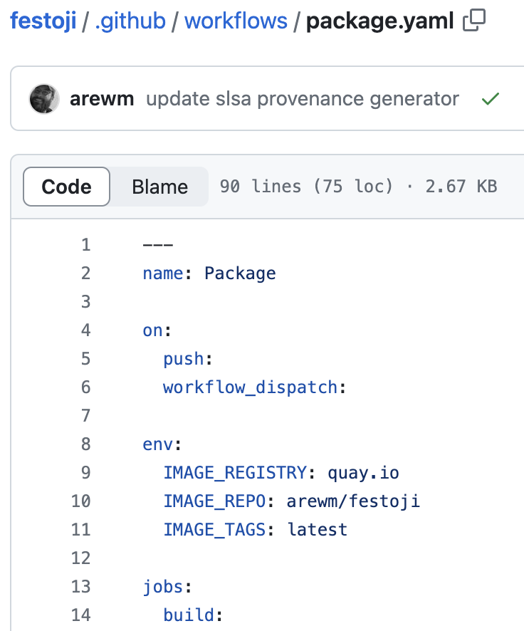
  

<!--

Building software artifacts can be easy (i.e. project maintainer). Securely building software artifacts is much harder (i.e. enterprise support). Requirements imposed are different: what works vs. what meets compliance policy

Graphics: committing code; github actions; release -> chain of events in build process

Call out the different ownership, pipeline changes are usually made by someone else with their own priorities
-->

---

# Devs want to troubleshoot builds

  
  

<!--

What if you need to troubleshoot a build in the build system?

Modify the build command locally, resubmit job
Vs. 
Hope that there is sufficient logging? Try to replicate the build system locally?
-->

---

# Devs want to explore new tech

  
  

<!--

What happens if you want to explore something new?

Fork, reconfigure for build configuration, commit

More pipelines, waiting for someone else to complete the work. - wait, does this pipeline have support? Is it compliant? How do we audit all of these pipelines or deprecate the old ones?
-->

---

# Devs don't need to be this unhappy

SLSA Build L3:

Harden the build platform

Generate provenance

<!--

Who has heard of SLSA build track? I have been asked many questions about what to do with transparency into the build process whether provenance or SBOMs. Producing provenance might be helpful for consumers. SBOMs might be helpful for meeting regulations.  But why not take advantage of it for yourself with detailed provenance?
-->

---

  

    

      <!-- Empty placeholders for future layers -->
      

      

      

      

      

      <!-- Foundation layer -->
      

        K8s + Tekton
      

    

  

  

    <h3>Foundation Platform</h3>
    
Kubernetes provides RBAC, containerization, and namespace isolation. Tekton provides the pipeline execution framework.

    
  

---

  

    

      <!-- Empty placeholders for future layers -->
      

      

      

      

      <!-- Trusted Task Library layer -->
      

        Trusted Task Library
      

      <!-- Foundation layer -->
      

        K8s + Tekton
      

    

  

  

    <h3>Secure Task Library</h3>
    
A library of tasks providing common and critical functions which need to be secure and auditable.

    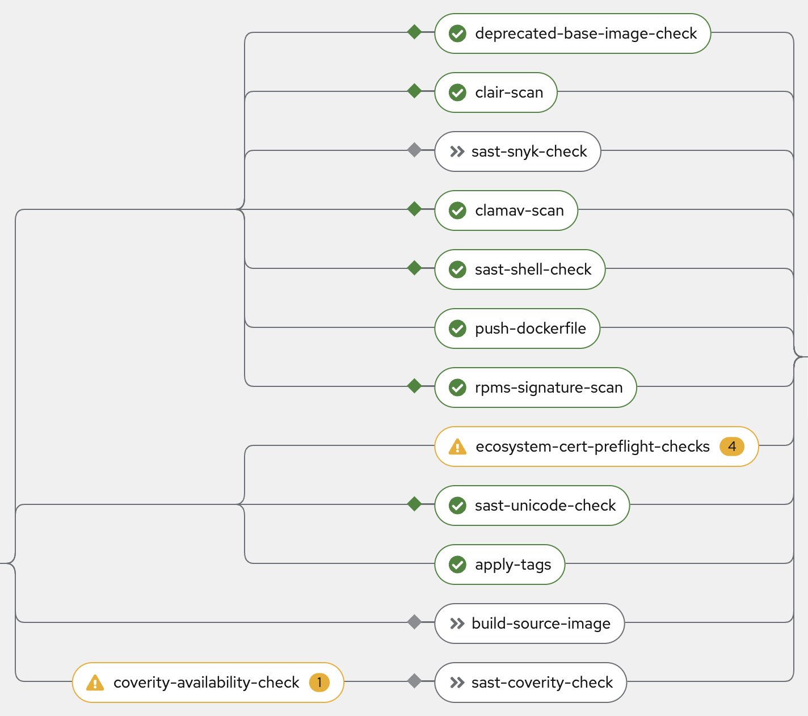
  

---

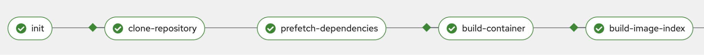

---

---

  

    

      <!-- Empty placeholders for future layers -->
      

      

      

      <!-- Trusted Artifacts layer -->
      

        Trusted Artifacts
      

      <!-- Trusted Task Library layer -->
      

        Trusted Task Library
      

      <!-- Foundation layer -->
      

        K8s + Tekton
      

    

  

  

    <h3>Trusted Artifacts</h3>
    
A method of sharing data between tasks which allows detection of data alterations.

    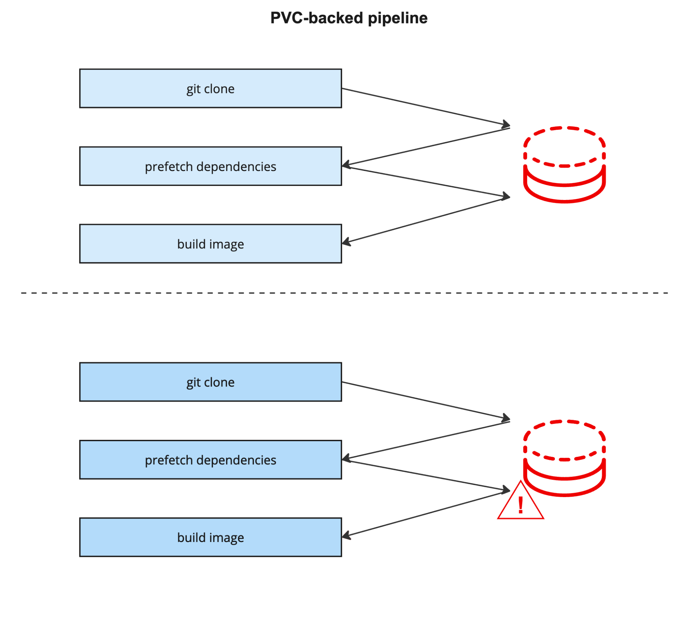
  

<!--

Konflux does not directly implement any security checks. Instead it uses tasks that call established tools like Snyk, Clair, ACS, ClamAV etc. The task library is where tool integrations happen and are the main path for user customization and potentially even commercial partnerships.
-->

---

---

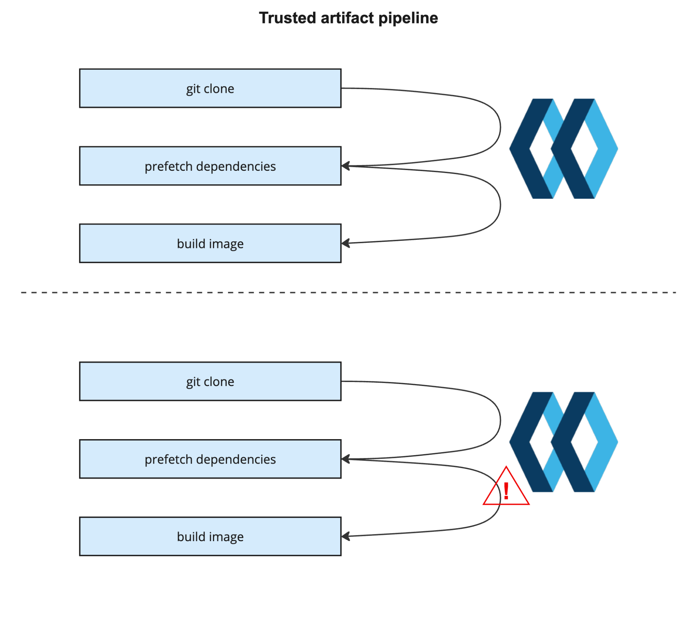

---

  

    

      <!-- Empty placeholders for future layers -->
      

      

      <!-- Observer Generated Attestations layer -->
      

        Observer Generated Attestations
      

      <!-- Trusted Artifacts layer -->
      

        Trusted Artifacts
      

      <!-- Trusted Task Library layer -->
      

        Trusted Task Library
      

      <!-- Foundation layer -->
      

        K8s + Tekton
      

    

  

  

    <h3>Observer Generated Attestations</h3>
    
Attestations are generated separately from the pipeline (by an 'observer') so they cannot be influenced by the user.

    
  

<!--

Tekton Chains was the first attestation generation service to use the 'observer' pattern, and this heavily influenced the design of Konflux. There is no reason this cannot be implemented for other CI / pipeline systems as well, but to date it has not been done.
-->

---

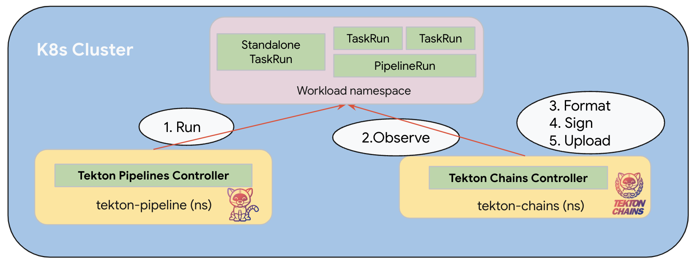

# https://tekton.dev/docs/chains/slsa-provenance/#how-does-tekton-chains-work

---

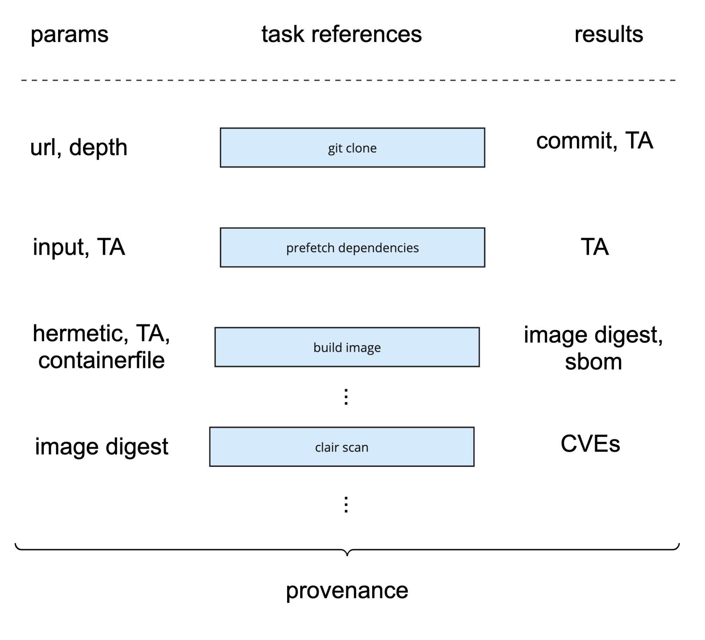

---

  

    

      <!-- Empty placeholder for future layer -->
      

      <!-- Policy Engine layer -->
      

        Policy Engine
      

      <!-- Observer Generated Attestations layer -->
      

        Observer Generated Attestations
      

      <!-- Trusted Artifacts layer -->
      

        Trusted Artifacts
      

      <!-- Trusted Task Library layer -->
      

        Trusted Task Library
      

      <!-- Foundation layer -->
      

        K8s + Tekton
      

    

  

  

    <h3>Policy Engine</h3>
    
A policy engine is used to compare the attestations against required policy (we use <a href="https://conforma.dev/">Conforma</a>).

    
  

<!--

Policies can precisely define things which need to be true about pipeline runs that produce artifacts. For example, that a specific task must be included, and optionally what the result of that task was. That specific tasks must not be included, that trusted artifacts are not modified before being input to specific tasks, that designated dependencies are not used, or are newer than a specified version… lots and lots of possibilities. 
-->

---

  
  
  

Allowed base images

---

  
  
  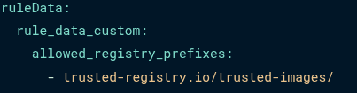

Allowed base images

---

  

    

      <!-- Release Service layer (complete model) -->
      

        Release Service
      

      <!-- Policy Engine layer -->
      

        Policy Engine
      

      <!-- Observer Generated Attestations layer -->
      

        Observer Generated Attestations
      

      <!-- Trusted Artifacts layer -->
      

        Trusted Artifacts
      

      <!-- Trusted Task Library layer -->
      

        Trusted Task Library
      

      <!-- Foundation layer -->
      

        K8s + Tekton
      

    

  

  

    <h3>Release Service</h3>
    
Release service gates access to protected destinations based on policy evaluation.

    
  

---

# Devs can easily build artifacts

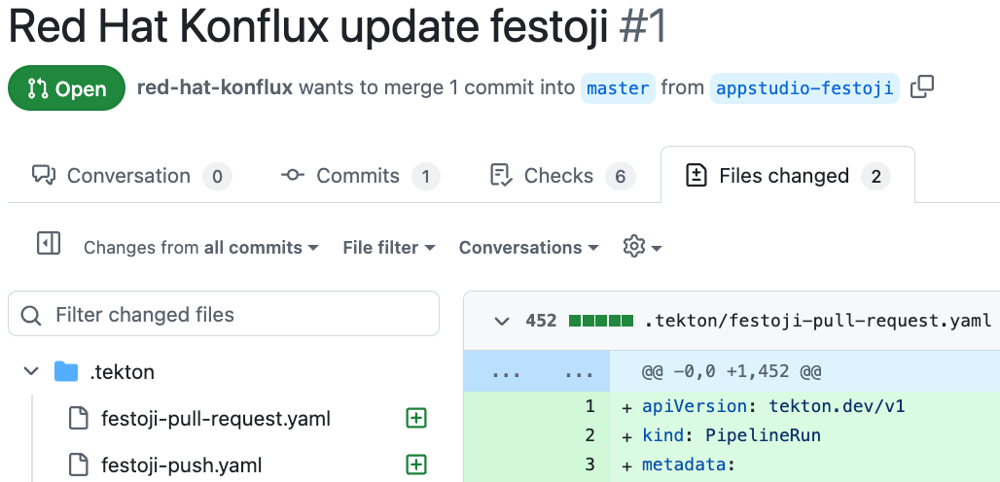

<!--

Onboard the source repository and customize the pipeline parameters.

If the policy required the onboarded pipeline, you can release right away. Otherwise, you can customize the parameters and/or repository to get the policies in-compliance with the help of the EC policy violations. Policy-driven-development.

Screenshot: PR of PAC changes being proposed

Talking points: 
Start with a sample pipeline
Iteration with policy-driven development based on target (show two checks, each for a different policy?)
-->

---

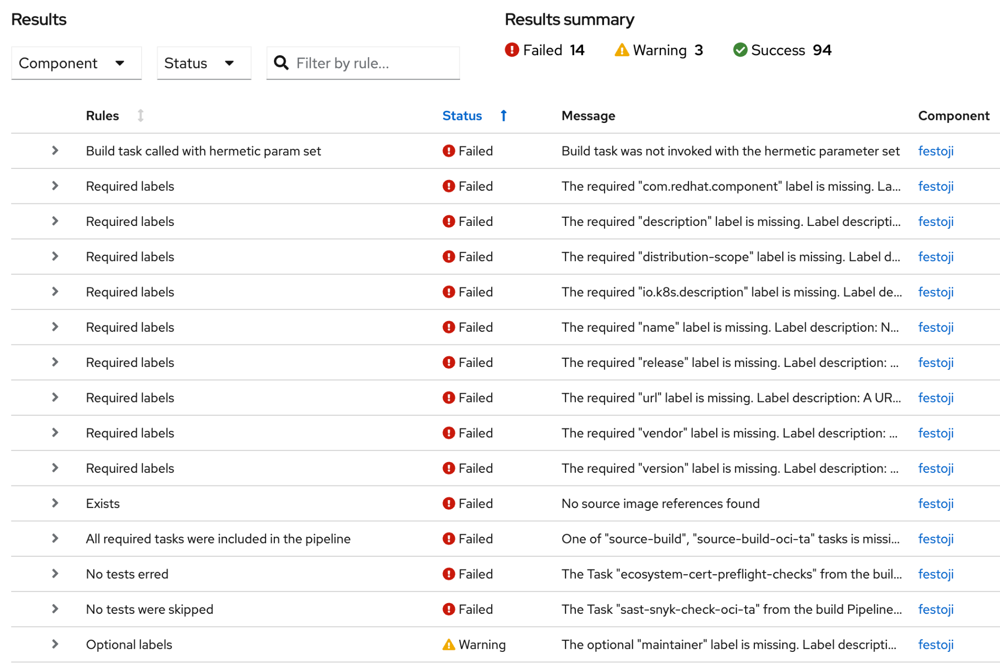

<!--

Onboard the source repository and customize the pipeline parameters.

If the policy required the onboarded pipeline, you can release right away. Otherwise, you can customize the parameters and/or repository to get the policies in-compliance with the help of the EC policy violations. Policy-driven-development.

Screenshot: PR of PAC changes being proposed

Talking points: 
Start with a sample pipeline
Iteration with policy-driven development based on target (show two checks, each for a different policy?)
-->

---

# Devs can troubleshoot builds

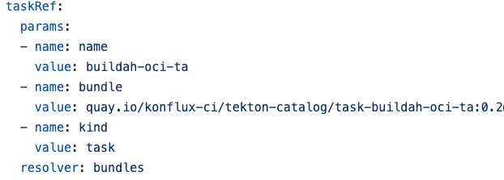

<!--

Screenshot of PR customizing the build

Talking points: 
You have your pipeline, you can see the tasks that are run
Change from a tekton resolver to in-line the task
Iterate on the failing step to troubleshoot
Don't worry – these will fail EC if the build or critical tests are modified

Modify the build command locally, resubmit job

If any of the critical tasks have been modified, potentially compromising the guarantees, the artifacts won't be able to be released
-->

---

__$ oras manifest fetch \-\-pretty quay\.io/konflux\-ci/tekton\-catalog/task\-buildah\-remote\-oci\-ta:0\.4 | jq \.annotations__

__\{__

__  "dev\.konflux\-ci\.task\.previous\-migration\-bundle": "",__

__  "org\.opencontainers\.image\.description": "Buildah task builds source code into a container image and pushes the image into container registry using buildah tool\.",__

__  "org\.opencontainers\.image\.documentation": "https://github\.com/konflux\-ci/build\-definitions/tree/75741ae0dbd0e3ffa0414acc7fbc950740e889ae/task/buildah\-remote\-oci\-ta/0\.4/README\.md",__

__  "org\.opencontainers\.image\.revision": "75741ae0dbd0e3ffa0414acc7fbc950740e889ae",__

__  "org\.opencontainers\.image\.source": "https://github\.com/konflux\-ci/build\-definitions",__

__  "org\.opencontainers\.image\.url": "https://github\.com/konflux\-ci/build\-definitions/tree/75741ae0dbd0e3ffa0414acc7fbc950740e889ae/task/buildah\-remote\-oci\-ta/0\.4",__

__  "org\.opencontainers\.image\.version": "0\.4"__

__\}__

<!--

Screenshot of PR customizing the build

Talking points: 
You have your pipeline, you can see the tasks that are run
Change from a tekton resolver to in-line the task
Iterate on the failing step to troubleshoot
Don't worry – these will fail EC if the build or critical tests are modified

Modify the build command locally, resubmit job

If any of the critical tasks have been modified, potentially compromising the guarantees, the artifacts won't be able to be released
-->

---

# Devs can explore new tech

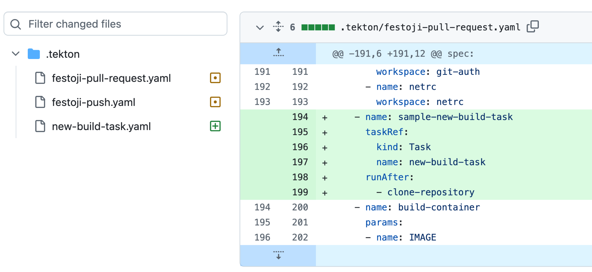

<!--

Talking points: 
You have your pipeline, you can customize it with your own tasks
Don't worry – these will fail EC if the build or critical tests are modified
Functionality can be expanded by adding to the trusted tasks … and performing necessary reviews of those additions. Tasks need to adhere to naming conventions (i.e. parameter/results)

Fork the project, reconfigure for build environment (maybe create a new Task or two), commit. Push this to your own registries, use it in personal or dev deployments. It won't get to production until the pipelines are approved
-->

---

# Devs don't need to be this unhappy

  
  
  
  

  
}

  

---

# Thank you!

  

         @arewm
  

  

    arewm@redhat.com
  

  

    
    
konflux-ci.dev

  

  

    
    
hermetoproject.github.io/hermeto

  

  

    
    
conforma.dev

  

