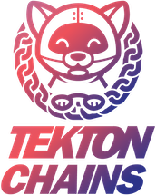
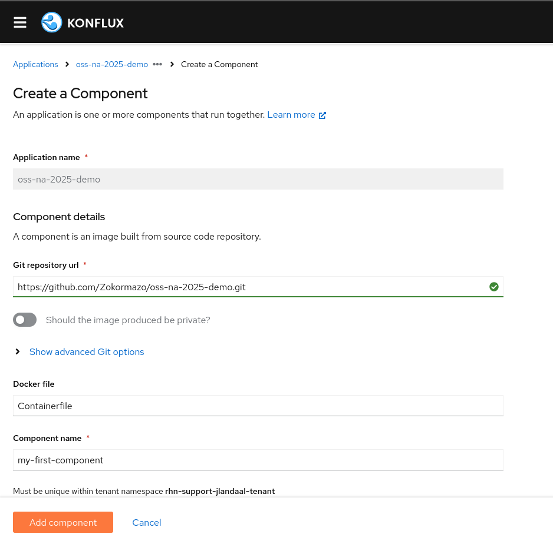
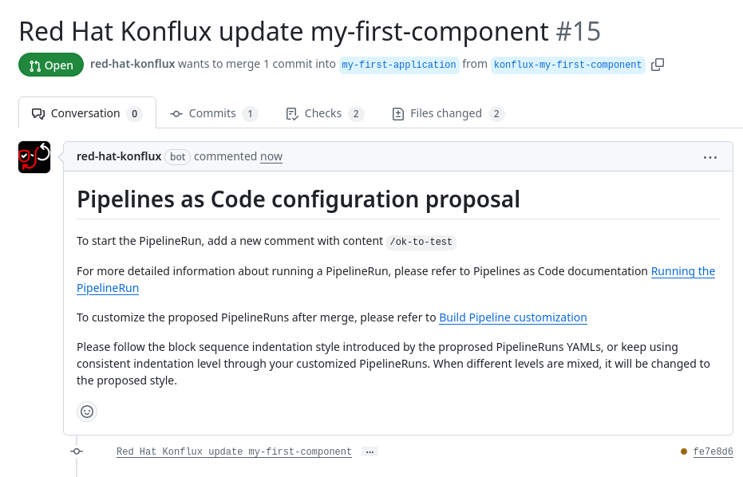
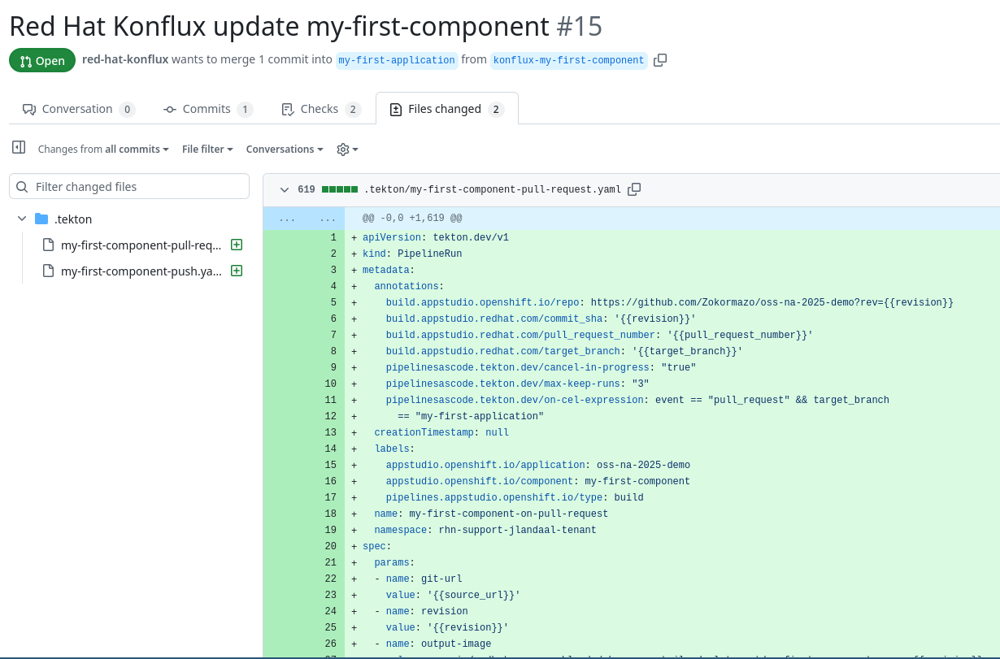
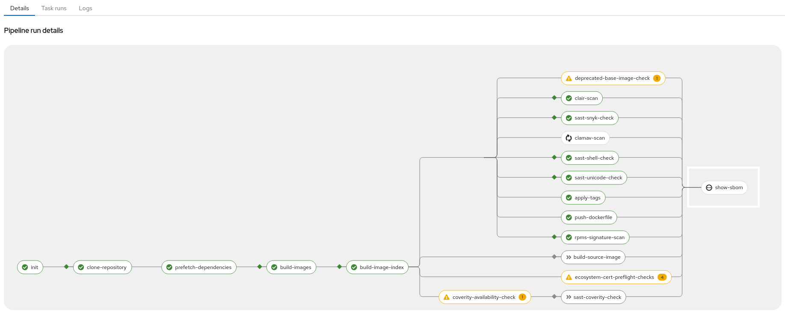
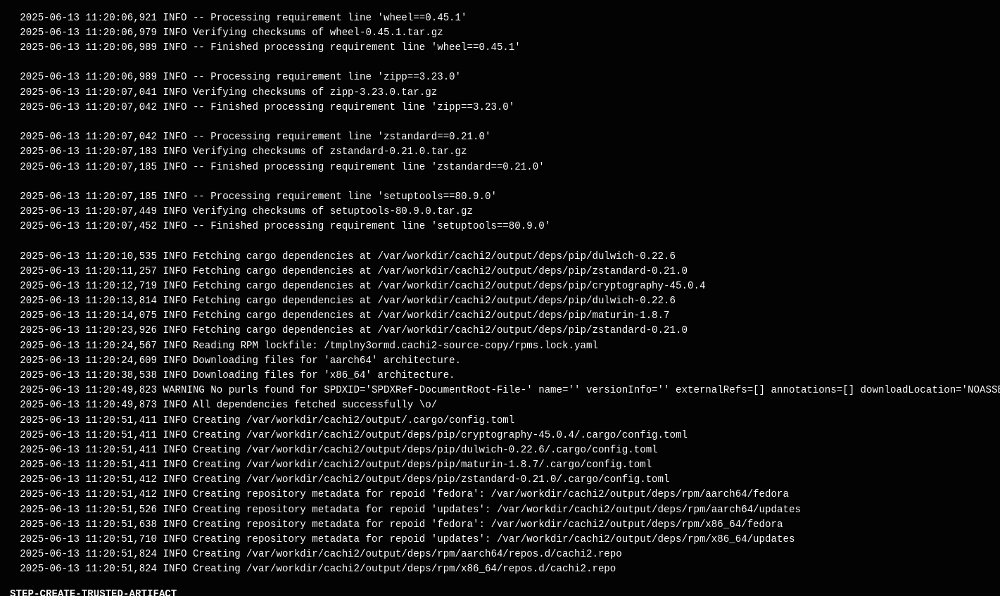

# Who Are You Building For: Pipelines Have a Purpose

Andrew McNamara & Julen Landa Alustiza, Red Hat

Open Source Summit North America 2025

<!---

# Today's Focus: The Developer Experience

<div style="display: flex; gap: 40px; align-items: center;">
  <div style="flex: 1;">
    <h3>📋 Our Journey Today</h3>
    <ol>
      <li><strong>Andrew:</strong> Progressive trust model</li>
      <li><strong>Andrew:</strong> Usable security by default</li>
      <li><strong>Andrew:</strong> Policy-driven development</li>
      <li><strong>Julen:</strong> Hands-on onboarding</li>
      <li><strong>Julen:</strong> Pipeline customization</li>
      <li><strong>Julen:</strong> Security in practice</li>
      <li><strong>Julen:</strong> Release workflow</li>
    </ol>
  </div>
  <div style="flex: 1;">
    <h3>🎯 What You'll Learn</h3>
    <ul>
      <li>Progressive trust model</li>
      <li>Usable security concepts</li>
      <li>Policy-driven development</li>
      <li>Real developer workflow</li>
      <li>Build once, release anywhere</li>
    </ul>
  </div>
</div>
-->
---

# Threats to the supply chain

<div style="display: flex; flex-direction: column; align-items: center; margin: 0 auto; max-width: 100%;">
  
</div>
<small style="margin-top: 10px; display: block;">Source: https://slsa.dev/spec/v1.1/threats-overview</small>

<!--
Is this something that we really need? 
-->

---

# Pipeline security vs developer experience

<div style="display: flex; gap: 40px; align-items: center;">
  <div style="flex: 1;">
    <h3>🚀 What Developers Want</h3>
    <ul>
      <li>Fast iteration cycles</li>
      <li>Simple onboarding</li>
      <li>Flexible workflows</li>
      <li>Clear feedback</li>
    </ul>
  </div>
  <div style="flex: 1;">
    <h3>🔒 Typical Security</h3>
    <ul>
      <li>Checkbox-driven security</li>
      <li>Few, restrictive configurations</li>
      <li>Late-stage feedback</li>
      <li>Developer friction</li>
    </ul>
  </div>
</div>

<div style="margin-top: 40px; text-align: center; font-size: 1.3em; color: #0066cc;">
  <strong>How do we achieve what developers want securely?</strong>
</div>

---

# Pipeline security vs developer experience

<div style="display: flex; gap: 40px; align-items: center;">
  <div style="flex: 1;">
    <h3>🚀 What Developers Want</h3>
    <ul>
      <li>Fast iteration cycles</li>
      <li>Simple onboarding</li>
      <li>Flexible workflows</li>
      <li>Clear feedback</li>
    </ul>
  </div>
  <div style="flex: 1;">
    <h3>🔒 Typical Security</h3>
    <ul>
      <li>Checkbox-driven security</li>
      <li>Few, restrictive configurations</li>
      <li>Late-stage feedback</li>
      <li>Developer friction</li>
    </ul>
  </div>
</div>

<div style="display: flex; flex-direction: column; align-items: center; margin: 0 auto; max-width: 100%;">
  
</div>

---

# Building up trust in the platform

<div style="display: flex; gap: 40px; align-items: flex-start;">
  <div style="flex: 1;">
    <div style="display: flex; flex-direction: column; justify-content: center; height: 400px; gap: 10px;">
      <!-- Complete trust model stack -->
      <div style="background: #ffe6e6; border: 2px solid #ff4444; padding: 15px; text-align: center; font-weight: bold; height: 50px; display: flex; align-items: center; justify-content: center; border-radius: 5px;">
        <div style="width: 30px; height: 30px; margin-right: 10px;">
          
        </div>
        Release Service
      </div>
      <div style="background: #e6f3ff; border: 2px solid #0066cc; padding: 15px; text-align: center; font-weight: bold; height: 50px; display: flex; align-items: center; justify-content: center; border-radius: 5px;">
        <div style="width: 30px; height: 30px; margin-right: 10px;">
           
        </div>
        Policy-Driven Development
      </div>
      <div style="background: #fff0e6; border: 2px solid #ff8c00; padding: 15px; text-align: center; font-weight: bold, height: 50px; display: flex; align-items: center; justify-content: center; border-radius: 5px;">
        <div style="width: 30px; height: 30px; margin-right: 10px;">
          
        </div>
        Observer Attestations
      </div>
      <div style="background: #f0e6ff; border: 2px solid #8c00ff; padding: 15px; text-align: center; font-weight: bold; height: 50px; display: flex; align-items: center; justify-content: center; border-radius: 5px;">
        <div style="width: 30px; height: 30px; margin-right: 10px;">
          
        </div>
        Trusted Artifacts
      </div>
      <div style="background: #ffe6e6; border: 2px solid #ff4444; padding: 15px; text-align: center; font-weight: bold; height: 50px; display: flex; align-items: center; justify-content: center; border-radius: 5px;">
        <div style="width: 30px; height: 30px; margin-right: 10px;">
          
        </div>
        Trusted Tasks
      </div>
      <div style="background: #e6ffe6; border: 2px solid #00cc66; padding: 15px; text-align: center; font-weight: bold; height: 50px; display: flex; align-items: center; justify-content: center; border-radius: 5px;">
        <div style="width: 30px; height: 30px; margin-right: 10px;">
          
        </div>
        Kubernetes + Tekton
      </div>
    </div>
  </div>
  <div style="flex: 1;">
    <div style="display: flex; flex-direction: column; justify-content: center; height: 400px; gap: 10px;">
      <div style="height: 50px; display: flex; align-items: center; padding: 15px;">Destination specific policies</div>
      <div style="height: 50px; display: flex; align-items: center; padding: 15px;">Guidance at the right time</div>
      <div style="height: 50px; display: flex; align-items: center; padding: 15px;">Fine-grained SLSA provenance</div>
      <div style="height: 50px; display: flex; align-items: center; padding: 15px;">Tamper-proof data flow</div>
      <div style="height: 50px; display: flex; align-items: center; padding: 15px;">Community-vetted build steps</div>
      <div style="height: 50px; display: flex; align-items: center; padding: 15px;">Secure execution environment</div>
    </div>
  </div>
</div>

<!--
Andrew: This is the core architecture
Each layer builds on the previous one
This is what enables usable security
-->

---

# Konflux's design philosophy

<div style="display: flex; gap: 40px; align-items: flex-start; justify-content: center;">
  <div style="flex: 1; min-width: 250px;">
    <h3 style="text-align: center;">🎯 Security by Default</h3>
    <ul>
      <li><strong>Immediate protection:</strong> SLSA Build Level 3 from the first build</li>
      <li><strong>Minimal configuration:</strong> Secure defaults work out of the box</li>
      <li><strong>Progressive enhancement:</strong> Enable additional scans as necessary</li>
    </ul>
  </div>
  <div style="flex: 1; min-width: 250px;">
    <h3 style="text-align: center;">🔄 Policy driven development</h3>
    <ul>
      <li><strong>Early detection:</strong> Find issues in development</li>
      <li><strong>Learning opportunities:</strong> Violations become education</li>
      <li><strong>Continuous improvement:</strong> Policies evolve with team</li>
      <li><strong>Flexibility allowed:</strong> Policies allow for some changes</li>
    </ul>
  </div>
</div>

<div style="margin-top: 30px; text-align: center; font-size: 1.2em; color: #0066cc;">
  <strong>Security that helps, not hinders</strong>
</div>

<!--
Andrew: Explain the usable security philosophy
This is different from traditional security approaches
-->

---

# Policy-driven development in practice

<div style="display: flex; gap: 30px; align-items: center;">
  <div style="flex: 1;">
    <h3>🚨 Traditional Approach</h3>
    <ul>
      <li>Security team creates policies</li>
      <li>Developers find out at release time</li>
      <li>"Why did my release fail?"</li>
      <li>Scramble to fix issues</li>
    </ul>
  </div>
  <div style="flex: 1;">
    <h3>✅ Policy-Driven Approach</h3>
    <ul>
      <li>Policies integrated into workflow</li>
      <li>Immediate feedback in PRs</li>
      <li>Clear violation descriptions</li>
      <li>Suggested remediation steps</li>
    </ul>
  </div>
</div>

<!--div style="margin-top: 30px; padding: 15px; background: #e8f5e8; border-left: 4px solid #4caf50;">
  <strong>The goal:</strong> Turn policy violations into learning opportunities, not roadblocks
</div-->

<!--
Andrew: Explain the shift from reactive to proactive security
This is what makes security usable
-->

<!---

# From theory to practice

<div style="display: flex; gap: 40px; align-items: center;">
  <div style="flex: 1;">
    <h3>🎓 What Andrew Covered</h3>
    <ul>
      <li>Progressive trust model architecture</li>
      <li>Usable security principles</li>
      <li>Policy-driven development approach</li>
      <li>Why this matters for developers</li>
    </ul>
  </div>
  <div style="flex: 1;">
    <h3>🛠️ What Julen Will Show</h3>
    <ul>
      <li>How this looks in practice</li>
      <li>Actual developer workflow</li>
      <li>Real onboarding experience</li>
      <li>Security without friction</li>
    </ul>
  </div>
</div>

<div style="margin-top: 40px; text-align: center; font-size: 1.3em; color: #0066cc;">
  <strong>Let's see the trust model in action!</strong>
</div>

<!--
Andrew: Transition to Julen
Set expectations for what's coming next
-->

---

# Hands-On: Quick Onboarding - From Zero to Building

<div style="display: flex; gap: 30px; align-items: center;">
  <div style="flex: 1;">
    <h3>🚀 Getting Started</h3>
    <ul>
      <li>Point Konflux at your repository</li>
      <li>Get a default build pipeline</li>
      <li>See your first build succeed</li>
      <li>Understand what happened</li>
    </ul>
  </div>
  <div style="flex: 1;">
    
  </div>
</div>

---

# Hands-On: Quick Onboarding - From Zero to Building

<div style="display: flex; gap: 30px; align-items: center;">
  <div style="flex: 1; display: flex; justify-content: center;">
    
  </div>
  <div style="flex: 1; display: flex; justify-content: center;">
    
  </div>
</div>

---

# Hands-On: Quick Onboarding - From Zero to Building

<div style="display: flex; gap: 30px; align-items: center;">
  <div style="flex: 1;">
    
  </div>
</div>

<!--
Julen: Show the UI for onboarding a repository
Show how Konflux auto-detects the project type
Show the generated Pipelines-as-Code configuration
Emphasize how this "just works" for most projects

img/onboarding*
-->

<!---

# The Magic: Secure by Default

<div style="display: flex; gap: 40px; align-items: flex-start;">
  <div style="flex: 1;">
    <div style="display: flex; flex-direction: column; justify-content: center; height: 300px; gap: 8px;">
      <div style="background: #e6f3ff; border: 2px solid #0066cc; padding: 10px; text-align: center; font-weight: bold; height: 40px; display: flex; align-items: center; justify-content: center; border-radius: 5px;">
        🔐 Secure-by-Default Pipeline
      </div>
      <div style="background: #fff0e6; border: 2px solid #ff8c00; padding: 10px; text-align: center; font-weight: bold; height: 40px; display: flex; align-items: center; justify-content: center; border-radius: 5px;">
        📦 Trusted Artifacts
      </div>
      <div style="background: #f0e6ff; border: 2px solid #8c00ff; padding: 10px; text-align: center; font-weight: bold; height: 40px; display: flex; align-items: center; justify-content: center; border-radius: 5px;">
        ✅ Trusted Tasks
      </div>
      <div style="background: #e6ffe6; border: 2px solid #00cc66; padding: 10px; text-align: center; font-weight: bold; height: 40px; display: flex; align-items: center; justify-content: center; border-radius: 5px;">
        🏗️ Tekton + Kubernetes
      </div>
    </div>
  </div>
  <div style="flex: 1;">
    <h3>Instant Security Benefits</h3>
    <ul>
      <li><strong>Observer attestations:</strong> Tekton Chains generates SLSA provenance</li>
      <li><strong>Tamper detection:</strong> Artifacts signed and verified</li>
      <li><strong>Audit trail:</strong> Every step recorded</li>
      <li><strong>Policy compliance:</strong> Built-in security checks</li>
    </ul>
  </div>
</div>

<!--
Julen: Show what the developer gets automatically
This is Andrew's trust model in action

... I don't think we need this.
-->

---

# Hands-On: Making Your First Pipeline Changes

<div style="display: flex; gap: 30px; align-items: center;">
  <div style="flex: 1;">
    <h3>🛠️ Customization</h3>
    <ul>
      <li>Pipeline lives in **your** repo</li>
      <li>Modify `.tekton/` directory</li>
      <li>Add custom build args</li>
      <li>Test changes in PRs</li>
    </ul>
  </div>
  <div style="flex: 1;">
    
  </div>
</div>

```yaml
# .tekton/build-pipeline.yaml
spec:
  params:
    - name: build-platforms
      value:
      - linux/x86_64
      - linux/arm64
    - name: build-source-image
      value: 'true'
```

<!--
Julen: Show how the pipeline configuration lives in the developer's repository
Show making a simple change like adding build arguments
Emphasize developer ownership and control
-->

---

# Hands-On: Enabling Security Tasks

<div style="display: flex; gap: 30px; align-items: center;">
  <div style="flex: 1;">
    <h3>🔍 Security Integration</h3>
    <ul>
      <li>Vulnerability scanning with Snyk</li>
      <li>SAST analysis</li>
      <li>Container image scanning</li>
      <li>License compliance</li>
    </ul>
  </div>
  <div style="flex: 1;">
    
  </div>
</div>

<div style="margin-top: 20px; padding: 15px; background: #fff8e1; border-left: 4px solid #ffa000;">
  <strong>Key Insight:</strong> These tasks are from the trusted task library - vetted by the community, configured by you
</div>

<!--
Julen: Show the practical configuration
These are the trusted tasks from Andrew's model
-->

---

# Hands-On: Hermetic Builds + Prefetch

<div style="display: flex; gap: 30px; align-items: center;">
  <div style="flex: 1;">
    <h3>🔒 Supply Chain Hardening</h3>
    <ul>
      <li><strong>Hermetic:</strong> No network access during build</li>
      <li><strong>Prefetch:</strong> Dependencies downloaded once</li>
      <li><strong>Reproducible:</strong> Same inputs = same outputs</li>
      <li><strong>Auditable:</strong> Complete dependency record</li>
    </ul>
  </div>
</div>

```yaml
# Enable hermetic builds and prefetch
spec:
  params:
    - name: hermetic
      value: "true"
    - name: prefetch-input
      value: '{"type": "gomod", "path": "."}'
```

<!--
Julen: Demonstrate enabling hermetic builds
Show the prefetch configuration for different package managers
This is SLSA Build Level 3 in practice
-->

---

# Hands-On: Hermetic Builds + Prefetch

<div style="display: flex; gap: 30px; align-items: center;">
  <div style="flex: 1;">
    
  </div>
</div>

---

# What Hermetic + Prefetch Gives You

<div style="display: flex; gap: 40px; align-items: center;">
  <div style="flex: 1;">
    <h3>🛡️ Security Benefits</h3>
    <ul>
      <li>No surprise downloads</li>
      <li>Complete dependency manifest</li>
      <li>Protection from typosquatting</li>
      <li>Reproducible builds</li>
    </ul>
  </div>
  <div style="flex: 1;">
    <h3>📊 Compliance Benefits</h3>
    <ul>
      <li>Full SBOM generation</li>
      <li>License analysis</li>
      <li>Vulnerability scanning</li>
      <li>Audit trail</li>
    </ul>
  </div>
</div>

<div style="margin-top: 30px; text-align: center; font-size: 1.2em; color: #0066cc;">
  <strong>This is SLSA Build Level 3 in action!</strong>
</div>

<!--
Julen: Show the practical developer benefit
This is where Andrew's usable security philosophy pays off
-->

---

# Hands-On: Responding to Policy Violations

<div style="display: flex; gap: 30px; align-items: center;">
  <div style="flex: 1;">
    <h3>🚨 Policy Guidance</h3>
    <ul>
      <li>Violations shown in PRs</li>
      <li>Clear remediation steps</li>
      <li>Progressive enforcement</li>
      <li>Learn as you go</li>
    </ul>
  </div>
  <div style="flex: 1;">
    
  </div>
</div>

<div style="margin-top: 20px; padding: 15px; background: #fce4ec; border-left: 4px solid #e91e63;">
  <strong>Gone are the days of:</strong> "I didn't know I had to do that!"
</div>

<!--
Julen: Show a real policy violation in a PR
Show how the feedback is actionable
This is Andrew's policy-driven development in practice
-->

---

# Hands-On: Automated Dependency Updates

<div style="display: flex; gap: 30px; align-items: center;">
  <div style="flex: 1;">
    <h3>🤖 Mintmaker</h3>
    <ul>
      <li>Automated security updates</li>
      <li>Policy-compliant changes</li>
      <li>Tested before merging</li>
      <li>Policy-compliant updates</li>
    </ul>
  </div>
  <div style="flex: 1;">
    
  </div>
</div>

```yaml
# Mintmaker finds security issues
CVE-2024-1234: High severity in dependency xyz
# Creates PR with tested fix
Updates xyz from 1.2.3 -> 1.2.4
✅ All security checks pass
✅ Policy compliance verified
```

<!--
Julen: Show a real Mintmaker PR
Explain how it's different from basic dependabot
This is proactive security maintenance
-->

---

# Hands-On: Triggering Releases

<div style="display: flex; gap: 30px; align-items: center;">
  <div style="flex: 1;">
    <h3>🚀 Release Service</h3>
    <ul>
      <li>Build once, release everywhere</li>
      <li>Environment-specific policies</li>
      <li>Automated promotion gates</li>
      <li>Complete audit trail</li>
    </ul>
  </div>
  <div style="flex: 1;">
    
  </div>
</div>

<div style="margin-top: 20px; padding: 15px; background: #e8f5e8; border-left: 4px solid #4caf50;">
  <strong>The payoff:</strong> Your artifact passes all dev/staging policies? It can automatically go to production.
</div>

<!--
Julen: Show the developer experience of creating a release
This is where all the trust building pays off
-->

---

# The Complete Developer Journey

<div style="display: flex; gap: 20px; align-items: center; justify-content: center;">
  <div style="text-align: center; padding: 15px; background: #f0f8ff; border-radius: 10px; flex: 1;">
    <strong>1. Onboard</strong><br>
    Point & click
  </div>
  <div style="font-size: 2em; color: #666;">→</div>
  <div style="text-align: center; padding: 15px; background: #fff8e1; border-radius: 10px; flex: 1;">
    <strong>2. Customize</strong><br>
    Your repo, your rules
  </div>
  <div style="font-size: 2em; color: #666;">→</div>
  <div style="text-align: center; padding: 15px; background: #fce4ec; border-radius: 10px; flex: 1;">
    <strong>3. Secure</strong><br>
    Enable protections
  </div>
  <div style="font-size: 2em; color: #666;">→</div>
  <div style="text-align: center; padding: 15px; background: #e8f5e8; border-radius: 10px; flex: 1;">
    <strong>4. Release</strong><br>
    Deploy with confidence
  </div>
</div>

<div style="margin-top: 40px; text-align: center; font-size: 1.3em; color: #0066cc;">
  <strong>Security and compliance, built into your development workflow</strong>
</div>

<!--
Julen: Tie this back to the complete journey
This is the complete developer experience
-->

---

# Key Takeaways for Developers

<div style="display: flex; gap: 40px; align-items: center;">
  <div style="flex: 1;">
    <h3>🎯 What We Achieved</h3>
    <ul>
      <li><strong>Quick start:</strong> Working pipeline in minutes</li>
      <li><strong>Full control:</strong> Pipeline lives in your repo</li>
      <li><strong>Progressive security:</strong> Add protections incrementally</li>
      <li><strong>Guided compliance:</strong> Policy violations help you learn</li>
      <li><strong>Automated maintenance:</strong> Security updates handled</li>
    </ul>
  </div>
  <div style="flex: 1;">
    <h3>🔗 Connection to Trust Model</h3>
    <ul>
      <li>Every step builds more trust</li>
      <li>Community-contributed tasks</li>
      <li>Observer-generated attestations</li>
      <li>Policy-driven development</li>
      <li>Build once, release everywhere</li>
    </ul>
  </div>
</div>

<!--
Both: Connect the developer experience to the bigger picture
This is what it looks like when security and developer experience align
-->

---

# Join us again
### OpenSSF Community Day

#### 🔍 Deeper Dive Topics

* Another look at the trust model
* Extending the build platform with community contribution
* Designing flexible tasks


<!--
Set expectations for the Community Day talk
Make sure people understand these are complementary, not repetitive
-->

---

# Thank you!

<div style="text-align: center; margin: 40px 0;">
  <div style="display: flex; justify-content: center; align-items: center; gap: 60px;">
    <div style="text-align: center;">
      <div style="display: flex; align-items: center; justify-content: center; gap: 5px; margin-bottom: 10px;">
        
        <span style="font-size: 1.5em; font-weight: bold;">@arewm</span>
      </div>
      <div style="font-size: 1.1em;">arewm@redhat.com</div>
    </div>
    <div style="text-align: center;">
      <div style="display: flex; align-items: center; justify-content: center; gap: 5px; margin-bottom: 10px;">
        
        <span style="font-size: 1.5em; font-weight: bold;">@Zokormazo</span>
      </div>
      <div style="font-size: 1.1em;">julen@redhat.com</div>
    </div>
  </div>
</div>

<div style="display: flex; justify-content: center; align-items: center; gap: 100px; margin-top: 50px;">
     <div style="text-align: center;">
     
     <div style="margin-top: 10px; font-size: 0.8em;">konflux-ci.dev</div>
   </div>
   <div style="text-align: center;">
     
     <div style="margin-top: 10px; font-size: 0.8em;">hermetoproject.github.io/hermeto</div>
   </div>
   <div style="text-align: center;">
     
     <div style="margin-top: 10px; font-size: 0.8em;">conforma.dev</div>
   </div>
</div>

<!--
Questions and discussion
Connect with us for more details about implementation
Join us Thursday at OpenSSF Community Day for the architectural deep-dive!
-->
