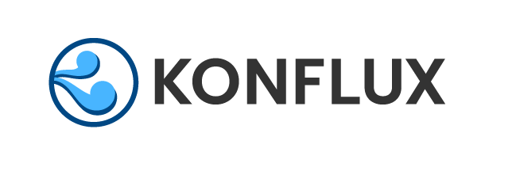
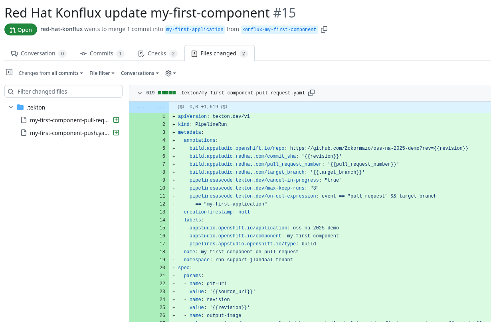
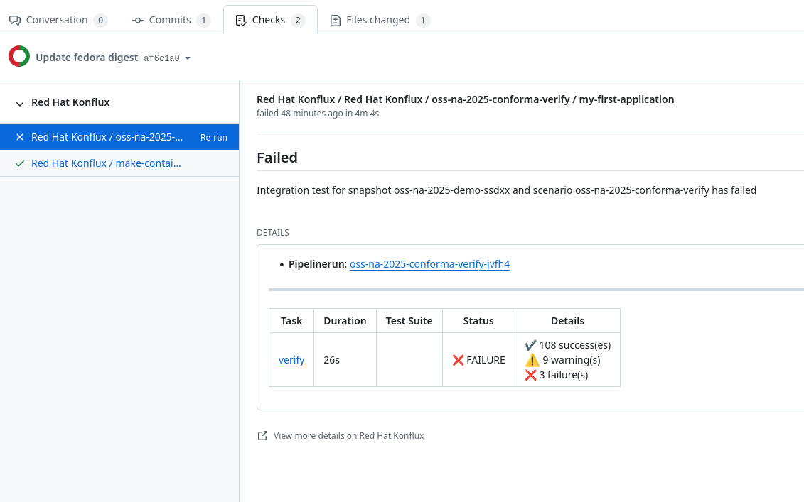
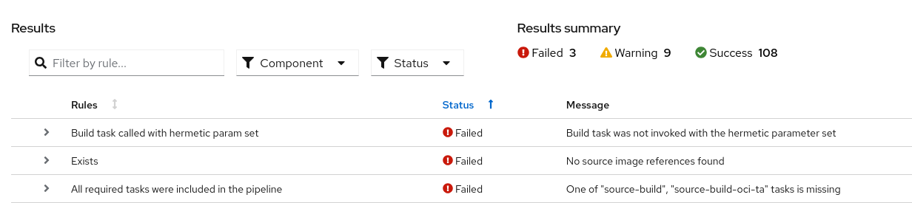

# Who Are You Building For: Pipelines Have a Purpose

Andrew McNamara & Julen Landa Alustiza, Red Hat

Open Source Summit North America 2025

<!---

# Today's Focus: The Developer Experience

<div style="display: flex; gap: 40px; align-items: center;">
  <div style="flex: 1;">
    <h3>📋 Our Journey Today</h3>
    <ol>
      <li><strong>Andrew:</strong> Progressive trust model</li>
      <li><strong>Andrew:</strong> Usable security by default</li>
      <li><strong>Andrew:</strong> Policy-driven development</li>
      <li><strong>Julen:</strong> Hands-on onboarding</li>
      <li><strong>Julen:</strong> Pipeline customization</li>
      <li><strong>Julen:</strong> Security in practice</li>
      <li><strong>Julen:</strong> Release workflow</li>
    </ol>
  </div>
  <div style="flex: 1;">
    <h3>🎯 What You'll Learn</h3>
    <ul>
      <li>Progressive trust model</li>
      <li>Usable security concepts</li>
      <li>Policy-driven development</li>
      <li>Real developer workflow</li>
      <li>Build once, release anywhere</li>
    </ul>
  </div>
</div>
-->
---

# Threats to the supply chain

<div style="display: flex; flex-direction: column; align-items: center; margin: 0 auto; max-width: 100%;">
  
</div>
<small style="margin-top: 10px; display: block;">Source: https://slsa.dev/spec/v1.1/threats-overview</small>

<!--
Is this something that we really need? 
-->

---

# Pipeline security vs developer experience

<div style="display: flex; gap: 40px; align-items: center;">
  <div style="flex: 1;">
    <h3>🚀 What Developers Want</h3>
    <ul>
      <li>Fast iteration cycles</li>
      <li>Simple onboarding</li>
      <li>Flexible workflows</li>
      <li>Clear feedback</li>
    </ul>
  </div>
  <div style="flex: 1;">
    <h3>🔒 Typical Security</h3>
    <ul>
      <li>Checkbox-driven security</li>
      <li>Few, restrictive configurations</li>
      <li>Late-stage feedback</li>
      <li>Developer friction</li>
    </ul>
  </div>
</div>

<div style="margin-top: 40px; text-align: center; font-size: 1.3em; color: #0066cc;">
  <strong>How do we achieve what developers want securely?</strong>
</div>

---

# Pipeline security vs developer experience

<div style="display: flex; gap: 40px; align-items: center;">
  <div style="flex: 1;">
    <h3>🚀 What Developers Want</h3>
    <ul>
      <li>Fast iteration cycles</li>
      <li>Simple onboarding</li>
      <li>Flexible workflows</li>
      <li>Clear feedback</li>
    </ul>
  </div>
  <div style="flex: 1;">
    <h3>🔒 Typical Security</h3>
    <ul>
      <li>Checkbox-driven security</li>
      <li>Few, restrictive configurations</li>
      <li>Late-stage feedback</li>
      <li>Developer friction</li>
    </ul>
  </div>
</div>

<div style="display: flex; flex-direction: column; align-items: center; margin: 0 auto; max-width: 100%;">
  
</div>

---

# Building up trust in the platform

<div style="display: flex; gap: 40px; align-items: flex-start;">
  <div style="flex: 1;">
    <div style="display: flex; flex-direction: column; justify-content: center; height: 400px; gap: 10px;">
      <!-- Complete trust model stack -->
      <div style="background: #ffe6e6; border: 2px solid #ff4444; padding: 15px; text-align: center; font-weight: bold; height: 50px; display: flex; align-items: center; justify-content: center; border-radius: 5px;">
        <div style="width: 30px; height: 30px; margin-right: 10px;">
          
        </div>
        Release Service
      </div>
      <div style="background: #e6f3ff; border: 2px solid #0066cc; padding: 15px; text-align: center; font-weight: bold; height: 50px; display: flex; align-items: center; justify-content: center; border-radius: 5px;">
        <div style="width: 30px; height: 30px; margin-right: 10px;">
           
        </div>
        Policy-Driven Development
      </div>
      <div style="background: #fff0e6; border: 2px solid #ff8c00; padding: 15px; text-align: center; font-weight: bold, height: 50px; display: flex; align-items: center; justify-content: center; border-radius: 5px;">
        <div style="width: 30px; height: 30px; margin-right: 10px;">
          
        </div>
        Observer Attestations
      </div>
      <div style="background: #f0e6ff; border: 2px solid #8c00ff; padding: 15px; text-align: center; font-weight: bold; height: 50px; display: flex; align-items: center; justify-content: center; border-radius: 5px;">
        <div style="width: 30px; height: 30px; margin-right: 10px;">
          
        </div>
        Trusted Artifacts
      </div>
      <div style="background: #ffe6e6; border: 2px solid #ff4444; padding: 15px; text-align: center; font-weight: bold; height: 50px; display: flex; align-items: center; justify-content: center; border-radius: 5px;">
        <div style="width: 30px; height: 30px; margin-right: 10px;">
          
        </div>
        Trusted Tasks
      </div>
      <div style="background: #e6ffe6; border: 2px solid #00cc66; padding: 15px; text-align: center; font-weight: bold; height: 50px; display: flex; align-items: center; justify-content: center; border-radius: 5px;">
        <div style="width: 30px; height: 30px; margin-right: 10px;">
          
        </div>
        Kubernetes + Tekton
      </div>
    </div>
  </div>
  <div style="flex: 1;">
    <div style="display: flex; flex-direction: column; justify-content: center; height: 400px; gap: 10px;">
      <div style="height: 50px; display: flex; align-items: center; padding: 15px;">Destination specific policies</div>
      <div style="height: 50px; display: flex; align-items: center; padding: 15px;">Guidance at the right time</div>
      <div style="height: 50px; display: flex; align-items: center; padding: 15px;">Fine-grained SLSA provenance</div>
      <div style="height: 50px; display: flex; align-items: center; padding: 15px;">Tamper-proof data flow</div>
      <div style="height: 50px; display: flex; align-items: center; padding: 15px;">Community-vetted build steps</div>
      <div style="height: 50px; display: flex; align-items: center; padding: 15px;">Secure execution environment</div>
    </div>
  </div>
</div>

<!--
Andrew: This is the core architecture
Each layer builds on the previous one
This is what enables usable security
-->

---

# Konflux's design philosophy

<div style="display: flex; gap: 40px; align-items: flex-start; justify-content: center;">
  <div style="flex: 1; min-width: 250px;">
    <h3 style="text-align: center;">🎯 Security by Default</h3>
    <ul>
      <li><strong>Immediate protection:</strong> SLSA Build Level 3 from the first build</li>
      <li><strong>Minimal configuration:</strong> Secure defaults work out of the box</li>
      <li><strong>See vulnerabilities:</strong> Scanners configured and ready to run</li>
      <li><strong>Progressive enhancement:</strong> Add custom tasks and scans as necessary</li>
    </ul>
  </div>
  <div style="flex: 1; min-width: 250px;">
    <h3 style="text-align: center;">🔄 Policy driven development</h3>
    <ul>
      <li><strong>Early detection:</strong> Find issues in development</li>
      <li><strong>Learning opportunities:</strong> Violations become education</li>
      <li><strong>Continuous improvement:</strong> Policies evolve with team</li>
      <li><strong>Flexibility allowed:</strong> Policies allow for some changes</li>
    </ul>
  </div>
</div>

<!--
Andrew: Explain the usable security philosophy
This is different from traditional security approaches
-->

---

# Policy-driven development in practice

<div style="display: flex; gap: 30px; align-items: center;">
  <div style="flex: 1;">
    <h3>Less of that</h3>
    <ul>
      <li>Security team creates policies</li>
      <li>Developers find out at release time</li>
      <li>"Why did my release fail?"</li>
      <li>Scramble to fix issues</li>
    </ul>
  </div>
  <div style="flex: 1;">
    <h3>More of this</h3>
    <ul>
      <li>Policies integrated into workflow</li>
      <li>Immediate feedback in PRs</li>
      <li>Clear violation descriptions</li>
      <li>Suggested remediation steps</li>
    </ul>
  </div>
</div>

---

# Quick Onboarding - From Zero to Building

<div style="display: flex; gap: 30px; align-items: center;">
  <div style="flex: 1;">
    <h3>🚀 Getting Started</h3>
    <ul>
      <li>Point Konflux at your repository</li>
      <li>Get a default build pipeline</li>
      <li>See your first build succeed</li>
      <li>Understand what happened</li>
    </ul>
  </div>
  <div style="flex: 1;">
    
  </div>
</div>

<!--
Julen: Show how easy is to onboard a new build.
You just need to point Konflux to a git repository and the Containerfile
-->

---

# Quick Onboarding - From Zero to Building

<div style="display: flex; gap: 30px; align-items: center;">
  <div style="flex: 1; display: flex; justify-content: center;">
    
  </div>
  <div style="flex: 1; display: flex; justify-content: center;">
    
  </div>
</div>

<!--
Julen: Konflux will open a pull request to onboard the repository.
The build pipeline is on the git repo. The developer owns it going forward.
-->

---

# Quick Onboarding - From Zero to Building

<div style="display: flex; gap: 30px; align-items: center;">
  <div style="flex: 1; justify-content: center;">
    
  </div>
</div>

<!--
Julen: It works out of the box. The build pipeline almost always builds successfully with the
default configuration.
-->

---

# Built-in Security Tasks

<div style="display: flex; gap: 30px; align-items: center;">
  <div style="flex: 1;">
    <h3>🔍 Security Integration</h3>
    <ul>
      <li>Vulnerability scanning with Clair</li>
      <li>SAST analysis</li>
      <li>Malware scanning with ClamAV</li>
      <li>License compliance</li>
    </ul>
  </div>
  <div style="flex: 1;">
    
  </div>
</div>

<!--
Julen: Lot of security tasks are built in and will work out of the box or after providing credentials.
These are the trusted tasks from Andrew's model
-->

---

# Road to compliance

Conforma CI check

<div style="display: flex; gap: 40px; align-items: center; justify-content: center;">
  
</div>

<!--
Julen: Konflux allows to check compliance with the policies on CI checks.
Great feedback loop to iterate fast and get compliant to conforma policy builds.
-->

---

# Road to compliance

Conforma CI check

<div style="display: flex; gap: 40px; align-items: center; flex-direction: column;">
  
</div>

<!--
Julen: Deeper details of the violations can be found on Konflux UI, including instructions to fix
or exclude them from your policy..
-->

---

# Road to compliance

Making Your First Pipeline Changes

<div style="display: flex; gap: 30px; align-items: center;">
  <div style="flex: 1;">
    <ul>
      <li>Pipelines lives in <strong>your</strong> repo</li>
      <li>Update the <code>.tekton/</code> directory</li>
      <li>Test changes in PRs</li>
    </ul>
    <code style="display: flex; align-tems: left;">
    # Enable source image build<br>
    spec:<br>
      &nbsp&nbspparams:<br>
        &nbsp&nbsp&nbsp&nbsp- name: build-source-image<br>
          &nbsp&nbsp&nbsp&nbsp&nbsp&nbspvalue: 'true'<br>
    </code>
  </div>
  <div style="flex: 1;">
    
    
  </div>
</div>

<!--
Julen: Easy iteration to harden your builds modifying the parameters of the build pipelines
the developer owns. Easily fix the compliance violations one at a time.
-->

---

# Hands-On: Hermetic Builds + Prefetch

<div style="display: flex; gap: 30px; align-items: center;">
  <div style="flex: 1;">
    <ul>
      <li><strong>Hermetic:</strong> No network access during build</li>
      <li><strong>Prefetch:</strong> Build platform controls dependency download</li>
      <li><strong>Reproducible:</strong> Same inputs = same outputs</li>
      <li><strong>Auditable:</strong> Complete dependency record in SBOM</li>
    </ul>
  </div>
  <div style="flex: 1;">
    <code style="display: flex; align-tems: left; font-size: 12pt; width=500">
      # Enable hermetic builds and prefetch<br>
      # gomod<br>
      spec:<br>
        &nbsp params:<br>
          &nbsp&nbsp&nbsp - name: hermetic<br>
            &nbsp&nbsp&nbsp&nbsp&nbsp value: 'true'<br>
          &nbsp&nbsp&nbsp - name: prefetch-input<br>
            &nbsp&nbsp&nbsp&nbsp&nbsp value: '{"type": "gomod", "path": "."}'<br>
    </code>
    <hr>
    <code style="display: flex; align-tems: left; font-size: 12pt; width=500">
      # Enable hermetic builds and prefetch<br>
      # Multiple package managers<br>
      spec:<br>
        &nbsp params:<br>
          &nbsp&nbsp&nbsp - name: hermetic<br>
            &nbsp&nbsp&nbsp&nbsp&nbsp value: 'true'<br>
          &nbsp&nbsp&nbsp - name: prefetch-input<br>
            &nbsp&nbsp&nbsp&nbsp&nbsp value: '[<br>
              &nbsp&nbsp&nbsp&nbsp&nbsp&nbsp&nbsp {"type": "pip", "path": "."},<br>
              &nbsp&nbsp&nbsp&nbsp&nbsp&nbsp&nbsp {"type": "npm", "path": "."}<br>
            &nbsp&nbsp&nbsp&nbsp&nbsp ]'<br>
    </code>
  </div>
</div>

<!--
Julen: Demonstrate enabling hermetic builds
Show the prefetch configuration for different package managers
This is SLSA Build Level 3+ in practice
-->

---

# Hands-On: Hermetic Builds + Prefetch

<div style="display: flex; gap: 30px; align-items: center;">
  <div style="flex: 1;">
    
  </div>
</div>

<!--
Julen: The build pipeline is prefetching the deps and isolating the build now
-->

---

# What Hermetic + Prefetch Gives You

<div style="display: flex; gap: 40px; align-items: center;">
  <div style="flex: 1;">
    <h3>🛡️ Security Benefits</h3>
    <ul>
      <li>No surprise downloads</li>
      <li>Complete dependency manifest</li>
      <li>Repeatable builds</li>
    </ul>
  </div>
  <div style="flex: 1;">
    <h3>📊 Compliance Benefits</h3>
    <ul>
      <li>Full SBOM generation</li>
      <li>Fewer scanning false positives</li>
      <li>Audit trail</li>
    </ul>
  </div>
</div>

<!--
Julen: Show the practical developer benefit
This is where Andrew's usable security philosophy pays off
-->

---

# Hands-On: Automated Dependency Updates

<div style="display: flex; gap: 30px; align-items: center;">
  <div style="flex: 1;">
    <h3>🤖 Mintmaker</h3>
    <ul>
      <li>Automated security updates</li>
      <li>Policy-compliant changes</li>
      <li>Tested before merging</li>
      <li>Policy-compliant updates</li>
    </ul>
  </div>
  <div style="flex: 1;">
    
  </div>
</div>

```yaml
# Mintmaker finds security issues
CVE-2024-1234: High severity in dependency xyz
# Creates PR with tested fix
Updates xyz from 1.2.3 -> 1.2.4
✅ All security checks pass
✅ Policy compliance verified
```

<!--
Julen: Show a real Mintmaker PR
Explain how it's different from basic dependabot
This is proactive security maintenance
-->

---

# Hands-On: Triggering Releases

<div style="display: flex; gap: 30px; align-items: center;">
  <div style="flex: 1;">
    <h3>🚀 Release Service</h3>
    <ul>
      <li>Build once, release multiple times</li>
      <li>Destination-specific policies</li>
      <li>Automated promotion gates</li>
    </ul>
  </div>
  <div style="flex: 1;">
    
  </div>
</div>

<div style="margin-top: 20px; padding: 15px; background: #e8f5e8; border-left: 4px solid #4caf50;">
  <strong>The payoff:</strong> Your artifact passes all dev/staging policies? It can automatically go to production.
</div>

<!--
Julen: Show the developer experience of creating a release
This is where all the trust building pays off.
The developer knows in advance the build is ready to release thanks to the Conforma ITS
-->

---

# The Complete Developer Journey

<div style="display: flex; gap: 20px; align-items: center; justify-content: center;">
  <div style="text-align: center; padding: 15px; background: #f0f8ff; border-radius: 10px; flex: 1;">
    <strong>1. Onboard</strong><br>
    Point & click
  </div>
  <div style="font-size: 2em; color: #666;">→</div>
  <div style="text-align: center; padding: 15px; background: #fff8e1; border-radius: 10px; flex: 1;">
    <strong>2. Customize</strong><br>
    Your repo, your rules
  </div>
  <div style="font-size: 2em; color: #666;">→</div>
  <div style="text-align: center; padding: 15px; background: #fce4ec; border-radius: 10px; flex: 1;">
    <strong>3. Secure</strong><br>
    Enable protections
  </div>
  <div style="font-size: 2em; color: #666;">→</div>
  <div style="text-align: center; padding: 15px; background: #e8f5e8; border-radius: 10px; flex: 1;">
    <strong>4. Release</strong><br>
    Deploy with confidence
  </div>
</div>

<div style="margin-top: 40px; text-align: center; font-size: 1.3em; color: #0066cc;">
  <strong>Security and compliance, built into your development workflow</strong>
</div>

<!--
Julen: Tie this back to the complete journey
This is the complete developer experience
-->

---

# Key Takeaways for Developers

<div style="display: flex;">
  <div style="flex: 1;">
    <h3>What developers get</h3>
  </div>
  <div style="flex: 1;">
    <h3>Made possible by Konflux</h3>
  </div>
</div>
<div style="display: flex; gap: 20px; margin-top: -20px;">
  <div style="flex: 1;">
    <ul>
      <dt><strong>Start quickly</strong></dt>
      <dd>Working pipeline in minutes</dd>
      <dt><strong>With full control</strong></dt>
      <dd>Pipeline lives in your repo</dd>
      <dt><strong>Progressively adding security</strong></dt>
      <dd>Add protections incrementally</dd>
      <dt><strong>Planning for compliance</strong></dt>
      <dd>Policy violations prep for release</dd>
      <dt><strong>And automated maintenance</strong></dt>
      <dd>Security updates handled</dd>
    </ul>
  </div>
  <div style="flex: 1;">
    <ul>
      <li>Built on a strong foundation</li>
      <li>Trust established on a task level</li>
      <li>Observer-generated attestations</li>
      <li>Policy-driven development</li>
      <li>Build once, automate release</li>
    </ul>
  </div>
</div>

<!--
Both: Connect the developer experience to the bigger picture
This is what it looks like when security and developer experience align
-->

---

# More talks about Konflux
<dl>
  <dt><strong>Monday, June 23 (cdCon)</strong></dt>
  <dd><em>Lock the Chef in the Kitchen: Enabling Accurate SBOMs Via Hermetic Builds</em></dd>

  <dt><strong>Wednesday, June 25 (cdCon)</strong></dt>
  <dd><em>Not Just Ticking a Box ☑️ Establishing Trust in Artifacts with Provenance 🔐🔗</em></dd>

  <dt><strong>Wednesday, June 25 (OpenGovCon)</strong></dt>
  <dd><em>Building Trust Through Proactive Security - Key Parts of the Trusted Software Supply Chain</em></dd>

  <dt><strong>Thursday, June 26 (OpenSSF Community Day)</strong></dt>
  <dd><em>Who Are You Building For: Pipelines Have a Purpose</em></dd>
</dl>


<!--
Set expectations for the Community Day talk
Make sure people understand these are complementary, not repetitive
-->

---

# Thank you!

<div style="text-align: center; margin: 40px 0;">
  <div style="display: flex; justify-content: center; align-items: center; gap: 60px;">
    <div style="text-align: center;">
      <div style="display: flex; align-items: center; justify-content: center; gap: 5px; margin-bottom: 10px;">
        
        <span style="font-size: 1.5em; font-weight: bold;">@arewm</span>
      </div>
      <div style="font-size: 1.1em;">arewm@redhat.com</div>
    </div>
    <div style="text-align: center;">
      <div style="display: flex; align-items: center; justify-content: center; gap: 5px; margin-bottom: 10px;">
        
        <span style="font-size: 1.5em; font-weight: bold;">@Zokormazo</span>
      </div>
      <div style="font-size: 1.1em;">julen@redhat.com</div>
    </div>
  </div>
</div>

<div style="display: flex; justify-content: center; align-items: center; gap: 100px; margin-top: 50px;">
     <div style="text-align: center;">
     
     <div style="margin-top: 10px; font-size: 0.8em;">konflux-ci.dev</div>
   </div>
   <div style="text-align: center;">
     
     <div style="margin-top: 10px; font-size: 0.8em;">hermetoproject.github.io/hermeto</div>
   </div>
   <div style="text-align: center;">
     
     <div style="margin-top: 10px; font-size: 0.8em;">conforma.dev</div>
   </div>
</div>

<!--
Questions and discussion
Connect with us for more details about implementation
Join us Thursday at OpenSSF Community Day for the architectural deep-dive!
-->
