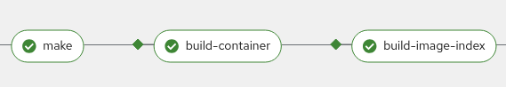
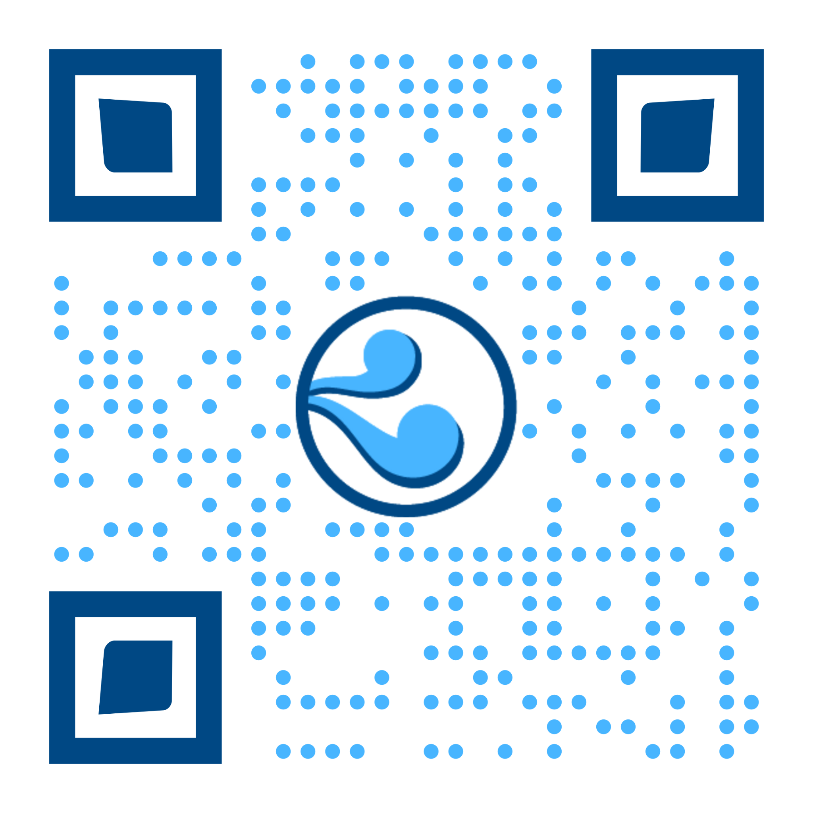

<!-- markdownlint-disable-file single-h1 no-inline-html line-length no-duplicate-heading no-trailing-punctuation heading-increment -->

# Who Are You Building For: Pipelines Have a Purpose

Andrew McNamara & Julen Landa Alustiza, Red Hat

OpenSSF Community Day North America 2025

---

# Pipelines serve dual purposes

<div style="display: flex; align-items: center; gap: 40px;">
  <div style="flex: 1;">
    <h3>🔒 Security Controls</h3>
    <ul>
      <li>Supply chain protection</li>
      <li>Establish organizational trust</li>
      <li>Policy compliance</li>
      <li>Audit requirements</li>
    </ul>
  </div>
  <div style="flex: 1;">
    <h3>🛠️ Developer Flexibility</h3>
    <ul>
      <li>Build once, release multiple times</li>
      <li>Customizable workflows</li>
      <li>Community contribution</li>
      <li>Innovation enablement</li>
    </ul>
  </div>
</div>

---

# The Challenge: Balance Trust and Flexibility


<small>Source: https://slsa.dev/spec/v1.1/threats-overview</small>

---

# Our Approach: Progressive Trust Model

<div style="display: flex; gap: 40px; align-items: flex-start;">
  <div style="flex: 1;">
    <div style="display: flex; flex-direction: column; justify-content: center; height: 400px; gap: 10px;">
      <!-- Empty placeholders for future layers -->
      <div style="height: 50px;"></div>
      <div style="height: 50px;"></div>
      <div style="height: 50px;"></div>
      <div style="height: 50px;"></div>
      <div style="height: 50px;"></div>
      <!-- Foundation layer -->
      <div style="background: white; border: 2px solid #333; padding: 15px; text-align: center; font-weight: bold; width: 100%; height: 50px; display: flex; align-items: center; justify-content: center;">
        K8s + Tekton
      </div>
    </div>
  </div>
  <div style="flex: 1;">
    <h3>Foundation Platform</h3>
    <p>Kubernetes provides RBAC, containerization, and namespace isolation. Tekton provides the pipeline execution framework with observer attestations.</p>
    
  </div>
</div>

---

# Building Trust: Trusted Task Library

<div style="display: flex; gap: 40px; align-items: flex-start;">
  <div style="flex: 1;">
    <div style="display: flex; flex-direction: column; justify-content: center; height: 400px; gap: 10px;">
      <!-- Empty placeholders for future layers -->
      <div style="height: 50px;"></div>
      <div style="height: 50px;"></div>
      <div style="height: 50px;"></div>
      <div style="height: 50px;"></div>
      <!-- Trusted Task Library layer -->
      <div style="background: #ffcccc; border: 2px solid #333; padding: 15px; text-align: center; font-weight: bold; width: 100%; height: 50px; display: flex; align-items: center; justify-content: center;">
        Trusted Task Library
      </div>
      <!-- Foundation layer -->
      <div style="background: white; border: 2px solid #333; padding: 15px; text-align: center; font-weight: bold; width: 100%; height: 50px; display: flex; align-items: center; justify-content: center;">
        K8s + Tekton
      </div>
    </div>
  </div>
  <div style="flex: 1;">
    <h3>Curated and Verified Tasks</h3>
    <p>Tasks that have been reviewed, tested, and approved for broader use.</p>
    <ul>
      <li>Build process standardization</li>
      <li>Security scanning integration</li>
      <li>Policy compliance helpers</li>
    </ul>
  </div>
</div>

---

# Building Trust: Trusted Artifacts

<div style="display: flex; gap: 40px; align-items: flex-start;">
  <div style="flex: 1;">
    <div style="display: flex; flex-direction: column; justify-content: center; height: 400px; gap: 10px;">
      <!-- Empty placeholders for future layers -->
      <div style="height: 50px;"></div>
      <div style="height: 50px;"></div>
      <div style="height: 50px;"></div>
      <!-- Trusted Artifacts layer -->
      <div style="background: #ff9999; border: 2px solid #333; padding: 15px; text-align: center; font-weight: bold; width: 100%; height: 50px; display: flex; align-items: center; justify-content: center;">
        Trusted Artifacts
      </div>
      <!-- Trusted Task Library layer -->
      <div style="background: #ffcccc; border: 2px solid #333; padding: 15px; text-align: center; font-weight: bold; width: 100%; height: 50px; display: flex; align-items: center; justify-content: center;">
        Trusted Task Library
      </div>
      <!-- Foundation layer -->
      <div style="background: white; border: 2px solid #333; padding: 15px; text-align: center; font-weight: bold; width: 100%; height: 50px; display: flex; align-items: center; justify-content: center;">
        K8s + Tekton
      </div>
    </div>
  </div>
  <div style="flex: 1;">
    <h3>Tamper-Proof Data Flow</h3>
    <p>Secure artifact sharing between tasks with integrity verification.</p>
    <ul>
      <li>Cryptographic signatures</li>
      <li>Tamper detection</li>
      <li>Build reproducibility</li>
    </ul>
  </div>
</div>

---

# Building Trust: Observer Generated Attestations

<div style="display: flex; gap: 40px; align-items: flex-start;">
  <div style="flex: 1;">
    <div style="display: flex; flex-direction: column; justify-content: center; height: 400px; gap: 10px;">
      <!-- Empty placeholders for future layers -->
      <div style="height: 50px;"></div>
      <div style="height: 50px;"></div>
      <!-- Observer Generated Attestations layer -->
      <div style="background: #ff6666; border: 2px solid #333; padding: 15px; text-align: center; font-weight: bold; width: 100%; height: 50px; display: flex; align-items: center; justify-content: center;">
        Observer Generated Attestations
      </div>
      <!-- Trusted Artifacts layer -->
      <div style="background: #ff9999; border: 2px solid #333; padding: 15px; text-align: center; font-weight: bold; width: 100%; height: 50px; display: flex; align-items: center; justify-content: center;">
        Trusted Artifacts
      </div>
      <!-- Trusted Task Library layer -->
      <div style="background: #ffcccc; border: 2px solid #333; padding: 15px; text-align: center; font-weight: bold; width: 100%; height: 50px; display: flex; align-items: center; justify-content: center;">
        Trusted Task Library
      </div>
      <!-- Foundation layer -->
      <div style="background: white; border: 2px solid #333; padding: 15px; text-align: center; font-weight: bold; width: 100%; height: 50px; display: flex; align-items: center; justify-content: center;">
        K8s + Tekton
      </div>
    </div>
  </div>
  <div style="flex: 1;">
    <h3>Independent Verification</h3>
    <p>Tekton Chains generates SLSA provenance independently from the pipeline, preventing manipulation.</p>
    <ul>
      <li>SLSA Build Level 3</li>
      <li>Tamper-resistant provenance</li>
      <li>Complete build record</li>
    </ul>
  </div>
</div>

---

# Building Trust: Policy Engine

<div style="display: flex; gap: 40px; align-items: flex-start;">
  <div style="flex: 1;">
    <div style="display: flex; flex-direction: column; justify-content: center; height: 400px; gap: 10px;">
      <!-- Empty placeholder for future layer -->
      <div style="height: 50px;"></div>
      <!-- Policy Engine layer -->
      <div style="background: #ff3333; border: 2px solid #333; padding: 15px; text-align: center; font-weight: bold; width: 100%; height: 50px; display: flex; align-items: center; justify-content: center;">
        Policy Engine
      </div>
      <!-- Observer Generated Attestations layer -->
      <div style="background: #ff6666; border: 2px solid #333; padding: 15px; text-align: center; font-weight: bold; width: 100%; height: 50px; display: flex; align-items: center; justify-content: center;">
        Observer Generated Attestations
      </div>
      <!-- Trusted Artifacts layer -->
      <div style="background: #ff9999; border: 2px solid #333; padding: 15px; text-align: center; font-weight: bold; width: 100%; height: 50px; display: flex; align-items: center; justify-content: center;">
        Trusted Artifacts
      </div>
      <!-- Trusted Task Library layer -->
      <div style="background: #ffcccc; border: 2px solid #333; padding: 15px; text-align: center; font-weight: bold; width: 100%; height: 50px; display: flex; align-items: center; justify-content: center;">
        Trusted Task Library
      </div>
      <!-- Foundation layer -->
      <div style="background: white; border: 2px solid #333; padding: 15px; text-align: center; font-weight: bold; width: 100%; height: 50px; display: flex; align-items: center; justify-content: center;">
        K8s + Tekton
      </div>
    </div>
  </div>
  <div style="flex: 1;">
    <h3>Policy-Driven Development</h3>
    <p>Automated policy evaluation guides developers toward compliance.</p>
    <ul>
      <li>Real-time violation feedback</li>
      <li>PR-based policy guidance</li>
      <li>Conforma policy engine</li>
    </ul>
  </div>
</div>

---

# Complete Trust Model: Release Service

<div style="display: flex; gap: 40px; align-items: flex-start;">
  <div style="flex: 1;">
    <div style="display: flex; flex-direction: column; justify-content: center; height: 400px; gap: 10px;">
      <!-- Release Service layer (complete model) -->
      <div style="background: #cc0000; color: white; border: 2px solid #333; padding: 15px; text-align: center; font-weight: bold; width: 100%; height: 50px; display: flex; align-items: center; justify-content: center;">
        Release Service
      </div>
      <!-- Policy Engine layer -->
      <div style="background: #ff3333; border: 2px solid #333; padding: 15px; text-align: center; font-weight: bold; width: 100%; height: 50px; display: flex; align-items: center; justify-content: center;">
        Policy Engine
      </div>
      <!-- Observer Generated Attestations layer -->
      <div style="background: #ff6666; border: 2px solid #333; padding: 15px; text-align: center; font-weight: bold; width: 100%; height: 50px; display: flex; align-items: center; justify-content: center;">
        Observer Generated Attestations
      </div>
      <!-- Trusted Artifacts layer -->
      <div style="background: #ff9999; border: 2px solid #333; padding: 15px; text-align: center; font-weight: bold; width: 100%; height: 50px; display: flex; align-items: center; justify-content: center;">
        Trusted Artifacts
      </div>
      <!-- Trusted Task Library layer -->
      <div style="background: #ffcccc; border: 2px solid #333; padding: 15px; text-align: center; font-weight: bold; width: 100%; height: 50px; display: flex; align-items: center; justify-content: center;">
        Trusted Task Library
      </div>
      <!-- Foundation layer -->
      <div style="background: white; border: 2px solid #333; padding: 15px; text-align: center; font-weight: bold; width: 100%; height: 50px; display: flex; align-items: center; justify-content: center;">
        K8s + Tekton
      </div>
    </div>
  </div>
  <div style="flex: 1;">
    <h3>Build Once, Release Everywhere</h3>
    <p>Single build artifacts can be safely promoted to multiple environments based on policy compliance.</p>
    <ul>
      <li>Environment-specific policies</li>
      <li>Automated release gating</li>
      <li>Audit trail preservation</li>
    </ul>
  </div>
</div>

---

# Community Contribution Workflow

<div style="display: flex; gap: 20px; align-items: center; justify-content: center;">
  <div style="text-align: center; padding: 15px; border-radius: 10px; flex: 1;">
    Personal Sandbox
  </div>
  <div style="font-size: 2em; color: #666;">→</div>
  <div style="text-align: center; padding: 15px; border-radius: 10px; flex: 1;">
    Establish trust
  </div>
  <div style="font-size: 2em; color: #666;">→</div>
  <div style="text-align: center; padding: 15px; border-radius: 10px; flex: 1;">
    Community Sharing
  </div>
</div>

<div style="display: flex; gap: 30px; align-items: center; margin-top: 40px;">
  <div style="text-align: center; flex: 1;">
    <h4>🧪 Experiment</h4>
    <p>Start with custom tasks in your own namespace</p>
  </div>
  <div style="text-align: center; flex: 1;">
    <h4>✅ Promote</h4>
    <p>Push to trusted task bundles</p>
  </div>
  <div style="text-align: center; flex: 1;">
    <h4>🤝 Share</h4>
    <p>Others can leverage your work</p>
  </div>
</div>

<!--
This is the core workflow we want to demonstrate
Shows how individual innovation becomes community benefit
Policy-driven development guides the process
-->

---

# Demo: Customizing the build pipeline

### Custom task to build execution environments

<div style="display: flex; gap: 10px; align-items: center;">
  <div style="flex: 1;">
    
    <div style="height: 50px;"></div>
    
  </div>
  <div style="flex: 1;">
    <ul style="list-style-type: '❌ '">
      <li>Policy violations</li>
      <li>Trust model gaps</li>
      <li>Compliance issues</li>
    </ul>
    
    
  </div>
</div>

<!--
Julen: Using a task on the same repo makes iterating easy for the developer.
However the solution break the supply chain security.
-->

---

# Demo: From Personal Task to Community Asset

### Generic Dynamic Containerfile generation

```bash
# From specific implementation...
ansible-builder create
buildah build -t $IMAGE context/

# To generalized implementation
exec $MY_SCRIPT
buildah build -t $IMAGE $CONTEXT_DIRECTORY
```

<div style="margin-top: 30px;">
  <h4>Benefits of Generalization</h4>
  <ul>
    <li><strong>Reusability:</strong> Works for Ansible, and other projects</li>
    <li><strong>Trust:</strong> No network access and accurate SBOMs during script ensures compliance</li>
    <li><strong>Community:</strong> Shared solution benefits everyone</li>
  </ul>
</div>

<!--
Shows how contributor thinking shifts from "solving my problem" to "solving everyone's problem"
This is the key to successful community contribution
-->

---

# Generic task

```yaml
# My custom task
- name: run-ansible-builder
  params:
    - name: SCRIPT_RUNNER_IMAGE
      value: ghcr.io/ansible/community-ansible-dev-tools:latest
    - name: SCRIPT
      value: ansible-builder create
    - name: HERMETIC
      value: 'true'
# Later on the pipeline the full reference of the script runner image
# is injected to the SBOM
- name: ADDITIONAL_BASE_IMAGES
  value:
    - $(tasks.run-ansible-builder.results.SCRIPT_RUNNER_IMAGE_REFERENCE)
```

---

# Demo: From Personal Task to Community Asset

### Community contributed trusted task

<div style="display: flex; gap: 10px; align-items: center;">
  <div style="flex: 1;">
    <h4></h4>
    
    <div style="height: 30px;"></div>
    
    <div style="height: 30px;"></div>
    
  </div>
  <div style="flex: 1;">
    <ul style="list-style-type: '✅ '">
      <li>No more blocking policy violations</li>
      <li>Trust model extended to include this task</li>
      <li>Adheres to policy requirements</li>
    </ul>
    
    
  </div>
</div>
<!--
Julen: will demonstrate this workflow
Contributing the task upstream solves the trust issues and provides the solution to the rest of the community.
Win-win scenario
-->

---

# Demo: From Personal Task to Community Asset

### Reusability

<div style="display: flex; gap: 10px; align-items: center;">
  <div style="flex: 1;">
    Ansible Execution Environments
  </div>
  <div style="flex: 1;">
    
  </div>
</div>
<div style="height: 30px;"></div>
<div style="display: flex; gap: 10px; align-items: center;">
  <div style="flex: 1;">
    Red Hat Developer Hub (Backstage) dynamic plugins
  </div>
  <div style="flex: 1;">
    
  </div>
</div>
<div style="height: 30px;"></div>
<div style="display: flex; gap: 10px; align-items: center;">
  <div style="flex: 1;">
    Generic make target
  </div>
  <div style="flex: 1;">
    
  </div>
</div>
<div style="height: 20px;"></div>

[github.com/Zokormazo/oss-na-2025-demo](https://github.com/Zokormazo/oss-na-2025-demo)

<!--
Julen: Generalization is great. One task, many use cases.
-->

---

# The Developer Experience

<div style="display: flex; gap: 40px; align-items: center;">
  <div style="flex: 1;">
    <h3>Before: Friction</h3>
    <ul>
      <li>"I didn't know I had to do that!"</li>
      <li>Pipeline changes by others</li>
      <li>Compliance surprises</li>
      <li>Manual security tasks</li>
    </ul>
  </div>
  <div style="flex: 1;">
    <h3>After: Guided Flow</h3>
    <ul>
      <li>Policy guidance in PRs</li>
      <li>Self-service customization</li>
      <li>Community task library</li>
      <li>Automatic compliance</li>
    </ul>
  </div>
</div>

<!--
This shows the transformation in developer experience
From reactive compliance to proactive guidance
-->

---

# Key Takeaways

<div style="display: flex; gap: 40px;">
  <div style="flex: 1;">
    <h3>🎯 Pipeline Purpose</h3>
    <ul>
      <li>Security + Flexibility simultaneously</li>
      <li>Policy driven development</li>
      <li>Community-driven improvements</li>
    </ul>
  </div>
  <div style="flex: 1;">
    <h3>🔧 Implementation</h3>
    <ul>
      <li>Progressive trust model</li>
      <li>Tekton + Tekton Chains</li>
      <li>Trust established at a task level</li>
    </ul>
  </div>
</div>

<div style="text-align: center; margin-top: 50px;">
  <h3>Build platforms should enable innovation while ensuring security</h3>
</div>

---

# Thank you!

<div style="text-align: center; margin: 40px 0;">
  <div style="display: flex; justify-content: center; align-items: center; gap: 60px;">
    <div style="text-align: center;">
      <div style="display: flex; align-items: center; justify-content: center; gap: 5px; margin-bottom: 10px;">
        
        <span style="font-size: 1.5em; font-weight: bold;">@arewm</span>
      </div>
      <div style="font-size: 1.1em;">arewm@redhat.com</div>
    </div>
    <div style="text-align: center;">
      <div style="display: flex; align-items: center; justify-content: center; gap: 5px; margin-bottom: 10px;">
        
        <span style="font-size: 1.5em; font-weight: bold;">@Zokormazo</span>
      </div>
      <div style="font-size: 1.1em;">julen@redhat.com</div>
    </div>
  </div>
</div>

<div style="display: flex; justify-content: center; align-items: center; gap: 100px; margin-top: 50px;">
     <div style="text-align: center;">
     
     <div style="margin-top: 10px; font-size: 0.8em;">konflux-ci.dev</div>
   </div>
   <div style="text-align: center;">
     
     <div style="margin-top: 10px; font-size: 0.8em;">hermetoproject.github.io/hermeto</div>
   </div>
   <div style="text-align: center;">
     
     <div style="margin-top: 10px; font-size: 0.8em;">conforma.dev</div>
   </div>
</div>