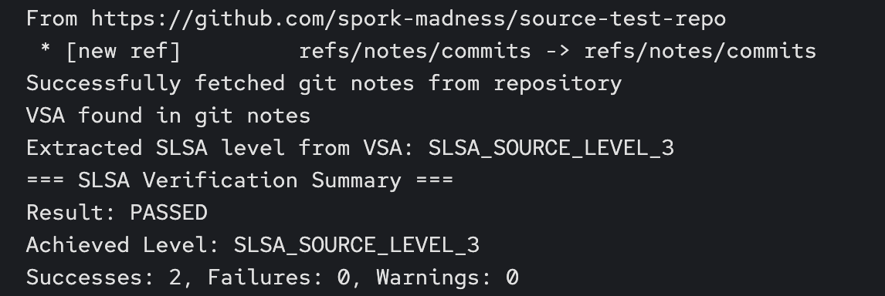

name: inverse
layout: true
class: center, middle, inverse

---

class: center, middle, title-slide

# 1-2-Step

## How do you SLSA?

Andrew McNamara; Red Hat, SLSA maintainer


.footnote[
  NC Cybersecurity Symposium 2026
]

???

SLSA rhymes with "salsa" — and today we're going to learn a two-step dance that will help you implement SLSA in a practical way. By the end of this talk, you'll understand how to automatically capture unforgeable proof about your software and enforce policies to block non-compliant artifacts.

---

layout: false
class: center, middle

## The Problem

Scanning for vulnerabilities isn't enough.

If you lack proof of a verified chain of custody,

your pipeline is flying blind.

???

Most organizations invest heavily in vulnerability scanning, but that only tells you *what* vulnerabilities exist. It doesn't tell you *who* built your artifact, *how* it was built, or *what source* it actually came from. Without provenance, you're trusting blind faith that the artifact in front of you is what you think it is.

---

class: center, middle, inverse

# Act 1: SLSA Theory

---

layout: false

## Supply Chain Threats

<div style="text-align: center;">

</div>

.footnote[slsa.dev/spec/v1.2/threats-overview]

???

The SLSA framework identifies nine categories of supply chain threats, labeled A through I. These attacks can happen at every link in the chain — from the source repository where developers commit code, through the build system that compiles it, to the distribution mechanism that delivers it to consumers. SLSA breaks this complex problem into independent tracks, each addressing specific threat categories. This diagram shows where each threat can manifest in your supply chain.

---

## What is SLSA?

**Supply-chain Levels for Software Artifacts**

- A security **framework**, not a tool
- Graduated levels of assurance within independent tracks
- Focuses on **evidence gathering** about observed behaviors
- Does NOT reason about what's good or bad — that's for policy


???

SLSA is a framework that gives you a structured way to think about supply chain security. It's not a single tool you install — it's a set of requirements organized into tracks and levels. The key insight is that SLSA focuses on gathering *evidence* about what actually happened, not making decisions about whether that's acceptable. That separation is crucial: SLSA tells you "this build ran in isolation with these parameters from this source," and your policy engine decides whether that's good enough.

---

## SLSA 1.2: What's New

SLSA 1.0/1.1 introduced the **Build track**.

SLSA 1.2 adds the **Source track**.

Tracks are **independent** — adopt incrementally.

<table style="margin-top: 2em; width: 100%;">
  <tr>
    <th>Track</th>
    <th>Status</th>
    <th>Focus</th>
  </tr>
  <tr>
    <td><strong>Build</strong></td>
    <td>Stable (v1.0)</td>
    <td>How was it built?</td>
  </tr>
  <tr>
    <td><strong>Source</strong></td>
    <td>New in v1.2</td>
    <td>Where did the code come from?</td>
  </tr>
</table>

???

The Build track has been stable since SLSA 1.0 and focuses on the integrity of the build process itself. The Source track is brand new in SLSA 1.2 and addresses a different set of concerns: proving that your source code comes from a properly controlled repository with appropriate change management practices. Because tracks are independent, you can achieve Build L3 without implementing any Source track requirements, or vice versa. This modularity makes SLSA practical to adopt incrementally.

---

## Build Track Recap

<table style="margin-top: 2em; width: 100%;">
  <tr>
    <th>Level</th>
    <th>Requirements</th>
  </tr>
  <tr>
    <td><strong>L1</strong></td>
    <td>Provenance exists</td>
  </tr>
  <tr>
    <td><strong>L2</strong></td>
    <td>Signed provenance from hosted build service</td>
  </tr>
  <tr>
    <td><strong>L3</strong></td>
    <td>Hardened builds — isolation between runs, signing keys inaccessible to the build</td>
  </tr>
</table>

**Key principle**: Provenance is an accurate representation of what the build platform *observed*.

???

Build L1 just requires that provenance exists in some form. L2 adds cryptographic signing and requires that the build run on a hosted service rather than someone's laptop. L3 is where it gets interesting: builds must be isolated from each other, and crucially, the build process itself cannot access the signing keys. This "observer pattern" ensures that provenance reflects what actually happened, not what a compromised build script claims happened. We'll see this pattern in action later when we look at Tekton Chains.

---

## Source Track Deep Dive

<table style="margin-top: 1em; width: 100%; font-size: 0.9em;">
  <tr>
    <th>Level</th>
    <th>Requirements</th>
  </tr>
  <tr>
    <td><strong>L1</strong></td>
    <td>Version controlled (modern VCS, discrete revisions, uniquely identifiable)</td>
  </tr>
  <tr>
    <td><strong>L2</strong></td>
    <td>History & provenance (continuous immutable history, source provenance attestations, identity management)</td>
  </tr>
  <tr>
    <td><strong>L3</strong></td>
    <td>Continuous technical controls (enforceable policies on protected references, organization must provide evidence of continuous enforcement)</td>
  </tr>
  <tr>
    <td><strong>L4</strong></td>
    <td>Two-party review (all changes require 2+ trusted persons)</td>
  </tr>
</table>

**Key distinction**: Not enough to *configure* branch protection; you need *evidence that it was active*.

???

The Source track focuses on the integrity of your source control management. L1 is straightforward — use Git or another modern VCS. L2 requires immutable history and starts requiring attestations that prove where commits came from. L3 is where many organizations struggle: it's not enough to have branch protection rules configured in GitHub. You need to prove that those rules were actually enforced when the specific revision you're building was created. L4 adds the requirement for two-party review — no single person can push code unilaterally. This maps directly to threats A and B from our earlier diagram.

---

## Source Tool

`slsa-framework/source-tool` — proof-of-concept SLSA tool for generating source track attestations.

- Generates source provenance attestations recording revision creation context
- Works with `source-actions` (GitHub Actions integration)
- Works with `source-policies` (repository policy definitions)
- Produces the Source track evidence we'll verify later

???

The source-tool is the a proof-of-concept implementation from the SLSA framework team for generating source provenance attestations. It runs during your CI workflow and records evidence about how a particular commit was created — was it pushed directly, or did it go through a pull request? Were branch protection rules active? Who approved the change? This evidence is what allows you to prove Source track compliance. We'll see how this integrates into a build pipeline shortly.

---

## Threats Revisited

<div style="text-align: center;">

</div>


???

Now that we understand both tracks, let's revisit the threat model. The Source track addresses threats A, B, and C — ensuring source code integrity and proper source control management. The Build track covers D, E, and F — ensuring build parameters weren't tampered with, the build process is trustworthy, and publication happened correctly. Distribution threats are addressed by consumer verification using VSAs, which we'll discuss later. SLSA explicitly does not address deployment and runtime threats — those require different tools and techniques.

---

class: center, middle

## Evidence vs. Reasoning

SLSA tracks answer: **"What happened?"**

They do NOT answer: **"Was that good enough?"**

<div style="margin-top: 3em; font-size: 1.2em;">
  <code>[SLSA Tracks] → [Attestations] → [Policy Engine] → [Decision]</code>
</div>

???

This is the conceptual core of SLSA. The tracks produce attestations — cryptographically signed statements about what happened. But attestations alone don't make decisions. You need a policy engine to evaluate the evidence and decide whether it meets your requirements. This separation of concerns is what makes SLSA practical: you can change your policy without changing your build infrastructure, and you can upgrade your build infrastructure without rewriting policy.

---

class: center, middle, inverse

# The 1-2-Step

**Step 1: Attest** — Automatically capture unforgeable proof of Source and Build

**Step 2: Enforce** — Use policy-as-code to block non-compliant artifacts before publication

???

This is our framework for implementing SLSA. Step 1 is all about evidence gathering — using tools like source-tool and Tekton Chains to automatically produce attestations without requiring developers to do anything special. Step 2 is about enforcement — using a policy engine to evaluate that evidence and make decisions about whether to release or block an artifact. Questions before we move on to the practical implementation?

---

class: center, middle, inverse

# Act 2: From Theory to Implementation

---

layout: false

## Architecture Overview

<div style="display: flex; flex-direction: column; gap: 1em; margin-top: 1em;">
  <div style="display: flex; align-items: center; justify-content: space-around;">
    <div style="text-align: center;">
      <br>
      <small>Developer commits</small>
    </div>
    <div style="font-size: 2em;">→</div>
    <div style="text-align: center;">
      <br>
      <small>Source verification</small><br>
      <small>(source-tool)</small>
    </div>
    <div style="font-size: 2em;">→</div>
    <div style="text-align: center;">
      <br>
      <small>Build Pipeline</small>
    </div>
  </div>
  <div style="display: flex; align-items: center; justify-content: space-around;">
    <div style="text-align: center;">
      <br>
      <small>Chains (observer)</small><br>
      <small>produces attestations</small>
    </div>
    <div style="font-size: 2em;">→</div>
    <div style="text-align: center;">
      <br>
      <small>Policy engine</small><br>
      <small>(Conforma)</small>
    </div>
    <div style="font-size: 2em;">→</div>
    <div style="text-align: center;">
      <br>
      <small>Release or Block</small>
    </div>
  </div>
</div>

???

Here's the end-to-end architecture we'll be implementing. A developer commits code to GitHub. The source-tool verifies the commit meets Source track requirements and produces an attestation. A Tekton pipeline builds the artifact. Tekton Chains watches the completed build and automatically generates SLSA provenance. That provenance, along with the source attestation, flows to Conforma, our policy engine, which evaluates everything against policy rules. Based on that evaluation, the artifact is either released to the OCI registry or blocked.

---

## Tekton Chains: The Observer


<div style="text-align: center;">

</div>

- Chains watches completed PipelineRuns
- Generates SLSA provenance automatically
- Signs with keys in a separate namespace (control plane signing)
- **The build never touches signing material** — this is Build L3

???

Tekton Chains implements the observer pattern we discussed earlier. It runs as a separate controller watching for completed PipelineRuns. When a build finishes, Chains examines the TaskRun metadata and results, constructs SLSA provenance, and signs it using keys stored in a completely separate namespace. The build process never has access to those keys. This architectural separation is what gives us Build L3: even if a build is compromised, it can't forge provenance because it never touches the signing material.

---

## Chains Signs Anything

**The problem**: Chains observes and signs what tasks *claim* — it doesn't verify claims.

A malicious task could:
- Claim to build from a trusted source
- Actually pull something else
- Provenance would be cryptographically valid but semantically wrong

**The solution**: Verify that tasks themselves are trustworthy.

???

Here's a critical limitation of the observer pattern. Chains faithfully records what tasks report, but it doesn't verify those reports are truthful. A malicious task could claim "I built from commit abc123 in the trusted repo" while actually pulling code from somewhere else entirely. The resulting provenance would have a valid signature, but the content would be lies. This is why we need the concept of trusted tasks.

---

## Trusted Tasks & Trusted Artifacts

<div style="display: flex; gap: 2em; margin-top: 2em;">
  <div style="flex: 1; border: 2px solid #4A90E2; padding: 1em; border-radius: 8px;">
    <h3 style="margin-top: 0;">Trusted Tasks</h3>
    <ul style="font-size: 0.9em;">
      <li>Digest-pinned task bundles from approved list</li>
      <li>Required tasks must be trusted</li>
      <li>Policy verifies the chain</li>
    </ul>
  </div>
  <div style="flex: 1; border: 2px solid #7CB342; padding: 1em; border-radius: 8px;">
    <h3 style="margin-top: 0;">Trusted Artifacts</h3>
    <ul style="font-size: 0.9em;">
      <li>Shared immutable OCI artifacts</li>
      <li>Content-addressable</li>
      <li>Explicit chaining between tasks</li>
    </ul>
  </div>
</div>

**Key advantage**: Developers can customize pipelines without affecting trust guarantees.

???

Trusted tasks are tasks that are pinned by digest to specific approved implementations. We maintain an allowlist of trusted task bundles, and policy requires that certain critical tasks — like source verification or image building — must use trusted implementations. Trusted artifacts solve a different problem: instead of passing data between tasks via shared mutable PersistentVolumeClaims, we push and pull immutable OCI artifacts. This gives us content-addressable storage and explicit provenance chains. Together, these two concepts let developers customize non-critical parts of their pipelines while maintaining trust guarantees for the parts that matter.

---

## Source Verification in the Build Pipeline

- Source verification runs as a task in the build pipeline using source-tool
- Because it's a trusted task, its results in the provenance are trustworthy

???

Source verification isn't a separate pre-build step — it runs as a task within the Tekton pipeline itself. The source-tool task is listed in our required tasks configuration, and it's pinned to a trusted task bundle. When Chains generates provenance, it includes the results from the source verification task. Our policy engine can then trust those results because it verifies that the task came from the approved trusted task list. This integration is what gives us end-to-end trust from source to build.

---

## Trust Boundaries

<div style="display: flex; gap: 2em; margin-top: 2em;">
  <div style="flex: 1; border: 2px solid #E57373; padding: 1em; border-radius: 8px;">
    <h3 style="margin-top: 0;">Tenant Context</h3>
    <ul style="font-size: 0.9em;">
      <li>Developer-controlled</li>
      <li>Unprivileged</li>
      <li>Builds run here</li>
    </ul>
  </div>
  <div style="flex: 1; border: 2px solid #81C784; padding: 1em; border-radius: 8px;">
    <h3 style="margin-top: 0;">Managed Context</h3>
    <ul style="font-size: 0.9em;">
      <li>Platform-controlled</li>
      <li>Privileged</li>
      <li>Release pipelines</li>
      <li>Policy evaluation + VSA generation</li>
    </ul>
  </div>
</div>

<div style="text-align: center; margin-top: 2em; font-size: 1.2em;">
  <strong>Build (tenant)</strong> → <strong>Release pipeline (managed)</strong> → <strong>Published artifact</strong>
</div>

???

Trust boundaries are critical to our architecture. The tenant context is where developers work — they have their own namespaces, they can customize pipelines, but they don't have access to signing keys or privileged operations. Builds run here, and Chains signs the provenance. The managed context is platform-controlled. This is where release pipelines run, where policy evaluation happens, and where we have keys to sign VSAs. Artifacts flow from tenant to managed via snapshots, and only the managed context can publish to production registries.

---

## Policy Evaluation: Conforma


- Policy-as-code engine (Rego-based)
- Evaluates attestations against defined policy rules
- Checks: trusted tasks, required tasks, hermetic build, allowed registries, etc.
- Runs in the managed context (privileged namespace)
- Produces structured pass/fail — **this is Step 2: Enforce**
- **Must** pass for the release to progress


???

Conforma is our policy engine — it takes attestations as input and evaluates them against Rego policy rules. It checks things like: were all required tasks present? Were they from trusted bundles? Was the build hermetic? Did the image get pushed to an allowed registry? Because Conforma runs in the managed context, developers can't bypass it. This is Step 2 of our 1-2-Step framework: enforcement. We'll be doing a deep dive on Conforma at Open Source SecurityCon in March if you want more details.

---

## The VSA

**Verification Summary Attestation** summarizes policy evaluation results.

- States which SLSA levels were achieved (source + build)
- Signed by managed context (separate key from build attestations)
- Published alongside the artifact in OCI registry
- Consumers verify the VSA instead of re-running verification

<!-- FALLBACK START
If VSA tooling isn't complete at presentation time, note that:
- VSA generation is a roadmap item
- Current implementation focuses on policy evaluation and blocking
- Consumers currently re-verify attestations directly
FALLBACK END -->

???

The Verification Summary Attestation is the final piece. After Conforma evaluates all the attestations and determines that an artifact passes policy, it generates a VSA. The VSA is a signed statement saying "I verified these attestations against policy, and this artifact achieves SLSA Build L3 and Source L2." The VSA is signed with a different key than the build attestations — this separation proves that an independent verifier checked everything. Consumers can then just verify the VSA signature instead of re-running the entire verification process themselves. Questions before we see it in action?

---

class: center, middle, inverse

# Act 3: See It Work

Screen captures from a working Tekton-based software factory


---

layout: false

## Build Provenance Output


Key fields:
- `predicateType`: `https://slsa.dev/provenance/v1`
- `buildType`: `https://tekton.dev/chains/v2`
- `builder.id`: The Tekton Chains instance
- `materials`: Source commit information

???

Here's the SLSA provenance that Tekton Chains generates. The predicateType tells us this is SLSA provenance v1. The buildType indicates it came from Tekton. The builder.id identifies the specific Chains instance that observed and signed this build. And the materials section shows exactly which source commits were used. This is the unforgeable evidence we talked about earlier — cryptographically signed by the build platform's observer.

---

## Provenance Details: Tasks


The `buildConfig.tasks` section shows:
- Each task that ran
- Its bundle reference (pinned by digest)
- Task results

**This is what Conforma uses to verify the right tasks ran from the right bundles.**

???

Drilling into the buildConfig section, we see every task that ran in this pipeline. Each task has its bundle reference pinned by digest — this is crucial for trusted task verification. We also see the results that each task produced. When Conforma evaluates this provenance, it checks that required tasks are present and that they came from approved trusted bundles. This task-level detail is what gives us confidence that the build was trustworthy.

---

## Source Verification Evidence



<!-- FALLBACK START
Source verification implementation is in progress. The policy already requires it:

```yaml
# required_tasks.yml
required_tasks:
  - name: verify-source
    bundle: quay.io/konflux-ci/tekton-catalog/task-verify-source@sha256:...
```

The source-tool task will produce attestations showing:
- Commit SHA and repository
- Branch protection status
- Review requirements met
- Identity of committer/approver

FALLBACK END -->

???

This shows the output from the source verification task. The source-tool runs within the pipeline and produces attestations about the source commit. It records whether branch protection was active, whether review requirements were met, and the identities involved. Because this task is in our trusted task list, we can trust these results when they appear in the provenance. This is how we achieve Source track compliance within the build pipeline itself.

---

## Policy Evaluation: Pass


All policy rules passed:
- Trusted tasks verified
- Required tasks present
- Build provenance validated
- Image pushed to allowed registry

???

Here's what success looks like in Conforma. We see a structured evaluation showing every policy rule that was checked. Trusted tasks were verified against the allowlist. Required tasks were present. The build provenance signature validated. The image was pushed to an allowed registry. Because all rules passed, this artifact is eligible for release. This is Step 2 — Enforce — in action.

---

## Policy Evaluation: Fail


Policy violation detected:
- Specific rule that failed
- Clear message explaining why
- Artifact blocked from publication

**This is Step 2 in action: Enforce**

???

And here's what failure looks like. Conforma detected that a required task was missing from the provenance. It provides a clear message explaining which rule failed and why. Based on this failure, the release pipeline blocks publication of this artifact. This is the enforcement step preventing non-compliant artifacts from reaching production. The developer gets immediate feedback about what they need to fix.

---

## VSA Output


<!-- FALLBACK START
Representative VSA structure:

```json
{
  "_type": "https://in-toto.io/Statement/v1",
  "predicateType": "https://slsa.dev/verification_summary/v1",
  "subject": [{
    "uri": "quay.io/example/image",
    "digest": {"sha256": "abc123..."}
  }],
  "predicate": {
    "verifier": {"id": "https://conforma.example.com/verifier"},
    "timeVerified": "2026-02-19T10:00:00Z",
    "resourceUri": "git+https://github.com/example/repo",
    "policy": {"uri": "https://example.com/release-policy"},
    "verificationResult": "PASSED",
    "verifiedLevels": ["SLSA_BUILD_LEVEL_3", "SLSA_SOURCE_LEVEL_2"]
  }
}
```

The verifier signs this with its own key, separate from build keys.
FALLBACK END -->

???

The VSA is the final output from our managed context. It's a signed attestation that summarizes the verification results. The predicate type identifies this as a SLSA verification summary. The verifier field identifies the Conforma instance that performed verification. The policy field references the specific policy that was evaluated. And the verificationResult tells consumers: this artifact passed. The verifiedLevels array shows both Build L3 and Source L2 were achieved. This VSA is signed with a key that only exists in the managed context, proving that an independent verifier checked everything.

---

## Consumer Verification

How a downstream consumer verifies:

1. Download artifact from registry
2. Discover attestations attached to the artifact
3. Verify VSA signature
4. Check VSA claims match requirements

```bash
cosign verify-attestation \
  --type=https://slsa.dev/verification_summary/v1 \
  --certificate-identity=... \
  --certificate-oidc-issuer=... \
  quay.io/example/image@sha256:...
```

**The VSA abstracts away internal details** — consumers don't need to know about your pipeline internals.

???

From a consumer's perspective, verification becomes straightforward. They pull the artifact, discover the attached attestations, and verify the VSA signature. The VSA tells them what SLSA levels were achieved without requiring them to understand your internal pipeline structure, your task definitions, or your policy rules. This abstraction is powerful — you can change your internal implementation while maintaining the same verification interface for consumers.

---

class: center, middle, inverse

# The 1-2-Step in Action

**Step 1: Attest** — Tekton Chains + source-tool produced unforgeable evidence

**Step 2: Enforce** — Conforma evaluated evidence against policy and blocked or released

---

layout: false

## Key Takeaways

- **SLSA 1.2 adds the Source track** — implement tracks independently
- **Tracks produce evidence**, policy engines make decisions
- **Observer pattern** (Tekton Chains) gives Build L3 without changing dev workflows
- **Trust boundaries** (tenant vs. managed) isolate concerns
- **VSAs** let consumers verify without re-evaluating
- **Trusted tasks + trusted artifacts** = customizable pipelines with trust guarantees

**Tease**: "From Mild to Wild: Policy Enforcement in the Software Supply Chain"
- Open Source SecurityCon, March 2026
- Deep dive on Conforma and advanced policy patterns

???

Let's recap. SLSA 1.2 gives us both Build and Source tracks, and you can implement them independently. The key insight is separating evidence gathering from decision making. Tekton Chains gives us Build L3 using an observer pattern that doesn't require developers to change how they work. Trust boundaries between tenant and managed contexts let us isolate concerns. VSAs abstract verification for consumers. And the combination of trusted tasks and trusted artifacts gives us flexibility without sacrificing trust. If you want to go deeper on policy enforcement, join us at Open Source SecurityCon in March.

---

## Resources

**Links**:
- SLSA Framework: [slsa.dev](https://slsa.dev)
- Conforma Policy Engine: [conforma.dev](https://conforma.dev)
- Konflux Software Factory: [konflux-ci.dev](https://konflux-ci.dev)
- Source Tool: [github.com/slsa-framework/source-tool](https://github.com/slsa-framework/source-tool)
- Example Implementation: [github.com/arewm/slsa-konflux-example](https://github.com/arewm/slsa-konflux-example)

<div style="display: flex; justify-content: space-around; margin-top: 2em;">
  <div style="text-align: center;">
    <br>
    <small>slsa.dev</small>
  </div>
  <div style="text-align: center;">
    <br>
    <small>konflux-ci.dev</small>
  </div>
  <div style="text-align: center;">
    <br>
    <small>conforma.dev</small>
  </div>
</div>

???

The SLSA spec and source-tool repo are the best starting points if you want to implement this yourself. The slsa-konflux-example repo has a complete working configuration you can fork and adapt. And Conforma and Konflux are both open source projects you can try today.

---

class: center, middle, inverse

# Thank You

 **@arewm**

**arewm@redhat.com**

???

Thank you for your time. I'm happy to take any remaining questions now, or feel free to reach out afterward on GitHub or email. The slides will be available at the URL on the resources slide.

---

layout: false

## Appendix A1: AMPEL for Source Provenance

**Alternative if Conforma doesn't yet support source attestation evaluation**

AMPEL (Attestation Metadata Policy Engine Language):
- Specialized policy engine for source track attestations
- Evaluates source-tool output against repository policy definitions
- Produces verification results that feed into VSA generation

More detail coming at Open Source SecurityCon.

???

If Conforma doesn't yet support evaluating source track attestations by the time we implement this, AMPEL is an alternative. It's a specialized policy engine designed specifically for source attestations. It consumes the output from source-tool and evaluates it against repository policy definitions to determine Source track level compliance. The results can then feed into the overall VSA generation process.

---

## Appendix A2: Hermetic Builds

**What are hermetic builds?**

- All dependencies fetched at known versions
- No network access during build (only from local cache)
- Reproducible builds from the same inputs
- Critical for SBOM accuracy

**Hermeto**: Tool for enforcing hermetic build practices in containerized builds.

???

Hermetic builds are builds where all dependencies are pinned to specific versions and fetched before the build starts. During the actual compilation, there's no network access — everything comes from a local cache. This ensures that builds are reproducible and that your SBOM accurately reflects what was actually used. Hermeto is a tool we've developed for enforcing hermetic build practices in containerized build environments.

---

## Appendix A3: Policy Configuration Details

**required_tasks.yml**:

```yaml
required_tasks:
  - name: verify-source
    bundle: quay.io/konflux-ci/tekton-catalog/task-verify-source@sha256:abc123...
  - name: build-container
    bundle: quay.io/konflux-ci/tekton-catalog/task-buildah@sha256:def456...
```

**rule_data.yml**:

```yaml
trusted_tasks:
  - ref: quay.io/konflux-ci/tekton-catalog/task-verify-source@sha256:abc123...
  - ref: quay.io/konflux-ci/tekton-catalog/task-buildah@sha256:def456...
  - ref: quay.io/konflux-ci/tekton-catalog/task-scan-image@sha256:789abc...

allowed_registries:
  - quay.io/myorg/
  - ghcr.io/myorg/
```

???

Here's what the policy configuration looks like in practice. The required_tasks.yml file lists tasks that must be present in the provenance, pinned to specific digest-based bundle references. The rule_data.yml file contains the trusted task allowlist — the complete set of task bundles that are approved for use. It also defines other policy data like allowed destination registries. Conforma loads these configurations and uses them to evaluate attestations.
