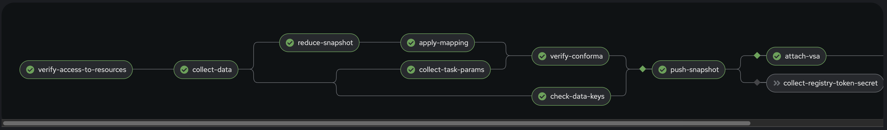
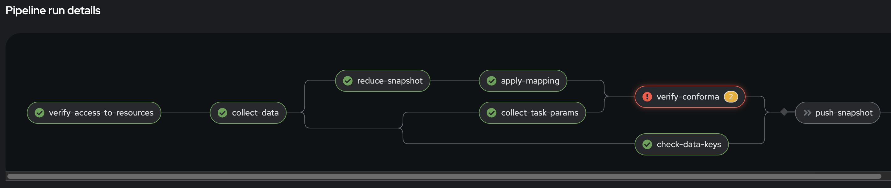
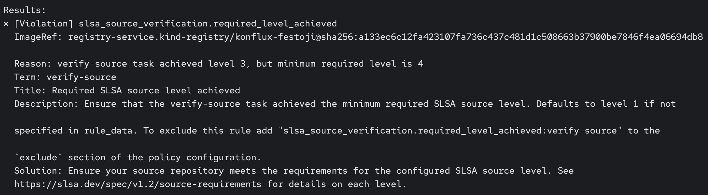
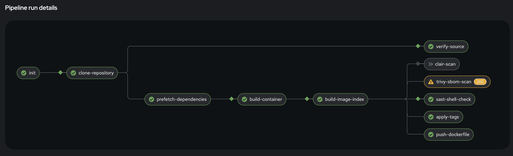

name: inverse
layout: true
class: center, middle, inverse

---

class: center, middle, title-slide

# 1-2-Step

## How do you SLSA?

Andrew McNamara; Red Hat, SLSA maintainer


.footnote[
  NC Cybersecurity Symposium 2026
]

???

SLSA rhymes with "salsa" — and today we're going to learn a two-step dance that will help you implement SLSA in a practical way. By the end of this talk, you'll understand how to automatically capture unforgeable proof about your software and enforce policies to block non-compliant artifacts.

---

layout: false
class: center, middle

## The Problem

Scanning for vulnerabilities isn't enough.

If you lack proof of a verified chain of custody,

your pipeline is flying blind.

???

Most organizations invest heavily in vulnerability scanning, but scanners are not a panacea. Zero-day vulnerabilities go undetected by definition, and scanners can only find what they know about. More fundamentally, scanning doesn't tell you *who* built your artifact, *how* it was built, or *what source* it actually came from. Without provenance, you have no proof that a build hasn't been tampered with. A compromised build system could inject malicious code that no scanner would flag because it's not a known vulnerability. Without a verified chain of custody, you're trusting blind faith that the artifact in front of you is what you think it is.

---

class: center, middle, inverse

# Act 1: SLSA Theory

---

layout: false

## Supply Chain Threats

<div style="text-align: center;">

</div>

.footnote[slsa.dev/spec/v1.2/threats-overview]

???

The SLSA framework identifies nine categories of supply chain threats, labeled A through I. These attacks can happen at every link in the chain — from the source repository where developers commit code, through the build system that compiles it, to the distribution mechanism that delivers it to consumers. SLSA breaks this complex problem into independent tracks, each addressing specific threat categories. This diagram shows where each threat can manifest in your supply chain.

---

## What is SLSA?

**Supply-chain Levels for Software Artifacts**

- A security **framework**, not a tool
- Graduated levels of assurance within independent tracks
- Focuses on **evidence gathering** about observed behaviors
- Does NOT reason about what's good or bad — that's for policy


???

SLSA is a framework that gives you a structured way to think about supply chain security. It's not a single tool you install — it's a set of requirements organized into tracks and levels. The key insight is that SLSA focuses on gathering *evidence* about what actually happened, not making decisions about whether that's acceptable. That separation is crucial: SLSA tells you "this build ran in isolation with these parameters from this source," and your policy engine decides whether that's good enough.

---

## SLSA 1.2: What's New

SLSA 1.0/1.1 introduced the **Build track**.

SLSA 1.2 adds the **Source track**.

Tracks are **independent** — adopt incrementally.

<table style="margin-top: 2em; width: 100%;">
  <tr>
    <th>Track</th>
    <th>Status</th>
    <th>Focus</th>
  </tr>
  <tr>
    <td><strong>Build</strong></td>
    <td>Stable (v1.0)</td>
    <td>How was it built?</td>
  </tr>
  <tr>
    <td><strong>Source</strong></td>
    <td>New in v1.2</td>
    <td>Where did the code come from?</td>
  </tr>
</table>

???

The Build track has been stable since SLSA 1.0 and focuses on the integrity of the build process itself. The Source track is brand new in SLSA 1.2 and addresses a different set of concerns: proving that your source code comes from a properly controlled repository with appropriate change management practices. Because tracks are independent, you can achieve Build L3 without implementing any Source track requirements, or vice versa. This modularity makes SLSA practical to adopt incrementally. However, there's an open question the spec doesn't fully address: how do you link the tracks together? The Build track proves *how* something was built, and the Source track proves *where* the code came from, but connecting those two statements for a given artifact is left to the implementation. We'll see how our implementation handles that connection later.

---

## Build Track Recap

<table style="margin-top: 2em; width: 100%;">
  <tr>
    <th>Level</th>
    <th>Requirements</th>
  </tr>
  <tr>
    <td><strong>L1</strong></td>
    <td>Provenance exists</td>
  </tr>
  <tr>
    <td><strong>L2</strong></td>
    <td>Signed provenance from hosted build service</td>
  </tr>
  <tr>
    <td><strong>L3</strong></td>
    <td>Hardened builds — isolation between runs, signing keys inaccessible to the build</td>
  </tr>
</table>

**Key principle**: Provenance is an accurate representation of what the build platform *observed*.

???

Build L1 just requires that provenance exists in some form. L2 adds cryptographic signing and requires that the build run on a hosted service rather than someone's laptop. L3 is where it gets interesting: builds must be isolated from each other, and crucially, the build process itself cannot access the signing keys. This "observer pattern" ensures that provenance reflects what actually happened, not what a compromised build script claims happened. We'll see this pattern in action later when we look at Tekton Chains.

---

## Source Track Deep Dive

<table style="margin-top: 1em; width: 100%; font-size: 0.9em;">
  <tr>
    <th>Level</th>
    <th>Requirements</th>
  </tr>
  <tr>
    <td><strong>L1</strong></td>
    <td>Version controlled (modern VCS, discrete revisions, uniquely identifiable)</td>
  </tr>
  <tr>
    <td><strong>L2</strong></td>
    <td>History & provenance (continuous immutable history, source provenance attestations, identity management)</td>
  </tr>
  <tr>
    <td><strong>L3</strong></td>
    <td>Continuous technical controls (enforceable policies on protected references, organization must provide evidence of continuous enforcement)</td>
  </tr>
  <tr>
    <td><strong>L4</strong></td>
    <td>Two-party review (all changes require 2+ trusted persons)</td>
  </tr>
</table>

**Key distinction**: Not enough to *configure* branch protection; you need *evidence that it was active*.

???

The Source track focuses on the integrity of your source control management. L1 is straightforward — use Git or another modern VCS. L2 requires immutable history and starts requiring attestations that prove where commits came from. L3 is where many organizations struggle: it's not enough to have branch protection rules configured in GitHub. You need to prove that those rules were actually enforced when the specific revision you're building was created. L4 adds the requirement for two-party review — no single person can push code unilaterally. This maps directly to threats A and B from our earlier diagram.

---

## Source Provenance Tools

`slsa-framework/source-tool` — generates source track attestations.

- Records revision creation context (branch protection, reviews, identities)
- Works with `source-actions` (GitHub Actions) and `source-policies`
- Produces the Source track evidence we'll verify later

`gittuf/gittuf` — embeds trust policies directly in the repository.

- Uses TUF (The Update Framework) for delegated trust
- Policy-as-code within the repo itself

???

Two active projects address source provenance. The source-tool is a proof-of-concept from the SLSA framework team. It runs during your CI workflow and records evidence about how a commit was created: was it pushed directly, or did it go through a pull request? Were branch protection rules active? gittuf takes a different approach by embedding trust policies directly into the Git repository using TUF, so the trust model travels with the code. We'll use source-tool in our demo, but both are active projects worth watching in this space.

---

## Threats Revisited

<div style="text-align: center;">

</div>


???

Now that we understand both tracks, let's revisit the threat model. The Source track addresses threats A, B, and C — ensuring source code integrity and proper source control management. The Build track covers D, E, and F — ensuring build parameters weren't tampered with, the build process is trustworthy, and publication happened correctly. Distribution threats are addressed by consumer verification, which we'll discuss later. SLSA explicitly does not address deployment and runtime threats — those require different tools and techniques.

---

class: center, middle

## Evidence vs. Reasoning

SLSA tracks answer: **"What happened?"**

They do NOT answer: **"Was that good enough?"**

<div style="margin-top: 3em; font-size: 1.2em;">
  <code>[SLSA Tracks] → [Attestations] → [Policy Engine] → [Decision]</code>
</div>

???

This is the conceptual core of SLSA. The tracks produce attestations — cryptographically signed statements about what happened. But attestations alone don't make decisions. You need a policy engine to evaluate the evidence and decide whether it meets your requirements. This separation of concerns is what makes SLSA practical: you can change your policy without changing your build infrastructure, and you can upgrade your build infrastructure without rewriting policy.

One thing the spec does not yet address: how to combine tracks. The Build track proves how an artifact was built; the Source track proves where the code came from — but there is no guidance on how to link those two statements together for a given artifact. That gap is exactly what our implementation addresses, and it sets up the 1-2-Step.

---

class: center, middle, inverse

# The 1-2-Step

**Step 1: Attest** — Automatically capture unforgeable proof of Source and Build

**Step 2: Enforce** — Use policy-as-code to block non-compliant artifacts before publication

???

This is our framework for implementing SLSA. Step 1 is all about evidence gathering — using tools like source-tool and Tekton Chains to automatically produce attestations without requiring developers to do anything special. Step 2 is about enforcement — using a policy engine to evaluate that evidence and make decisions about whether to release or block an artifact. Questions before we move on to the practical implementation?

---

class: center, middle, inverse

# Act 2: From Theory to Implementation

---

layout: false

## Architecture Overview

<div style="display: flex; flex-direction: column; gap: 1em; margin-top: 1em;">
  <div style="display: flex; align-items: center; justify-content: space-around;">
    <div style="text-align: center;">
      <br>
      <small>Developer commits</small>
    </div>
    <div style="font-size: 2em;">→</div>
    <div style="text-align: center;">
      <br>
      <small>Source verification</small><br>
      <small>(source-tool)</small>
    </div>
    <div style="font-size: 2em;">→</div>
    <div style="text-align: center;">
      <br>
      <small>Build Pipeline</small>
    </div>
  </div>
  <div style="display: flex; align-items: center; justify-content: space-around;">
    <div style="text-align: center;">
      <br>
      <small>Chains (observer)</small><br>
      <small>produces attestations</small>
    </div>
    <div style="font-size: 2em;">→</div>
    <div style="text-align: center;">
      <br>
      <small>Policy engine</small><br>
      <small>(Conforma)</small>
    </div>
    <div style="font-size: 2em;">→</div>
    <div style="text-align: center;">
      <br>
      <small>Release or Block</small>
    </div>
  </div>
</div>

???

Here's the end-to-end architecture we'll be implementing. A developer commits code to GitHub. The source-tool verifies the commit meets Source track requirements and produces an attestation. A Tekton pipeline builds the artifact. Tekton Chains watches the completed build and automatically generates SLSA provenance. Conforma, our policy engine, consumes that provenance along with the source attestation to evaluate everything against policy rules. Based on that evaluation, the artifact is either released to the OCI registry or blocked.

---

## Tekton Chains: The Observer


<div style="text-align: center;">

</div>

- Chains watches completed PipelineRuns
- Generates SLSA provenance automatically
- Signs with keys in a separate namespace (control plane signing)
- **The build never touches signing material** — this is Build L3

???

Tekton Chains implements the observer pattern we discussed earlier. It runs as a separate controller watching for completed PipelineRuns. When a build finishes, Chains examines the TaskRun metadata and results, constructs SLSA provenance, and signs it using keys stored in a completely separate namespace. The build process never has access to those keys. This architectural separation is what gives us Build L3: even if a build is compromised, it can't forge provenance because it never touches the signing material.

---

## Chains Signs Anything

**The problem**: Chains observes and signs what tasks *claim* — it doesn't verify claims.

A malicious task could:
- Claim to build from a trusted source
- Actually pull something else
- Provenance would be cryptographically valid but semantically wrong

**The solution**: Verify that tasks themselves are trustworthy.

???

Here's a critical limitation of the observer pattern. Chains faithfully records what tasks report, but it doesn't verify those reports are truthful. A malicious task could claim "I built from commit abc123 in the trusted repo" while actually pulling code from somewhere else entirely. The resulting provenance would have a valid signature, but the content would be lies. This is why we need the concept of trusted tasks.

---

## Trusted Tasks & Trusted Artifacts

<div style="display: flex; gap: 2em; margin-top: 2em;">
  <div style="flex: 1; border: 2px solid #4A90E2; padding: 1em; border-radius: 8px;">
    <h3 style="margin-top: 0;">Trusted Tasks</h3>
    <ul style="font-size: 0.9em;">
      <li>Digest-pinned task bundles from approved list</li>
      <li>Policy verifies the chain</li>
    </ul>
  </div>
  <div style="flex: 1; border: 2px solid #7CB342; padding: 1em; border-radius: 8px;">
    <h3 style="margin-top: 0;">Trusted Artifacts</h3>
    <ul style="font-size: 0.9em;">
      <li>Shared immutable OCI artifacts</li>
      <li>Content-addressable</li>
      <li>Explicit chaining between tasks</li>
    </ul>
  </div>
</div>

**Key advantage**: Developers can customize pipelines without affecting trust guarantees.

???

Trusted tasks are tasks that are pinned by digest to specific approved implementations. We maintain an allowlist of trusted task bundles, and policy requires that certain critical tasks — like source verification or image building — must use trusted implementations. Trusted artifacts solve a different problem: instead of passing data between tasks via shared mutable PersistentVolumeClaims, we push and pull immutable OCI artifacts. This gives us content-addressable storage and explicit provenance chains. Together, these two concepts let developers customize non-critical parts of their pipelines while maintaining trust guarantees for the parts that matter.

---

## Source Verification in the Build Pipeline

- Source verification runs as a task in the build pipeline using source-tool
- Because it's a trusted task, its results in the provenance are trustworthy

???

Source verification isn't a separate pre-build step — it runs as a task within the Tekton pipeline itself. The source-tool task is listed in our required tasks configuration, and it's pinned to a trusted task bundle. When Chains generates provenance, it includes the results from the source verification task. Our policy engine can then trust those results because it verifies that the task came from the approved trusted task list. This integration is what gives us end-to-end trust from source to build.

---

## Trust Boundaries

<div style="display: flex; gap: 2em; margin-top: 2em;">
  <div style="flex: 1; border: 2px solid #E57373; padding: 1em; border-radius: 8px;">
    <h3 style="margin-top: 0;">Tenant Context</h3>
    <ul style="font-size: 0.9em;">
      <li>Developer-controlled</li>
      <li>Unprivileged</li>
      <li>Builds run here</li>
    </ul>
  </div>
  <div style="flex: 1; border: 2px solid #81C784; padding: 1em; border-radius: 8px;">
    <h3 style="margin-top: 0;">Managed Context</h3>
    <ul style="font-size: 0.9em;">
      <li>Platform-controlled</li>
      <li>Privileged credentials</li>
      <li>Release pipelines</li>
      <li>Policy evaluation + VSA generation</li>
    </ul>
  </div>
</div>

<div style="text-align: center; margin-top: 2em; font-size: 1.2em;">
  <strong>Build (tenant)</strong> → <strong>Release pipeline (managed)</strong> → <strong>Published artifact</strong>
</div>

???

Trust boundaries are critical to our architecture. The tenant context is where developers work — they have their own namespaces, they can customize pipelines, but they don't have access to signing keys or privileged operations. Builds run here, and Chains signs the provenance. The managed context is platform-controlled. This is where release pipelines run, where policy evaluation happens, and where we have keys to sign VSAs. Artifacts flow from tenant to managed via snapshots, and only the managed context can publish to production registries.

---

## Policy Evaluation: Conforma


- Policy-as-code engine (Rego-based)
- Evaluates attestations against defined policy rules
- Checks: trusted tasks, required tasks, hermetic builds, allowed registries, etc.
- Runs in the managed context (privileged namespace)
- Produces structured pass/fail — **this is Step 2: Enforce**
- **Must** pass for the release to progress


???

Conforma is our policy engine — it takes attestations as input and evaluates them against Rego policy rules. It checks things like: were all required tasks present? Were they from trusted bundles? Was the build hermetic — meaning dependencies were prefetched before the build task ran with network access removed? Did the image get pushed to an allowed registry? This is where the required tasks concept connects back to trusted tasks: policy enforces that specific tasks must appear in every pipeline, and those tasks must come from the approved trusted bundle list. Because Conforma runs in the managed context, developers can't bypass it. This is Step 2 of our 1-2-Step framework: enforcement.

---

## The VSA

**Verification Summary Attestation** summarizes policy evaluation results.

- States which SLSA levels were achieved (source + build)
- Signed by managed context (separate key from build attestations)
- Published alongside the artifact in OCI registry
- Consumers verify the VSA instead of re-running verification

???

The Verification Summary Attestation is the final piece. After Conforma evaluates all the attestations and determines that an artifact passes policy, it generates a VSA. The VSA is a signed statement saying "I verified these attestations against policy, and this artifact achieves SLSA Build L3 and Source L3." The VSA is signed with a different key than the build attestations — this separation proves that an independent verifier checked everything. Consumers can then just verify the VSA signature instead of re-running the entire verification process themselves. Questions before we see it in action?

---

class: center, middle, inverse

# Act 3: See It Work

Screen captures from a working Tekton-based software factory


---

layout: false

## Build Provenance Output

```json
{
  "predicateType": "https://slsa.dev/provenance/v0.2",
  "builder": { "id": "https://tekton.dev/chains/v2" },
  "buildType": "tekton.dev/v1/PipelineRun",
  "materials": [
    { "uri": "git+https://github.com/spork-madness/source-test-repo.git",
      "digest": { "sha1": "b5349554b33b..." } },
    ...
  ]
}
```

Key fields:
- `builder.id`: Identifies the build system type (Tekton Chains v2)
- `buildType`: This is a Tekton PipelineRun
- `materials`: Source commits and task bundle references used in the build

???

Here's the SLSA provenance that Tekton Chains generates. The builder.id identifies the build system type. The buildType tells us this came from a Tekton PipelineRun. And the materials section shows exactly which source commits and task bundles were used. This is the unforgeable evidence we talked about earlier, cryptographically signed by the build platform's observer.

---

## Provenance Details: Tasks

```json
"buildConfig": {
  "tasks": [
    "init", "clone-repository", "prefetch-dependencies",
    "build-container", "verify-source", "build-image-index",
    "apply-tags", "push-dockerfile",
    "sast-shell-check", "trivy-sbom-scan"
  ]
}
```

Each task entry includes:
- Its bundle reference (pinned by digest)
- Parameters and results
- Invocation timestamps

**This is what Conforma uses to verify the right tasks ran from the right bundles.**

???

Drilling into the buildConfig section, we see every task that ran in this pipeline. Each task has its bundle reference pinned by digest, which is crucial for trusted task verification. We also see the results that each task produced. When Conforma evaluates this provenance, it checks that required tasks are present and that they came from approved trusted bundles. This task-level detail is what gives us confidence that the build was trustworthy.

---

## Source Verification Evidence

The `verify-source` task result in the provenance:

```json
{
  "name": "verify-source",
  "results": [
    { "name": "SLSA_SOURCE_LEVEL_ACHIEVED",
      "value": "SLSA_SOURCE_LEVEL_3" },
    { "name": "TEST_OUTPUT",
      "value": { "result": "PASSED", "successes": 2,
                 "failures": 0, "warnings": 0 } }
  ]
}
```

Because `verify-source` is a **trusted task**, its results in the provenance are trustworthy.

???

This shows the output from the source verification task as recorded in the provenance. The source-tool runs within the pipeline and records evidence about the source commit: whether branch protection was active, whether review requirements were met, and the identities involved. The key result is SLSA_SOURCE_LEVEL_ACHIEVED, which tells us the actual source level this commit achieves. Because this task is in our trusted task list, we can trust these results when they appear in the provenance.

---

class: center, middle


???

Here's the actual output from the verify-source task. It fetches the source VSA from git notes, extracts the SLSA level, and reports the result. PASSED, Source Level 3.

---

## Policy Evaluation: Pass

All policy rules passed — 50 checks across two image components:

```
✓ Trusted tasks verified against allowlist
✓ Required tasks present (verify-source, build-container, ...)
✓ Build provenance signature validated
✓ Source level meets minimum requirement
```

**Result: PASSED** — artifact eligible for release.

???

Here's what success looks like in Conforma. We see a structured evaluation showing every policy rule that was checked. Trusted tasks were verified against the allowlist. Required tasks were present. The build provenance signature validated. And our custom source verification rule confirmed the commit meets the minimum required source level. Because all rules passed, this artifact is eligible for release. This is Step 2 in action.

---

class: center, middle



???

The release pipeline with all tasks green. verify-conforma passed, push-snapshot published the image, and attach-vsa signed and attached the VSAs.

---

## VSA Output

```json
{
  "predicateType": "https://slsa.dev/verification_summary/v1",
  "subject": [{"name": "registry/released-source-test-repo",
    "digest": {"sha256": "a133ec6c12fa..."}}],
  "predicate": {
    "verifier": {"id": "https://conforma.dev/cli"},
    "verificationResult": "PASSED",
    "verifiedLevels": [
      "SLSA_BUILD_LEVEL_3", "SLSA_SOURCE_LEVEL_3"
    ],
    "policy": {"uri": "oci::quay.io/conforma/..."},
    "resourceUri": "registry/konflux-festoji@sha256:..."
  }
}
```

Signed with a **separate key** in the managed context, attached to the **released** image.

???

The VSA is the final output from our managed context. The subject identifies the released image by digest. The verifier identifies Conforma. The verifiedLevels array shows both Build L3 and Source L3 were achieved. The resourceUri points back to the original build image that was verified. This VSA is signed with a key that only exists in the managed context, proving an independent verifier checked everything. Consumers can verify just this VSA instead of re-running the entire verification process.

---

## Policy Evaluation: Fail

```
FAILURE: slsa_source_verification.required_level_achieved

  verify-source task achieved level 3,
  but minimum required level is 4
```

Policy violation detected:
- Specific rule and code identified
- Clear message explaining what was expected vs. achieved
- Release pipeline blocked — artifact cannot be published

**This is Step 2 in action: Enforce**

???

And here's what failure looks like. We changed the policy to require Source Level 4, but the commit only achieves Level 3. Conforma identifies the exact rule that failed and provides a clear message. The release pipeline blocks publication. The developer gets immediate, actionable feedback about what needs to change. Notice that the policy change required no code changes to the pipeline itself, only a configuration update.

---

class: center, middle



???

The release pipeline with verify-conforma in red. push-snapshot is grayed out because it depends on verify-conforma succeeding. The artifact is blocked from publication.

---

class: center, middle



???

The specific violation: verify-source achieved level 3, but we set the minimum to 4. Clear, actionable feedback.

---

## Consumer Verification

How a downstream consumer verifies:

1. Download artifact from registry
2. Discover attestations attached to the artifact
3. Verify VSA signature
4. Check VSA claims match requirements

```bash
cosign verify-attestation \
  --type=https://slsa.dev/verification_summary/v1 \
  --certificate-identity=... \
  --certificate-oidc-issuer=... \
  quay.io/example/image@sha256:...
```

**The VSA abstracts away internal details** — consumers don't need to know about your pipeline internals.

???

From a consumer's perspective, verification becomes straightforward. They pull the artifact, discover the attached attestations, and verify the VSA signature. The VSA tells them what SLSA levels were achieved without requiring them to understand your internal pipeline structure, your task definitions, or your policy rules. This abstraction is powerful: you can change your internal implementation while maintaining the same verification interface for consumers. Note: the example shows Sigstore keyless verification (certificate-based), which is what production deployments would typically use. Our demo uses key-based signing for simplicity on a local cluster.

---

class: center, middle, inverse

# The 1-2-Step in Action

**Step 1: Attest** — Tekton Chains + source-tool produced unforgeable evidence

**Step 2: Enforce** — Conforma evaluated evidence against policy and blocked or released

---

layout: false

## Key Takeaways

- **Build track** — how was it built? (provenance, signing, isolation)
- **Source track** — where did the code come from? (continuity, review, provenance)
- **SLSA does not specify** how to combine tracks — that gap is real
- **A policy engine** is what connects them: evaluate both sets of evidence, make one decision

???

Let's recap. SLSA 1.2 gives us two independent tracks: Build, which proves how an artifact was produced, and Source, which proves where the code came from. We've given you an overview of both. But the spec leaves open how to combine them — there's no standard for linking a source attestation to a build provenance for the same artifact. A policy engine is the practical answer: it consumes attestations from both tracks and makes a single pass/fail decision. That's the 1-2-Step.

---

## Resources

**Links**:
- SLSA Framework: [slsa.dev](https://slsa.dev)
- Conforma Policy Engine: [conforma.dev](https://conforma.dev)
- Konflux Software Factory: [konflux-ci.dev](https://konflux-ci.dev)
- Source Tool: [github.com/slsa-framework/source-tool](https://github.com/slsa-framework/source-tool)
- Example Implementation: [github.com/arewm/slsa-konflux-example](https://github.com/arewm/slsa-konflux-example)

<div style="display: flex; justify-content: space-around; margin-top: 2em;">
  <div style="text-align: center;">
    <br>
    <small>slsa.dev</small>
  </div>
  <div style="text-align: center;">
    <br>
    <small>konflux-ci.dev</small>
  </div>
  <div style="text-align: center;">
    <br>
    <small>conforma.dev</small>
  </div>
</div>

???

The SLSA spec and source-tool repo are the best starting points if you want to implement this yourself. The slsa-konflux-example repo has a complete working configuration you can fork and adapt. And Conforma and Konflux are both open source projects you can try today.

---

class: center, middle, inverse

# Thank You

 **@arewm**

**arewm@redhat.com**

.footnote[
  slides.arewm.com/presentations/2026-02-19-the-1-2-step/
]

???

Thank you for your time. I'm happy to take any remaining questions now, or feel free to reach out afterward on GitHub or email. The slides will be available at the URL on the resources slide.

---

layout: false

## Appendix A1: Build Pipeline



The build pipeline runs in the tenant context. Key tasks: `clone-repository`, `verify-source`, `build-container`, `build-image-index`. Tekton Chains observes the completed run and generates signed SLSA provenance.

---

## Appendix A2: Policy Configuration

**EnterpriseContractPolicy** (on-cluster):

```yaml
spec:
  publicKey: k8s://tekton-pipelines/public-key
  sources:
  - name: Release Policies
    config:
      include: ['@slsa3', '@slsa_source']
    policy:
    - oci::quay.io/conforma/release-policy:konflux
    - github.com/arewm/slsa-konflux-example//...
        .../policy/custom/slsa_source_verification
    data:
    - github.com/arewm/slsa-konflux-example//...
        .../ec-policy-data/data
    - oci::quay.io/konflux-ci/tekton-catalog/
        data-acceptable-bundles:latest
```

???

Here's the actual policy configuration from the demo. The EnterpriseContractPolicy resource on the cluster defines which policy collections to include (slsa3 for build, slsa_source for our custom source verification), where to fetch policy rules from (the conforma release policy plus our custom rego rules), and where to get policy data like the trusted task allowlist and the minimum source level requirement. The public key is used to verify build provenance signatures.
