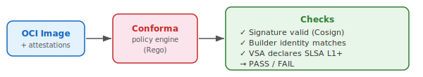

name: inverse
layout: true
class: center, middle, inverse

---

class: center, middle, title-slide

# From Mild To Wild
## How Hot Can Your SLSA Be?

Andrew McNamara (Conforma) • Adolfo "puerco" Garcia (AMPEL)

<div style="margin-top: 2em;">
  
  
</div>

.footnote[
  Open Source SecurityCon · March 23, 2026
]

???

Andrew and puerco briefly introduce themselves. "I'm Andrew, I work on Conforma, a Rego-based policy engine built around Tekton and Konflux." / "And I'm puerco, I work on AMPEL." One sentence each — get right to the talk.

---

layout: false

## You Have Attestations. Now What?

You've signed your artifacts. Provenance exists.

But how do you actually *use* them to enforce policy?

<div style="margin-top: 2em; font-size: 1.1em;">
  Today: <strong>three levels</strong> of policy enforcement · <strong>two policy engines</strong> · <strong>one conclusion</strong>
</div>

<div style="text-align: center; margin-top: 3em;">
  
</div>

???

Andrew sets up the problem space. We're not talking about *generating* attestations today — that's covered elsewhere. We're talking about what you do with them once they exist. A signed artifact with provenance is only useful if something checks that provenance. Today we walk through three levels of sophistication for that checking, and show how two different policy engines handle each level.

---

## Two Policy Engines Walk Into a Bar...

<div style="display: flex; gap: 3em; margin-top: 2em; align-items: flex-start;">
  <div style="flex: 1; text-align: center;">
    <br>
    <strong>Conforma</strong><br>
    <small>Rego-based policy engine<br>built around Tekton / Konflux</small>
  </div>
  <div style="flex: 1; text-align: center;">
    <div style="font-size: 3em; margin-bottom: 0.2em;">⚙</div>
    <strong>AMPEL</strong><br>
    <small>Policy engine for in-toto attestation evaluation<br>produces VSAs and SVRs</small>
  </div>
</div>

<div style="margin-top: 2.5em; border-top: 1px solid #ccc; padding-top: 1.5em;">
  We show each level with <strong>both engines</strong>.<br>
  The engines are interchangeable. <em>Your policies are not your lock-in.</em>
</div>

???

Playful framing — introduce the "game." Andrew will demo a feature with Conforma, puerco will say "AMPEL does that too." Then the challenger ups the ante to the next level. At mild, Andrew leads and puerco challenges. At medium, puerco leads and Andrew challenges. At wild, Andrew leads again, puerco closes. This slide explains the structure so the audience can follow along.

---

class: center, middle, inverse

# 🌶 Mild

**Is this attestation here? Is it valid?**

<div style="margin-top: 1em;">
  
</div>

???

Andrew introduces this level. Brief context for the audience: an attestation is a signed statement about your software — produced by your build system, your CI pipeline, or a verification tool. At mild, we do presence and validity checks: does the artifact have the expected attestation, is it signed, does it declare a minimum SLSA level? This is where everyone should start.

---

layout: false

## Mild: Verify the Signature, Builder, and SLSA Level

**Scenario**: OCI artifact in a registry, built on GitHub Actions.

Three checks:

1. Is there a **valid signature**? (Cosign / Sigstore)
2. Does the provenance say it was built by the **expected builder**?
3. Does a **VSA** declare SLSA L1 or higher?

```rego
# Conforma policy — presence + signature + SLSA level
deny contains result if {
    count(lib.results_named("slsa-provenance-available")) == 0
    result := lib.result_helper(rego.metadata.chain(), [])
}

deny contains result if {
    not attestation.signed_by_builder
    result := lib.result_helper(rego.metadata.chain(), [])
}

deny contains result if {
    vsa := input.attestations[_]
    vsa.predicate.verifiedLevels[_] < "SLSA_BUILD_LEVEL_1"
    result := lib.result_helper(rego.metadata.chain(), [])
}
```

**Result**: pass / fail per rule, with clear messages.

<div style="text-align: center; margin-top: 1em;">
  
</div>

???

Andrew walks through a Conforma policy doing these three presence/validity checks. The VSA here is already produced upstream — by GitHub Actions' SLSA generator, for example — we're just *verifying* it. Keep it concrete: one policy invocation, one clear result. Briefly explain what a VSA is for newcomers: "a signed summary saying 'this artifact passed our checks at level X'."

---

## Mild: "AMPEL Does That Too"

Same three checks, different engine:

```python
# AMPEL policy — presence, signature, SLSA level
policy = Policy()

@policy.rule
def provenance_present(ctx):
    return ctx.has_attestation("slsa-provenance")

@policy.rule
def signature_valid(ctx):
    return ctx.attestation("slsa-provenance").signature.valid

@policy.rule
def meets_slsa_level(ctx):
    vsa = ctx.attestation("slsa-vsa")
    return vsa.predicate.verifiedLevels >= ["SLSA_BUILD_LEVEL_1"]
```

**Same result. Different engine.**

Because attestation formats follow open standards (in-toto / SLSA), engines are substitutable.

???

Puerco's "me too." Brief and playful — one policy snippet showing the same three checks in AMPEL. The point: because the attestation format is standardized, you're not locked in to any engine. This should be quick — about 30 seconds.

---

## "But What If You Actually Want to Know What's *Inside*?"

*puerco raises the bar*

> "Okay — so you can tell me it has an attestation and it's signed."

> "But what does it actually *say*? What properties did the build have?"

> "And what if I want to combine information from *multiple* attestations?"

???

Puerco raises the bar. The natural next question after presence/validity is content: what's actually in the attestation? And can we use multiple attestations together to answer richer questions? Keep it punchy — two or three questions, no answers yet. This is the transition slide to medium.

---

class: center, middle, inverse

# 🌶🌶 Medium

**What does it say inside? Can I combine multiple attestations?**

<div style="margin-top: 1em;">
  
</div>

???

Puerco takes the lead. Medium means going beyond presence checks into *content*: inspecting the fields of a provenance attestation, checking properties like source repo, branch, and build parameters, and combining that with other attestations to produce a new VSA or SVR.

---

## Medium: Inspecting Provenance Content + Producing a VSA/SVR

**Scenario**: Same artifact — now we look *inside* the provenance.

- Which source **repo and branch** was used?
- What were the **build parameters**?
- Combine provenance **+ SBOM attestation** for richer checks

```python
# AMPEL — evaluate content across attestations, produce VSA/SVR
@policy.rule
def trusted_source_branch(ctx):
    prov = ctx.attestation("slsa-provenance")
    return prov.predicate.buildDefinition.externalParameters.ref \
        == "refs/heads/main"

@policy.rule
def sbom_present(ctx):
    return ctx.has_attestation("cyclonedx-sbom")

# Produce a VSA (SLSA) or SVR (in-toto) summarising evaluation
result = policy.evaluate(artifact, produce="vsa")
```

<div style="text-align: center; margin-top: 1em;">
  
</div>

???

Puerco explains the difference between a presence check and a content check. The new concept here is the VSA/SVR as *output* — AMPEL is not just checking, it's summarizing the result into a new attestation. This decouples "who evaluates" from "who enforces." VSA = SLSA Verification Summary Attestation; SVR = Verification Summary Result (both in-toto predicates). Mention admission controllers as a downstream consumer without going deep: "the VSA is what an admission controller checks — it doesn't need to re-run verification."

---

## Medium: "Conforma Does That Too"

```rego
# Conforma — inspect provenance content
deny contains result if {
    prov := lib.pipelinerun_attestations[_]
    ref := prov.predicate.buildDefinition.externalParameters.git.ref
    not startswith(ref, "refs/heads/main")
    result := lib.result_helper(rego.metadata.chain(), [ref])
}

# Conforma also produces a VSA after policy passes
```

Same interchangeability point: standardized provenance format, substitutable engines.

Both engines can inspect content **and** produce summary attestations.

???

Andrew's "me too." Brief — one policy snippet showing Conforma checking a content property. Reinforce the standards story: the provenance schema is the same, so either engine can read it. Also: Conforma can produce a VSA after evaluation, just like AMPEL. About 45 seconds.

---

## "But Here's What Keeps Me Up at Night"

*Andrew raises the bar*

> "We can verify *what* the provenance says."

> "But did the steps recorded in the provenance actually *produce* this artifact?"

> "What if someone copied a pre-built artifact into the pipeline output? The provenance would still look fine."

> "Tekton Chains records tasks accurately — but pipelines are user-customizable. Any task could have injected a different artifact."

???

Andrew raises the deeper trust question. This is the distinction between recording what ran and knowing that what ran *actually produced* the artifact. Tekton Chains accurately records the tasks that ran, but because Tekton pipelines are user-customizable, the provenance can't on its own prove the artifact is the genuine output of those tasks. This motivates wild: use policy to inspect the Tekton provenance and verify that specific pinned trusted task bundles were used — qualifying trust based on provenance content.

---

class: center, middle, inverse

# 🌶🌶🌶 Wild

**Did those steps actually produce this artifact?**

<div style="margin-top: 1em;">
  
</div>

???

Andrew introduces the Tekton angle. The question is not about whether we trust Tekton Chains — we do, it accurately records what ran. The question is: given a flexible, user-customizable pipeline, can we use policy to verify that the specific tasks recorded in the provenance were pinned, trusted implementations? If yes, we can reason about artifact integrity.

---

## Wild: Trusted Task Bundles and Tekton Provenance

Tekton provenance records which TaskRun steps executed — including **bundle refs and digests**:

```json
{
  "buildConfig": {
    "tasks": [{
      "name": "build-container",
      "ref": {
        "name": "buildah",
        "bundle": "quay.io/konflux-ci/tekton-catalog/task-buildah@sha256:a1b2c3..."
      }
    }]
  }
}
```

**The problem**: without constraints, any task could have injected or copied an artifact.

**The solution**: Policy verifies every task is a **known, pinned trusted bundle digest**.

```rego
# Conforma — verify task bundles against approved allowlist
deny contains result if {
    task := lib.pipelinerun_attestations[_].predicate.buildConfig.tasks[_]
    bundle_ref := task.ref.bundle
    not trusted_bundles[bundle_ref]
    result := lib.result_helper(rego.metadata.chain(), [bundle_ref])
}
```

<div style="text-align: center; margin-top: 1em;">
  
</div>

???

Andrew explains the Conforma approach. Tekton Chains records task bundle references and digests in the provenance. Conforma policy can then verify: were these the tasks we approved? If yes, we can qualify our trust — because a pinned task with a known digest behaves deterministically. This is the "trusted task" model that Konflux is built on. A pinned task can't lie about what it built, because it was pinned *before* the build ran.

---

## Wild: "AMPEL Can Verify That Too"

```python
# AMPEL — evaluate task bundle digests against approved list
APPROVED_BUNDLES = load_allowlist("trusted-bundles.json")

@policy.rule
def all_tasks_trusted(ctx):
    prov = ctx.attestation("slsa-provenance")
    tasks = prov.predicate.buildConfig.tasks
    return all(
        task["ref"]["bundle"] in APPROVED_BUNDLES
        for task in tasks
    )
```

Same interchangeability point: standardized Tekton provenance format, substitutable engines.

Even for the most nuanced policy use case — both engines can do it.

???

Puerco's final "me too." The payoff of the running gag: even for the most nuanced policy use case, both engines can do it. The attestation standard is the key — not the engine. Keep it brief — about 30 seconds. Then segue directly into takeaways.

---

## Which Heat Level Are You?

<table style="margin-top: 1.5em; width: 100%; font-size: 0.95em;">
  <tr>
    <th style="width: 15%;">Level</th>
    <th style="width: 25%;">You have…</th>
    <th style="width: 35%;">You check…</th>
    <th style="width: 25%;">Start here if…</th>
  </tr>
  <tr>
    <td>🌶 <strong>Mild</strong></td>
    <td>Signed artifacts with provenance</td>
    <td>Signature valid, builder identity, SLSA level declared</td>
    <td>Just getting started</td>
  </tr>
  <tr>
    <td>🌶🌶 <strong>Medium</strong></td>
    <td>Mature CI producing attestations</td>
    <td>Provenance content, multi-attestation evaluation, produce VSAs for admission control</td>
    <td>You want automated enforcement</td>
  </tr>
  <tr>
    <td>🌶🌶🌶 <strong>Wild</strong></td>
    <td>Control of your build platform</td>
    <td>Pinned trusted task bundles in Tekton provenance — closing the provenance loop</td>
    <td>You want end-to-end trust</td>
  </tr>
</table>

<div style="margin-top: 2em; border-top: 1px solid #ccc; padding-top: 1.5em;">
  Policy engines are <strong>interchangeable</strong>. Pick the one that fits your stack.<br>
  <em>Attestation standards are open. Your policies travel with you.</em>
</div>

???

Both speakers together. Quick summary. The three key messages:
1. Attestations are useful at every maturity level — start mild, turn up the heat.
2. Policy engines are interchangeable because the attestation standards are open.
3. The build platform is part of the trust model — not just an implementation detail. Wild-level trust requires controlling your build platform (Tekton) and pinning trusted tasks.

---

## Resources

<div style="display: flex; justify-content: space-around; margin-top: 2em; flex-wrap: wrap; gap: 2em;">
  <div style="text-align: center;">
    <br>
    <strong>conforma.dev</strong>
  </div>
  <div style="text-align: center;">
    <div style="width: 140px; height: 140px; border: 2px dashed #999; display: flex; align-items: center; justify-content: center; margin: 0 auto; font-size: 0.75em; color: #666;">
      AMPEL QR<br>(coming soon)
    </div><br>
    <strong>AMPEL project</strong>
  </div>
  <div style="text-align: center;">
    <br>
    <strong>slsa.dev</strong>
  </div>
  <div style="text-align: center;">
    <div style="width: 140px; height: 140px; border: 2px dashed #999; display: flex; align-items: center; justify-content: center; margin: 0 auto; font-size: 0.75em; color: #666;">
      Slides QR<br>(coming soon)
    </div><br>
    <strong>These slides</strong>
  </div>
</div>

???

Quick close. "Scan, follow along, try it yourself." The AMPEL QR and slides QR will be added once the project link and slides URL are confirmed.

---

class: center, middle, inverse

# Thank You

Questions?

<div style="margin-top: 2em;">
  Andrew McNamara · <strong>conforma.dev</strong><br>
  Adolfo "puerco" Garcia · <strong>AMPEL</strong>
</div>

???

Open for Q&A. Roughly 7 minutes. Both speakers take questions.
