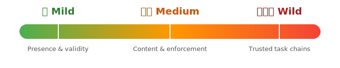
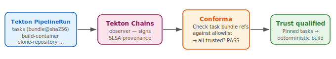

name: inverse
layout: true
class: center, middle, inverse

---

class: center, middle, title-slide

<div style="position: absolute; left: 0; top: 0; right: 0; bottom: 0; margin: -2em -4em; padding: 2em 4em; background: linear-gradient(135deg, #2e7d32 0%, #388e3c 25%, #f57c00 50%, #e65100 75%, #b71c1c 100%); color: white; display: flex; flex-direction: column; align-items: center; justify-content: center;">
<h1 style="color: white; margin: 0; font-size: 5em;">From Mild To Wild</h1>
<h2 style="margin: 0.5em 0; color: #ffca43">How Hot Can Your SLSA Be?</h2>
<p style="margin: 0.5em 0;">Andrew McNamara (Conforma) • Adolfo "puerco" García Veytia (AMPEL)</p>

<div style="margin-top: 2em; display:flex">
  <div style="display: inline-flex; flex-direction: row; align-items: center; margin-right: 6em; vertical-align: middle; gap: 0.5em;">
    
    <span style="font-family: sans-serif; font-weight: 700; font-size: 2.5em; color: #6b5b95;">conforma</span>
  </div>
  
  <!--img src="/shared/logos/slsa.svg" width="100" alt="SLSA logo" style="vertical-align: middle;"-->
</div>

<div style="position: absolute; bottom: 3em; font-size: 0.8em; color: rgba(255,255,255,0.9);">
  Open Source SecurityCon · March 23, 2026
</div>
</div>

???

Andrew and puerco briefly introduce themselves. "I'm Andrew, I am a SLSA maintainer and I work on Konflux, a CI system built on Tekton. We also built Conforma, a Rego-based policy engine." / "And I'm puerco, I work on AMPEL." One sentence each — get right to the talk.

---

layout: false

## Attestations in One Slide

<div style="display: flex; align-items: center; justify-content: center; gap: 0.6em; margin: 1.2em 0; flex-wrap: wrap;">
  <span style="display: inline-block; padding: 0.4em 0.8em; background: #e3f2fd; border-radius: 8px; font-size: 0.9em;">artifact</span>
  <span style="color: #666;">→</span>
  <span style="display: inline-block; padding: 0.4em 0.8em; background: #fff3e0; border-radius: 8px; font-size: 0.9em;">predicate</span>
  <span style="color: #666;">+</span>
  <span style="display: inline-block; padding: 0.4em 0.8em; background: #e8f5e9; border-radius: 8px; font-size: 0.9em;">signature</span>
  <span style="color: #666;">→</span>
  <span style="display: inline-block; padding: 0.4em 0.8em; background: #f3e5f5; border-radius: 8px; font-size: 0.9em; font-weight: bold;">attestation</span>
</div>

```jsonc
{
  "subject": {
    "name": "registry.k8s.io/kube-proxy:v1.36.0-beta.0",
    "digest": { "sha256": "5f013cc6fb21eb60820bfc4a925fddb710a70acecd56166874da8ef2c13d3933" }
  },

  "predicateType": "https://in-toto.io/attestation/promotion-record/v1",
  "predicate": {
    "srcRef": "us-central1-docker.pkg.dev/k8s-staging-images/kube-proxy:v1.36.0-beta.0",
    "dstRef": "registry.k8s.io/kube-proxy:v1.36.0-beta.0",
    "digest": "5f013cc6fb21eb60820bfc4a925fddb710a70acecd56166874da8ef2c13d3933",
    "promotedAt": "2026-03-21T19:56:27Z",
    "builderId": "htts://sigs.k8s.io/promo-tools/v4.0.9"
  }
}
```
<div style="background: #f5f5f5; border-left: 4px solid #1976d2; padding: 0.2em 1em; line-height: 1.3em ">
  
  <strong>Attestations</strong> = signed statements about an artifact (who built it, from what, how).  
  <br>Often <strong>in-toto</strong>: predicate (e.g. SLSA provenance) + signature.
</div>

???

One-line setup: we're talking about signed metadata (provenance, etc.). Don't dwell — next slide is "you have these, now what?"

---

## You Have Attestations. Now What?

<div style="display: flex; gap: 2em; margin-top: 1.5em; align-items: center;">
  <div style="flex: 1; ">
    <div style="font-size: 1.3em; line-height: 1.5;">
      ✅ You've signed your artifacts. <br>
      ✅ Provenance exists.
    </div>
    <div style="font-size: 1.3em; line-height: 1.5; padding: 1em 0;">But how do you actually <em>use</em> them to enforce policy?</div>
    <div style="font-weight: 500; font-size: 1.3em; color: #c62828; line-height: 1.5;">
      👉 You get provenance and other predicates — the hard part is <em>using</em> them.
      <div style="display: flex; align-items: center; gap: 1.5em; margin-top: 0.5em; flex-wrap: wrap;">
        
        
        
      </div>
    </div>
  </div>
  <div style="flex: 1; padding: 1em; text-align: center;">
  <div style=" font-size: 2em;">
      Today: <strong>three levels</strong> of policy enforcement · <strong>two policy engines</strong> · <strong>one conclusion</strong>
    </div>
    <div style="text-align: center; margin-top: 3em;">
      
    </div>
  </div>
</div>


???

Andrew sets up the problem space. We're not talking about *generating* attestations today — that's covered elsewhere. We're talking about what you do with them once they exist. A signed artifact with provenance is only useful if something checks that provenance. Today we walk through three levels of sophistication for that checking, and show how two different policy engines handle each level.

---

## Two Policy Engines Walk Into an Attestation...

<div style="display: flex; gap: 3em; margin-top: 2em; align-items: center; justify-content: center;">
  <div style="flex: 1; text-align: center;">
    
  </div>
  <div style="flex: 1; text-align: center;">
    <div style="display: inline-flex; flex-direction: row; align-items: center; gap: 0.3em;">
      
      <span style="font-family: sans-serif; font-weight: 700; font-size: 2em; color: #6b5b95;">conforma</span>
    </div>
  </div>
</div>
<div style="display: flex; gap: 3em; margin-top: 1em; align-items: flex-start; justify-content: center;">
  <div style="flex: 1; text-align: center;">
    <small>Policy engine for in-toto attestation evaluation<br>produces VSAs</small>
  </div>
  <div style="flex: 1; text-align: center;">
    <small>Rego-based policy engine<br>incubated with Konflux</small>
  </div>
</div>

<div style="position: relative; margin-top: 2.5em; border-top: 1px solid #ccc; text-align: center;">
  <div style="position: relative; top: -0.9em; display: inline-block; background: #faf8f5; border: 1px solid #ccc; border-radius: 50%; padding: 0.3em 1.2em; font-size: 0.9em;">
    <strong>Coming up:</strong>
  </div>
  <div style="display: flex; justify-content: center; gap: 1.5em; margin-top: -0.5em; font-size: 0.9em;">
    <div style=" padding: 0.4em 1em; text-align: center;">
      <span style="color: #2e7d32; font-size: 3em;">🌶 Mild</span><br><b>simple verification</b>
    </div>
    <div style=" padding: 0.4em 1em; text-align: center;">
      <span style="color: #e65100; font-size: 3em;">🌶🌶 Medium</span><br><b>combining attestations</b>
    </div>
    <div style=" padding: 0.4em 1em; text-align: center;">
      <span style="color: #b71c1c; font-size: 3em;">🌶🌶🌶 Wild</span><br><b>digging into attestations</b>
    </div>
  </div>
</div>

???

Playful framing — introduce the "game." Puerco will demo a feature with AMPEL, Andrew will show that "Conforma does that too." Then the challenger ups the ante to the next level. At mild, puerco leads and Andrew challenges. At medium, puerco leads and Andrew challenges. At wild, Andrew leads again, puerco closes. Tell the audience: at each level we'll show both engines so you see they're interchangeable; same attestations, same policies.

---

class: center, middle, inverse

<h1 style="font-size: 5em; padding:0; margin:0">🌶 Mild</h1>
<div style="font-size: 2em;">Verify provenance properties</span>

???

Puerco introduces this level. As mentioned before, an attestation is a signed statement about your software — produced by your build system, your CI pipeline, or a verification tool. At mild, we verify fundamental provenance properties: is provenance present, is the build type recognized, does it come from a trusted builder, were materials properly tracked? This is where everyone should start.

---

layout: false

## 🌶 Mild: Verify Provenance Properties

<div style="display: flex; gap: 2em; margin-top: 1.5em; align-items: stretch;">
  <div style="flex: 1; padding: 1.5em; display: flex; align-items: center;">
    <div style="font-size: 2em; line-height: 1.4;">
      Consuming any <strong>OCI artifact</strong> with <strong>SLSA provenance</strong> — regardless of build system.
    </div>
  </div>
  <div style="flex: 1; padding: 1.2em 1.5em;">
    <strong style="font-size: 1.3em; color: #555;">Checks</strong>
    <ol style="margin: 0.5em 0 0 0; padding-left: 1.2em; line-height: 1.8;">
      <li><strong>Provenance attestation</strong> is present</li>
      <li><strong>Build type</strong> is in the accepted list</li>
      <li><strong>Builder identity</strong> matches expected builder</li>
      <li><strong>Source materials</strong> are version-controlled with SHAs</li>
      <li><strong>External parameters</strong> are restricted</li>
    </ol>
  </div>
</div>

???

Puerco introduces the mild checks. These are the foundational properties every consumer should verify. They're entirely build-system-agnostic — they work with provenance from GitHub Actions, Tekton, or any other system that produces SLSA-formatted attestations.

---

## 🌶 Mild: AMPEL PolicySet

```hjson
{
    id: set-base-verification
    frameworks: [ { id: SLSA, name: "Supply-Chain Levels for Software Artifacts" } ]
    policies: [
        {
            id: slsa-builder-id
            source: {
                location: { uri: "git+https://github.com/carabiner-dev/policies#slsa/slsa-builder-id.json" }
            }
            meta: { controls: [ { framework: SLSA, class: BUILD, id: LEVEL_3 } ] }
        }
        {
            id: slsa-build-type
            source: {
                location: { uri: "git+https://github.com/carabiner-dev/policies#slsa/slsa-build-type.json" }
            }
            meta: { controls: [ { framework: SLSA, class: BUILD, id: LEVEL_3 } ] }
        }
        {
            id: slsa-build-point
            source: {
                location: { uri: "git+https://github.com/carabiner-dev/policies#slsa/slsa-build-point.json" }
            }
            meta: { controls: [ { framework: SLSA, class: BUILD, id: LEVEL_3 } ] }
        }
    ]
}
```

**Result**: pass / fail per rule. Works with any build system that produces SLSA provenance.

???

Puerco walks through the AMPEL policy for mild. Two tenets: the first checks that SLSA provenance exists, the second verifies the VSA declares at least Build Level 1. No hardcoded builder identity or build type. CEL expressions keep the policy compact and readable.

---

## 🌶 Mild: AMPEL Policy

```hjson
{
    id: slsa-build-point
    context: {
        buildPoint:          { required: true,  type: string }
        buildPointAllowRepo: { required: false, type: bool,   default: true }
        buildPointCommit:    { required: false, type: string, default: "" }
    }
    tenets: [
        {
            predicates: { types: ["https://slsa.dev/provenance/v1"] }
            outputs: {
                uri: {
                    code: "has(predicate.data.buildDefinition) && has(predicate.data.buildDefinition.resolvedDependencies) && predicate.data.buildDefinition.resolvedDependencies.exists(dep, has(dep.uri) && (dep.uri.contains('@') ? dep.uri.split('@')[0] : dep.uri) == (context.buildPoint.contains('@') ? context.buildPoint.split('@')[0] : context.buildPoint)) ? predicate.data.buildDefinition.resolvedDependencies.filter(dep, has(dep.uri) && (dep.uri.contains('@') ? dep.uri.split('@')[0] : dep.uri) == (context.buildPoint.contains('@') ? context.buildPoint.split('@')[0] : context.buildPoint))[0].uri : ''"
                }
                commitMatch: {
                    code: "context.buildPointCommit != '' && has(predicate.data.buildDefinition) && has(predicate.data.buildDefinition.resolvedDependencies) && predicate.data.buildDefinition.resolvedDependencies.exists(dep, has(dep.uri) && (dep.uri.contains('@') ? dep.uri.split('@')[0] : dep.uri) == (context.buildPoint.contains('@') ? context.buildPoint.split('@')[0] : context.buildPoint) && has(dep.digest) && dep.digest.exists(k, dep.digest[k] == (context.buildPointCommit.contains(':') ? context.buildPointCommit.split(':')[1] : context.buildPointCommit)))"
                }
            }
            code: "outputs.uri != '' && (context.buildPointAllowRepo || outputs.uri == context.buildPoint) && (context.buildPointCommit == '' || outputs.commitMatch)"
            assessment: { message: "Expected build point found: {{ .Context.buildPoint }}" }
            error: {
                message: "Build point mismatch"
                guidance: "The attested build point does not match the expected reference"
            }
        }
    ]
}
```

**Result**: pass / fail per rule. Works with any build system that produces SLSA provenance.

???

Puerco walks through the AMPEL policy for mild. Two tenets: the first checks that SLSA provenance exists, the second verifies the VSA declares at least Build Level 1. No hardcoded builder identity or build type. CEL expressions keep the policy compact and readable.

---

## 🌶 Mild: Run the AMPEL Policy

```shell
ampel verify sha256:734d6c22b80cdf9bd21c6b13d3475cf02c888d4a0b00d2e092a735 \
   # Path to policy
   --policy "1-mild/ampel/policy.hjson" \
   # SLSA Attestation
   --attestation "slsa.json"
```

<div style="background: #272822; color: rgb(166, 226, 46); font-family: 'Ubuntu Mono', monospace; font-size: 0.7em; padding: 1em; border-radius: 4px; overflow-x: auto; white-space: pre; line-height: 1.4;">+-------------------------------------------------------------------------------------------------------------------------------------------------+
| <span style="color: #ff0000;">⬤</span><span style="color: #ffcc00;">⬤</span><span style="color: #447821;">⬤</span><span style="color: #fff; font-weight: bold;"> AMPEL: Evaluation Results</span>                                                                                                                    |
+------------------+-----------------------+--------+---------------------------------------------------------------------------------------------+
| PolicySet        | set-base-verification | Date   | 2026-03-21 15:03:22.255829 +0100 CET                                                        |
+------------------+-----------------------+--------+---------------------------------------------------------------------------------------------+
| Status: <span style="color: #447821;">●</span> PASS   | Subject               | - sha256:734d6c22b80cdf9bd21c6b13d3475cf0...                                                         |
+------------------+-----------------------+--------+---------------------------------------------------------------------------------------------+
| Policy           | Controls              | Status | Details                                                                                     |
+------------------+-----------------------+--------+---------------------------------------------------------------------------------------------+
| slsa-builder-id  | BUILD-LEVEL_3         | <span style="color: #447821;">●</span> PASS | Authorized builder ID detected                                                              |
| slsa-build-type  | BUILD-LEVEL_3         | <span style="color: #447821;">●</span> PASS | Expected buildType found: tekton.dev/v1/PipelineRun                                         |
| slsa-build-point | BUILD-LEVEL_3         | <span style="color: #447821;">●</span> PASS | Expected build point found: git+https://gitlab.com/redhat/rhel/containers/ubi10-minimal.git |
+------------------+-----------------------+--------+---------------------------------------------------------------------------------------------+
</div>
---

## 🌶 Mild: Run the AMPEL Policy

```shell
ampel verify "$(crane registry.access.redhat.com/ubi10/ubi-minimal:latest)" \
   
   # Policy code
   --policy '1-mild/ampel/policy.hjson' \
   
   # Read attestations attached to the image
   --collector 'coci:registry.access.redhat.com/ubi10/ubi-minimal:latest' \
   
   # Pass the build point to check 
   --context 'buildPoint:git+https://gitlab.com/redhat/rhel/containers/ubi10-minimal.git' \
   
   # Output an attested copy of the resutls 
   --attest-results=true \
   
   # Output the results as a VSA
   --attest-format 'vsa' 
```

---

## 🌶 Mild: "Conforma Does That Too"

Same checks, different engine:

```rego
# Conforma policy — verify foundational provenance properties
deny contains result if {
    count(lib.slsa_provenance_attestations) == 0
    result := lib.result_helper(rego.metadata.chain(), [])
}

deny contains result if {
    some att in lib.slsa_provenance_attestations
    build_type := _build_type(att)  # handles both SLSA v0.2 and v1.0
    allowed := lib.rule_data("allowed_build_types")
    not build_type in allowed
    result := lib.result_helper(rego.metadata.chain(), [build_type])
}

# Plus upstream rules for: builder identity, source materials, external params
```

**Same checks. Different engine.**

Attestation formats follow open standards (in-toto / SLSA), so engines are substitutable.

???

Andrew's "me too." The Conforma policy does the same checks in Rego. Two custom rules: provenance must exist, build type must be in the allowed list. The allowed list is configurable — not hardcoded to any build system. Upstream rules handle builder identity, source materials, and external parameters. About 30 seconds.

---

## 🌶 Mild: Run Conforma

```shell
./1-mild/conforma/verify.sh
```

```shell
=== Mild: Verifying base image ===
Image: registry.access.redhat.com/ubi10/ubi-minimal:latest

--- Step 1: Verify release signature
    Key: 1-mild/conforma/cosign-release.pub
Success: true
Result: SUCCESS
Violations: 0, Warnings: 0, Successes: 15

[...]

--- Step 2: Verify provenance
    Policy: 1-mild/conforma/policy.yaml
    Key: 1-mild/conforma/cosign-provenance.pub
Success: true
Result: SUCCESS
Violations: 0, Warnings: 0, Successes: 50

[...]

=== Output files ===
  output/mild/conforma/signature-report.json  — image signature verification result
  output/mild/conforma/provenance-report.json — SLSA provenance policy evaluation
```

???

Walk through the transcript: two `ec validate` passes (release key, then policy + provenance key), multi-arch index components, JSON reports under `output/mild/conforma/`. This is literal sample output from `mild-to-wild-samples` on a recent run.

---

## "But What About Multiple Attestations — and a Portable Summary?"
<div class="subheading">Raising the bar</div>

<div style="display: flex; flex-direction: column; gap: 1.2em; margin-top: 1em; align-items: flex-start;">
  <div style="position: relative; background: #fff; border: 2px solid #333; border-radius: 20px; padding: 0.8em 1.2em; max-width: 75%; font-size: 1.1em;">
    So you verified one artifact's provenance.
    <div style="position: absolute; bottom: -10px; left: 30px; width: 0; height: 0; border-left: 10px solid transparent; border-right: 10px solid transparent; border-top: 12px solid #333;"></div>
    <div style="position: absolute; bottom: -7px; left: 32px; width: 0; height: 0; border-left: 8px solid transparent; border-right: 8px solid transparent; border-top: 10px solid #fff;"></div>
  </div>
  <div style="position: relative; background: #fff; border: 2px solid #333; border-radius: 20px; padding: 0.8em 1.2em; max-width: 85%; align-self: flex-end; font-size: 1.1em;">
    What about its dependencies? Base image, other attestations — can you combine and verify them together?
    <div style="position: absolute; bottom: -10px; right: 30px; width: 0; height: 0; border-left: 10px solid transparent; border-right: 10px solid transparent; border-top: 12px solid #333;"></div>
    <div style="position: absolute; bottom: -7px; right: 32px; width: 0; height: 0; border-left: 8px solid transparent; border-right: 8px solid transparent; border-top: 10px solid #fff;"></div>
  </div>
  <div style="position: relative; background: #fff; border: 2px solid #333; border-radius: 20px; padding: 0.8em 1.2em; max-width: 85%; font-size: 1.1em;">
    And produce a signed summary so downstream doesn't have to re-verify all of them?
    <div style="position: absolute; bottom: -10px; left: 30px; width: 0; height: 0; border-left: 10px solid transparent; border-right: 10px solid transparent; border-top: 12px solid #333;"></div>
    <div style="position: absolute; bottom: -7px; left: 32px; width: 0; height: 0; border-left: 8px solid transparent; border-right: 8px solid transparent; border-top: 10px solid #fff;"></div>
  </div>
</div>

???

Puerco raises the bar. Medium does two things: combine multiple attestations (e.g. built image + base image) and verify them together, and produce a VSA so downstream consumers don't have to re-fetch and re-verify every attestation — they check the one summary. This is the transition to medium — Puerco leads with AMPEL.

---

class: center, middle, medium

<h1 style="font-size: 5em; padding:0; margin:0">🌶🌶 Medium</h1>
<div style="font-size: 2em;">Combine multiple attestations · produce a VSA</span>

???

Puerco takes the lead. Medium combines and verifies multiple attestations (e.g. built image + base image), same mild-style checks, and produces a VSA that captures the combined result so downstream doesn't re-verify each attestation.

---

## 🌶🌶 Medium: More Attestations & Producing a VSA

<div style="display: flex; gap: 2em; margin-top: 1.5em; align-items: stretch;">
  <div style="flex: 1; padding: 1.5em; display: flex; align-items: center;">
    <div style="font-size: 1.6em; line-height: 1.4;">
      Image built with <strong>GitHub Actions</strong>, signed with <strong>Sigstore keyless</strong>.
      <br/><br/>Verify the <strong>built image</strong> and its <strong>base image</strong>, then produce a signed <strong>VSA at SLSA Build Level 2</strong>.
    </div>
  </div>
  <div style="flex: 1.1; padding: 1.2em 1.5em;">
    <strong style="font-size: 1.3em; color: #555;">What's new</strong>
    <ul style="margin: 0.5em 0 0 0; padding-left: 1.2em; line-height: 1.8;">
      <li><strong>Combine & verify</strong> multiple attestations (built image + base image)</li>
      <li>AMPEL produces a single <strong>VSA</strong> with verified level and dependency levels</li>
      <li><strong>Portable summary</strong> — downstream checks the VSA instead of re-verifying each attestation</li>
    </ul>
    <div style="margin-top: 1em; font-weight: 500;">Result: One VSA at L2 attached — one check for downstream.</div>
  </div>
</div>

???

Puerco leads. AMPEL policy at medium extends mild: same provenance checks, plus the engine produces a signed VSA (verifiedLevels, dependencyLevels for the base image) and attaches it. Demo: run AMPEL against the GitHub Actions–built image and base image, show the resulting VSA.

---

## 🌶🌶 Medium: AMPEL - Ensuring SLSA Level 2

```hjson
{
    id: slsa-source-level-2
    meta: {
        description: "Checks for SLSA_SOURCE Level 2 or higher compliance in a VSA"
    }
    tenets: [
        {
            predicates: { types: ["https://slsa.dev/verification_summary/v1"] }
            outputs: {
                pass: { code: "has(predicates[0].data.verificationResult) ? predicates[0].data.verificationResult == 'PASSED' : false" }
                levels: { code: "has(predicates[0].data.verifiedLevels) ? predicates[0].data.verifiedLevels : []" }
            }
            code: "outputs.pass && outputs.levels.exists(k, v, (v == 'SLSA_SOURCE_LEVEL_2' || v == 'SLSA_SOURCE_LEVEL_3' || v == 'SLSA_SOURCE_LEVEL_4'))"
            assessment: {
              message: "VSA attesting SLSA_SOURCE L2 compliance checks"
            }
            error: {
                message: "SLSA Source L2+ not recorded in verification summary"
            }
        }
    ]
}
```
???

This slide is the **source-level** check on a **VSA**: it reads `verification_summary/v1` and requires `SLSA_SOURCE_LEVEL_2` (or higher) in `verifiedLevels`. That mirrors how you gate on a dependency’s summary before trusting the built image’s story.

---

## 🌶🌶 Medium: AMPEL - Chaining Provenance to VSA

```hjson
{
  id: verify-base-image
  source: {
    location: { uri: "git+https://github.com/carabiner-dev/policies#vsa/slsa-build-level2.json" }
  },
  context: {
    // This is the base image reference
    baseImage: { default: "registry.access.redhat.com/ubi10/ubi-minimal", required: true, }
  },
  chain: [
    {
      // Same as above, we chain the build provenance to extract
      // the digest of the image. 
      predicate: {
        type: "https://slsa.dev/provenance/v1",
        selector: "has(predicate.data.buildDefinition) ? (has(predicate.data.buildDefinition.resolvedDependencies) ? (predicate.data.buildDefinition.resolvedDependencies.map(dep, dep.uri.startsWith(context.baseImage), \"sha256:\" + dep.digest[\"sha256\"])[0]) : '') : ''"
      }
    }
  ],
}
```

*Chaining predicates: find a VSA from the policy*

???

This is the **base-image chain** from the built image’s SLSA provenance: resolve the base digest, then load that image’s VSA and assert build level 2. Conforma’s `generate-vsa.sh` does the same story in two passes (base then built).

---

## 🌶🌶 Medium: Conforma — two-pass verification

<span style="font-size: 0.95em">**Scenario**: Same — **built image + base**. Run <code>./2-medium/conforma/verify.sh</code> (wraps <code>scripts/generate-vsa.sh</code>).</span>

```shell
./2-medium/conforma/verify.sh
# optional: BUILT_IMAGE=ghcr.io/arewm/mild-to-wild-samples:tag
# Tekton:  PUBLIC_KEY=provenance.pub BUILT_IMAGE=quay.io/... ./2-medium/conforma/verify.sh
```

**Outcome** (representative `mild-to-wild-samples` run):

<div style="background: #272822; color: #e8e8e3; font-family: 'Ubuntu Mono', monospace; font-size: 0.62em; padding: 0.75em 1em; border-radius: 4px; line-height: 1.5; text-align: left;">
<strong style="color: #a6e22e;">Pass 1</strong> · base <code>ubi-minimal@sha256:734d6c22…</code> → release signature OK, provenance OK<br/>
<strong style="color: #a6e22e;">Pass 2</strong> · built <code>ghcr.io/arewm/mild-to-wild-samples@sha256:e9ac6c43…</code> → <code>Result: WARNING</code> (5× <code>github_certificate.gh_workflow_extensions</code>) · <strong>policy evaluation PASSED</strong><br/>
<strong style="color: #a6e22e;">Levels</strong> · built <code>SLSA_BUILD_LEVEL_2</code> · base dependency <code>SLSA_BUILD_LEVEL_2</code> (count 1)<br/>
<strong style="color: #a6e22e;">Write</strong> · <code>output/medium/conforma/image.vsa.json</code> (+ <code>base-report.json</code>, <code>built-report.json</code>)
</div>

???

Andrew: "Conforma does that too." Pass 1 (base) then pass 2 (built, keyless GitHub Actions). Warnings are optional GitHub OIDC **certificate extensions** missing on the cert — not provenance failures; **violations stay 0** and the VSA file is still written. Next slide: what goes into that VSA. Tekton: `PUBLIC_KEY` + `BUILT_IMAGE`.

---

## 🌶🌶 Medium: Conforma — portable VSA (predicate)

Downstream consumers care about the **verification summary** fields, not the full `ec` log.

**`output/medium/conforma/image.vsa.json`** — downstream-facing predicate (trimmed):

```json
{
  "verificationResult": "PASSED",
  "verifiedLevels": ["SLSA_BUILD_LEVEL_2"],
  "dependencyLevels": { "SLSA_BUILD_LEVEL_2": 1 },
  "slsaVersion": "1.0"
}
```

Same **in-toto** SLSA verification-summary shape AMPEL can emit — portable across policy engines.

???

Walk the JSON: **verifiedLevels** is the built image; **dependencyLevels** rolls up the base. Full files include `verifier`, `resourceUri`, `policy.uri`, `timeVerified`. Run `./2-medium/conforma/verify.sh` in `mild-to-wild-samples` to reproduce.

---

## 🌶🌶 Medium: "Conforma Does That Too"

The policy doesn't care whether the image was built by GitHub Actions or Tekton:

```yaml
# policy.yaml accepts both build systems (2-medium/conforma/policy.yaml)
ruleData:
  allowed_builder_ids:
    - "https://github.com/arewm/mild-to-wild-samples/tekton-build"
    - "https://github.com/arewm/mild-to-wild-samples/.github/workflows/build-push.yaml@refs/heads/main"
  allowed_build_types:
    - "https://tekton.dev/chains/v2/slsa"
    - "https://actions.github.io/buildtypes/workflow/v1"
```

`./2-medium/conforma/verify.sh` uses keyless flags by default; set `PUBLIC_KEY` for Tekton Chains. Same VSA predicate shape either way.

Both engines verify the same properties and can produce VSAs for downstream enforcement. The VSA format is standardized (in-toto), so the output is portable across policy engines.

???

Andrew's "me too." The key insight: the same Conforma policy accepts provenance from either build system because the SLSA format is standardized. The ruleData lists both builder IDs and build types. The repo helper switches key-based vs keyless via `PUBLIC_KEY` vs default certificate flags. The VSA format is standardized, so either engine can produce VSAs that any consumer can verify. About 45 seconds.

---

## "But Here's What Keeps Me Up at Night"
<div class="subheading">Raising the bar</div>

<div style="display: flex; flex-direction: column; gap: 1.2em; margin-top: 1em; align-items: flex-start;">
  
  <div style="position: relative; background: #fff; border: 2px solid #333; border-radius: 20px; padding: 0.8em 1.2em; max-width: 85%; align-self: flex-end; font-size: 1.1em;">
    But did the tasks recorded in the provenance actually <em>produce</em> this artifact?
    <div style="position: absolute; bottom: -10px; right: 30px; width: 0; height: 0; border-left: 10px solid transparent; border-right: 10px solid transparent; border-top: 12px solid #333;"></div>
    <div style="position: absolute; bottom: -7px; right: 32px; width: 0; height: 0; border-left: 8px solid transparent; border-right: 8px solid transparent; border-top: 10px solid #fff;"></div>
  </div>
  <div style="position: relative; background: #fff; border: 2px solid #333; border-radius: 20px; padding: 0.8em 1.2em; max-width: 85%; font-size: 1.1em;">
    Tekton Chains records tasks accurately — but pipelines are user-customizable. Any task could have injected a different artifact.
    <div style="position: absolute; bottom: -10px; left: 30px; width: 0; height: 0; border-left: 10px solid transparent; border-right: 10px solid transparent; border-top: 12px solid #333;"></div>
    <div style="position: absolute; bottom: -7px; left: 32px; width: 0; height: 0; border-left: 8px solid transparent; border-right: 8px solid transparent; border-top: 10px solid #fff;"></div>
  </div>
  <div style="position: relative; background: #fff; border: 2px solid #333; border-radius: 20px; padding: 0.8em 1.2em; max-width: 80%; align-self: flex-end; font-size: 1.1em;">
    If we verify the tasks themselves were pinned and trusted, can we upgrade to L3?
    <div style="position: absolute; bottom: -10px; right: 30px; width: 0; height: 0; border-left: 10px solid transparent; border-right: 10px solid transparent; border-top: 12px solid #333;"></div>
    <div style="position: absolute; bottom: -7px; right: 32px; width: 0; height: 0; border-left: 8px solid transparent; border-right: 8px solid transparent; border-top: 10px solid #fff;"></div>
  </div>
</div>

???

Andrew raises the deeper trust question. This is the distinction between recording what ran and knowing that what ran *actually produced* the artifact. We're already producing VSAs at L2. The question for wild is: can we verify the tasks were trusted and upgrade to L3? Tekton Chains accurately records the tasks that ran, but because Tekton pipelines are user-customizable, the provenance can't on its own prove the artifact is the genuine output of those tasks. This motivates wild: use policy to inspect the Tekton provenance and verify that specific pinned trusted task bundles were used.

---

class: center, middle, wild

<h1 style="font-size: 5em; padding:0; margin:0">🌶🌶🌶 Wild</h1>
<div style="font-size: 2em;">Upgrade from L2 to L3 with trusted task verification</span>

???

Andrew introduces the wild level. Wild does the same thing as medium but for Tekton, where we have trusted tasks and isolation guarantees that let us upgrade to L3. Tekton Chains records task references in the provenance. Wild policy verifies every task is a known, pinned bundle or git reference. If all tasks are trusted, the build environment's isolation guarantees are established, and the VSA declares L3. If any are untrusted, warnings are produced and the VSA stays at L2.

---
## 🌶🌶🌶 Wild: Trusted Task Verification for L3

Tekton provenance records remote task references including bundle digests or git SHAs.

```json
// TaskRun provenance (SLSA v1.0)
{ "buildDefinition": { "resolvedDependencies": [{
    "name": "task",
    "uri": "git+https://github.com/arewm/mild-to-wild-samples",
    "digest": { "sha1": "e2c6ae7358fd68399787d322347a95ccd7bbb2f8" }
}]}}
```

**Policy**: verify every task against a **trusted allowlist**. `warn` rule, not `deny` → untrusted → **L2**; all trusted → **L3**.

```rego
# Conforma — warn on untrusted task refs
warn contains result if {
    some att in lib.pipelinerun_attestations
    tasks := tekton.tasks(att)
    untrusted := tekton.untrusted_task_refs(tasks, manifests)  # allowlist check
    count(untrusted) > 0
    result := lib.result_helper(rego.metadata.chain(), [bundle_ref])
}
```

???

Andrew explains the wild approach. Tekton Chains records task bundle references (for PipelineRun) or git resolver references (for TaskRun) in the provenance. Wild policy collects the bundle refs, fetches their OCI manifests (for version constraint checking), and verifies each task against a trusted task allowlist. Crucially, this is a `warn` rule, not `deny` — the policy always passes. Untrusted tasks produce warnings, which means the VSA stays at L2. If all tasks are trusted (no warnings), the VSA upgrades to L3. This is the "trusted task" model that Konflux uses: pinned tasks with known digests behave deterministically.

---

## 🌶🌶🌶 Wild: Trusted Task Data Format

The allowlist specifies which task references are trusted:

```yaml
# For PipelineRun: trusted_task_rules (OCI bundle patterns)
# Loaded from quay.io/konflux-ci/tekton-catalog/data-acceptable-bundles

# For TaskRun: trusted_task_refs (git URI + digest)
trusted_task_refs:
  - uri: "git+https://github.com/arewm/mild-to-wild-samples"
    digest:
      sha1: "e2c6ae7358fd68399787d322347a95ccd7bbb2f8"
```

Policy checks the provenance task references against this data. Matching = trusted. Warnings = untrusted → L2. No warnings = all trusted → L3.

<div style="text-align: center; margin-top: 1em;">
  
</div>

???

Show the trusted task data format. For PipelineRun provenance, the trusted task rules come from an OCI bundle (Konflux's tekton-catalog). For TaskRun provenance using the git resolver, we maintain a list of trusted git URI prefixes and digests. The policy matches the task references in the provenance against this data. Any untrusted task produces a warning, which signals the VSA generator to stay at L2. All trusted means no warnings, so the VSA can declare L3.

---

## 🌶🌶🌶 Wild: Run Conforma

```shell
./3-wild/conforma/verify.sh
# Default BUILT_IMAGE in script: quay.io/arewm/mild-to-wild-samples:build-20260319-164911
```

**Outcome** (same idea as medium — compress the long `ec` transcript):

<div style="background: #272822; color: #e8e8e3; font-family: 'Ubuntu Mono', monospace; font-size: 0.62em; padding: 0.75em 1em; border-radius: 4px; line-height: 1.5; text-align: left;">
<strong style="color: #a6e22e;">Pass 1</strong> · base <code>ubi-minimal@sha256:7ccae4b0…</code> → OK<br/>
<strong style="color: #a6e22e;">Pass 2</strong> · built <code>quay.io/arewm/mild-to-wild-samples@sha256:288eb652…</code> · wild policy + <code>trusted-tasks.yaml</code> → <code>Result: SUCCESS</code>, no task warnings<br/>
<strong style="color: #a6e22e;">Levels</strong> · built <code>SLSA_BUILD_LEVEL_3</code> · base dependency <code>SLSA_BUILD_LEVEL_2</code> ×1<br/>
<strong style="color: #a6e22e;">Write</strong> · <code>output/wild/conforma/image.vsa.json</code>
</div>

**VSA predicate** (L3 on the artifact under verification):

```json
{
  "verificationResult": "PASSED",
  "verifiedLevels": ["SLSA_BUILD_LEVEL_3"],
  "dependencyLevels": { "SLSA_BUILD_LEVEL_2": 1 },
  "slsaVersion": "1.0"
}
```

???

Representative run from `3-wild/conforma/verify.sh`: trusted tasks satisfied → pass 2 stays **SUCCESS** (contrast medium’s GitHub cert **warnings**) → VSA promotes the built image to **L3**. Full stdout is in the samples repo if you want a backup slide with the raw log.

---

## 🌶🌶🌶 Wild: "AMPEL Can Verify That Too"

```hjson
{
    id: verify-trusted-tasks
    context: {
        // This is the context data from the file
        trusted_task_refs: { required: true }
    }
    tenets: [
        {
            predicates: { types: ["https://slsa.dev/provenance/v1"] }
            code:
                '''
                has(predicates[0].data.buildDefinition) && has(predicates[0].data.buildDefinition.resolvedDependencies) && has(context.trusted_task_refs)
                && predicates[0].data.buildDefinition.resolvedDependencies.filter(dep, has(dep.name) && dep.name == 'task')
                    .all(dep, context.trusted_task_refs.exists(ref, ref.uri == dep.uri))
                '''
            assessment: {
              message: "All tasks are in the allow list of trusted tasks"
            }
            error: {
                message: "Untrusted task found"
                guidance: "At least one task was not found in the allowed tasklist"
            }
        }
    ]
}
```

Same idea: trusted allowlist, substitutable engines. Untrusted → L2; all trusted → L3.

???

Puerco's final "me too." The payoff of the running gag: even for the most nuanced policy use case — trusted task verification with warn-level rules — both engines can do it. The attestation standard is the key, not the engine. Keep it brief — about 30 seconds. Then segue directly into takeaways.

---

## Which Heat Level Are You?

<table style="margin-top: 1.5em; width: 100%; font-size: 0.95em;">
  <tr>
    <th style="width: 15%;">Level</th>
    <th style="width: 30%;">You check…</th>
    <th style="width: 30%;">Produces…</th>
    <th style="width: 25%;">Start here if…</th>
  </tr>
  <tr>
    <td>🌶 <strong>Mild</strong></td>
    <td>Provenance present, build type, builder identity, source materials, external params</td>
    <td>Pass/fail verification</td>
    <td>Just getting started</td>
  </tr>
  <tr>
    <td>🌶🌶 <strong>Medium</strong></td>
    <td>Same as mild</td>
    <td>VSA at SLSA Build Level 2</td>
    <td>You want portable summaries for admission control</td>
  </tr>
  <tr>
    <td>🌶🌶🌶 <strong>Wild</strong></td>
    <td>Same as medium + trusted task verification (Tekton-specific)</td>
    <td>VSA at L2 (warnings) or L3 (all tasks trusted)</td>
    <td>You want end-to-end trust</td>
  </tr>
</table>

<div style="margin-top: 2em; border-top: 1px solid #ccc; padding-top: 1.5em;">
  Policy engines are <strong>interchangeable</strong>. Pick the one that fits your stack.<br>
  <em>Attestation standards are open.</em>
</div>

???

Both speakers together. Quick summary. The three key messages:
1. Start at mild with foundational provenance checks. Medium adds VSA output at L2 for portable verification. Wild upgrades to L3 by verifying trusted tasks.
2. Policy engines are interchangeable because the attestation standards are open.
3. Wild-level trust is Tekton-specific but follows the same pattern: verify properties in standardized attestations.

---

class: center, middle, inverse

<h1 style="font-size: 5em; padding:0; margin:0">Thank You</h1>

<div style="font-size: 3em;">Questions?</div>

<div style="font-size: 2em; margin-top: 2em; line-height: 1.2em;">
  Andrew McNamara · <strong>arewm@redhat.com</strong><br>
  Adolfo "puerco" García Veytia · <strong>puerco@carabiner.dev</strong>
</div>

.footnote[
  <a href="https://slides.arewm.com/presentations/2026-03-23-from-mild-to-wild">slides.arewm.com/presentations/2026-03-23-from-mild-to-wild</a>
]

???

Open for Q&A. Roughly 7 minutes. Both speakers take questions.

---

## Resources

<div style="display: flex; flex-direction: column; gap: 2.5em; margin-top: 2em;">
  <div style="display: flex; justify-content: space-around; flex-wrap: wrap; gap: 2em;">
    <div style="text-align: center;">
      <br>
      <strong><a href="https://conforma.dev">conforma.dev</a></strong>
    </div>
    <div style="text-align: center;">
      <br>
      <strong><a href="https://github.com/carabiner-dev/ampel">github.com/carabiner-dev/ampel</a></strong>
    </div>
    <div style="text-align: center;">
      <br>
      <strong><a href="https://slsa.dev">slsa.dev</a></strong>
    </div>
  </div>
  <div style="display: flex; justify-content: space-around; flex-wrap: wrap; gap: 2em;">
    <div style="text-align: center;">
      <br>
      <strong><a href="https://slides.arewm.com">slides.arewm.com</a></strong>
    </div>
    <div style="text-align: center;">
      <br>
      <strong><a href="https://github.com/arewm/mild-to-wild-samples">github.com/arewm/mild-to-wild-samples</a></strong>
    </div>
  </div>
</div>

???

Quick close. "Scan, follow along, try it yourself."
