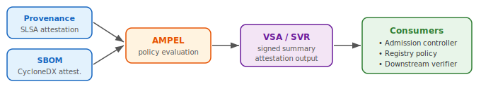

name: inverse
layout: true
class: center, middle, inverse

---

class: center, middle, title-slide

# From Mild To Wild
## How Hot Can Your SLSA Be?

Andrew McNamara (Conforma) • Adolfo "puerco" Garcia (AMPEL)

<div style="margin-top: 2em;">
  <span style="font-size: 2.5em; vertical-align: middle; margin-right: 2em;">🔴🟡🟢</span>
  
  
</div>

.footnote[
  Open Source SecurityCon · March 23, 2026
]

???

Andrew and puerco briefly introduce themselves. "I'm Andrew, I work on Konflux, a CI system built on Tekton. We also built Conforma, a Rego-based policy engine." / "And I'm puerco, I work on AMPEL." One sentence each — get right to the talk.

---

layout: false

## You Have Attestations. Now What?

You've signed your artifacts. Provenance exists.

But how do you actually *use* them to enforce policy?

<div style="margin-top: 2em; font-size: 1.1em;">
  Today: <strong>three levels</strong> of policy enforcement · <strong>two policy engines</strong> · <strong>one conclusion</strong>
</div>

<div style="text-align: center; margin-top: 3em;">
  
</div>

???

Andrew sets up the problem space. We're not talking about *generating* attestations today — that's covered elsewhere. We're talking about what you do with them once they exist. A signed artifact with provenance is only useful if something checks that provenance. Today we walk through three levels of sophistication for that checking, and show how two different policy engines handle each level.

---

## Two Policy Engines Walk Into a Bar...

<div style="display: flex; gap: 3em; margin-top: 2em; align-items: flex-start;">
  <div style="flex: 1; text-align: center;">
    <br>
    <strong>Conforma</strong><br>
    <small>Rego-based policy engine<br>built around Tekton / Konflux</small>
  </div>
  <div style="flex: 1; text-align: center;">
    <div style="font-size: 3em; margin-bottom: 0.2em;">🔴🟡🟢</div>
    <strong>AMPEL</strong><br>
    <small>Policy engine for in-toto attestation evaluation<br>produces VSAs and SVRs</small>
  </div>
</div>

<div style="margin-top: 2.5em; border-top: 1px solid #ccc; padding-top: 1.5em;">
  We show each level with <strong>both engines</strong>.<br>
  The engines are interchangeable. <em>Your policies are not your lock-in.</em>
</div>

???

Playful framing — introduce the "game." Puerco will demo a feature with AMPEL, Andrew will say "Conforma does that too." Then the challenger ups the ante to the next level. At mild, puerco leads and Andrew challenges. At medium, puerco leads and Andrew challenges. At wild, Andrew leads again, puerco closes. This slide explains the structure so the audience can follow along.

---

class: center, middle, inverse

# 🌶 Mild

**Verify provenance properties**

<div style="margin-top: 1em;">
  
</div>

???

Puerco introduces this level. Brief context for the audience: an attestation is a signed statement about your software — produced by your build system, your CI pipeline, or a verification tool. At mild, we verify fundamental provenance properties: is provenance present, is the build type recognized, does it come from a trusted builder, were materials properly tracked? This is where everyone should start.

---

layout: false

## Mild: Verify Provenance Properties

**Scenario**: OCI artifact built on **Tekton**.

Checks:
1. **Provenance attestation** is present
2. **Build type** is in the accepted list
3. **Builder identity** matches expected builder
4. **Source materials** are version-controlled git repos with SHAs
5. **External parameters** are restricted (no shared volumes)

```rego
# Conforma policy — verify foundational provenance properties
deny contains result if {
    count(lib.slsa_provenance_attestations) == 0
    result := lib.result_helper(rego.metadata.chain(), [])
}

deny contains result if {
    some att in lib.slsa_provenance_attestations
    build_type := _build_type(att)  # handles both SLSA v0.2 and v1.0
    allowed := lib.rule_data("allowed_build_types")
    not build_type in allowed
    result := lib.result_helper(rego.metadata.chain(), [build_type])
}

# Plus upstream rules for: builder identity, source materials, external params
```

**Result**: pass / fail per rule.

Signature verification is handled by the CLI before policy evaluation.

???

Puerco walks through the Conforma policy for mild. Two custom checks: provenance must exist, and the build type must be in the allowed list. This supports both SLSA v0.2 and v1.0 formats. Then upstream rules from the Conforma release-policy handle builder identity verification, source material checks (git URI and SHA present), and external parameter restrictions. Signature is verified by the ec CLI using cosign before policy runs — not a policy rule. These are builder-agnostic checks that work with any SLSA provenance.

---

## Mild: "Conforma Does That Too"

Same checks, different engine:

```hjson
// AMPEL policy — presence, identity, build properties
{
    identities: [{
        type: exact
        issuer: https://tekton.dev/chains
        identity: https://tekton.dev/chains/v2
    }]

    tenets: [
        {
            id: provenance-present
            code: "size(predicates) > 0"
            predicates: { types: [https://slsa.dev/provenance/v1] }
        }
        {
            id: build-type-accepted
            code: '''
                predicates.exists(p,
                    p.data.buildDefinition.buildType == "https://tekton.dev/chains/v2/slsa"
                )
            '''
            predicates: { types: [https://slsa.dev/provenance/v1] }
        }
    ]
}
```

**Same checks. Different engine.**

Attestation formats follow open standards (in-toto / SLSA), so engines are substitutable.

???

Andrew's "me too." Brief and playful — one policy snippet showing the same checks in AMPEL. The point: because the attestation format is standardized, you're not locked in to any engine. This should be quick — about 30 seconds.

---

## "But What About Producing a Portable Summary?"

*Andrew raises the bar*

> "So you verified the provenance locally."

> "What if downstream consumers need to know it passed verification?"

> "Can you produce a signed summary they can check without re-running all the policy checks?"

???

Andrew raises the bar. The natural next question after local verification is portability: how do you communicate verification results to downstream systems? VSAs solve this: they're signed summaries that say "I verified this artifact at SLSA level X." An admission controller can check the VSA instead of re-verifying the provenance. This is the transition to medium.

---

class: center, middle, inverse

# 🌶🌶 Medium

**Same checks + produce a VSA**

<div style="margin-top: 1em;">
  
</div>

???

Puerco takes the lead. Medium means taking the same verification from mild and producing a portable summary — a VSA (Verification Summary Attestation). The policy checks are identical to mild; the difference is that medium produces a signed VSA declaring SLSA Build Level 2.

---

## Medium: Verification Results as a Portable VSA

**Scenario**: Same artifact, same checks — now **produce a VSA** summarizing the result.

The policy is identical to mild (same SLSA checks). The difference: we run verification and produce a signed VSA at **SLSA Build Level 2**.

```yaml
# Tekton verify-and-attest task
- name: verify-image
  run: |
    ec validate image \
      --image $(params.IMAGE) \
      --policy policy.yaml \
      --public-key $(params.PUBLIC_KEY) \
      --output result.json

- name: create-vsa
  run: |
    # Extract verification result, format as VSA
    # VSA declares SLSA_BUILD_LEVEL_2
    echo '{ "verifiedLevels": ["SLSA_BUILD_LEVEL_2"], ... }' > vsa.json

- name: sign-vsa
  run: |
    cosign attest --type https://slsa.dev/verification_summary/v1 \
      --predicate vsa.json \
      --key $(params.VSA_KEY) \
      --new-bundle-format \
      $(params.IMAGE)
```

<div style="text-align: center; margin-top: 1em;">
  
</div>

???

Puerco explains the medium workflow. The policy checks are the same as mild — provenance present, build type, builder identity, source materials, external parameters. The new concept is the VSA as *output*. The verify-and-attest Tekton task runs ec validate, creates a VSA declaring SLSA Build Level 2, and signs it with cosign. This decouples "who evaluates" from "who enforces." Downstream consumers (like admission controllers) can check the VSA without re-running verification.

---

## Medium: "Conforma Does That Too"

Same verification flow, same VSA output:

```rego
# Conforma — same mild checks
deny contains result if {
    count(lib.slsa_provenance_attestations) == 0
    result := lib.result_helper(rego.metadata.chain(), [])
}

# ... builder identity, source materials, external params ...
```

After policy passes, Conforma's output can be used to produce a standard SLSA VSA at level 2.

Both engines verify the same properties and can produce VSAs for downstream enforcement. The verification summary format is standardized (in-toto VSA), so the output is portable across policy engines.

???

Andrew's "me too." The Conforma policy is identical to mild — we're checking the same properties. After verification passes, the results can be formatted as a VSA and signed. The task flow is the same: run ec validate, extract the result, format as a VSA at L2, sign and attach. Reinforce that the VSA format is standardized, so either engine can produce VSAs that any consumer can verify. About 45 seconds.

---

## "But Here's What Keeps Me Up at Night"

*Andrew raises the bar*

> "We can verify what the provenance says and produce a VSA at L2."

> "But did the tasks recorded in the provenance actually *produce* this artifact?"

> "Tekton Chains records tasks accurately — but pipelines are user-customizable. Any task could have injected a different artifact."

> "If we verify the tasks themselves were pinned and trusted, can we upgrade to L3?"

???

Andrew raises the deeper trust question. This is the distinction between recording what ran and knowing that what ran *actually produced* the artifact. We're already producing VSAs at L2. The question for wild is: can we verify the tasks were trusted and upgrade to L3? Tekton Chains accurately records the tasks that ran, but because Tekton pipelines are user-customizable, the provenance can't on its own prove the artifact is the genuine output of those tasks. This motivates wild: use policy to inspect the Tekton provenance and verify that specific pinned trusted task bundles were used.

---

class: center, middle, inverse

# 🌶🌶🌶 Wild

**Upgrade from L2 to L3 with trusted task verification**

<div style="margin-top: 1em;">
  
</div>

???

Andrew introduces the wild level. The question is: given that we're already producing VSAs at L2, can we verify trusted tasks and upgrade to L3? The key insight is that Tekton Chains records task references in the provenance. Wild policy checks that every task is a known, pinned bundle or git reference. If all tasks are trusted, the VSA declares L3. If any are untrusted, warnings are produced and the VSA stays at L2.

---

## Wild: Trusted Task Verification for L3

Tekton provenance records task references — **bundle digests** (PipelineRun) or **git SHAs** (TaskRun):

```json
// PipelineRun provenance (SLSA v0.2)
{ "buildConfig": { "tasks": [{
    "name": "buildah",
    "ref": { "bundle": "quay.io/konflux-ci/tekton-catalog/task-buildah@sha256:..." }
}]}}

// TaskRun provenance (SLSA v1.0)
{ "buildDefinition": { "resolvedDependencies": [{
    "name": "task",
    "uri": "git+https://github.com/arewm/mild-to-wild-samples",
    "digest": { "sha1": "e2c6ae7358fd68399787d322347a95ccd7bbb2f8" }
}]}}
```

**Wild policy**: verify every task against a **trusted task allowlist**. This is a `warn` rule, not `deny`:
- Untrusted tasks → warnings → VSA declares **L2**
- All tasks trusted (no warnings) → VSA declares **L3**

```rego
# Conforma — verify task references (warn, not deny)
warn contains result if {
    some att in lib.pipelinerun_attestations
    tasks := tekton.tasks(att)
    untrusted := tekton.untrusted_task_refs(tasks)
    count(untrusted) > 0
    some task in untrusted
    ref := tekton.task_ref(task)
    bundle_ref := object.get(ref, "bundle", ref.key)
    result := lib.result_helper(rego.metadata.chain(), [bundle_ref])
}
```

???

Andrew explains the wild approach. Tekton Chains records task bundle references (for PipelineRun) or git resolver references (for TaskRun) in the provenance. Wild policy verifies these against a trusted task allowlist. Crucially, this is a `warn` rule, not `deny` — the policy always passes. Untrusted tasks produce warnings, which means the VSA stays at L2. If all tasks are trusted (no warnings), the VSA upgrades to L3. This is the "trusted task" model that Konflux uses: pinned tasks with known digests behave deterministically.

---

## Wild: Trusted Task Data Format

The allowlist specifies which task references are trusted:

```yaml
# For PipelineRun: trusted_task_rules (OCI bundle patterns)
# Loaded from quay.io/konflux-ci/tekton-catalog/data-acceptable-bundles

# For TaskRun: trusted_task_refs (git URI + digest)
trusted_task_refs:
  - uri: "git+https://github.com/arewm/mild-to-wild-samples"
    digest:
      sha1: "e2c6ae7358fd68399787d322347a95ccd7bbb2f8"
```

Policy checks the provenance task references against this data. Matching = trusted. Warnings = untrusted → L2. No warnings = all trusted → L3.

<div style="text-align: center; margin-top: 1em;">
  
</div>

???

Show the trusted task data format. For PipelineRun provenance, the trusted task rules come from an OCI bundle (Konflux's tekton-catalog). For TaskRun provenance using the git resolver, we maintain a list of trusted git URI prefixes and digests. The policy matches the task references in the provenance against this data. Any untrusted task produces a warning, which signals the VSA generator to stay at L2. All trusted means no warnings, so the VSA can declare L3.

---

## Wild: "AMPEL Can Verify That Too"

```hjson
// AMPEL — evaluate task bundle digests
{
    context: {
        values: {
            allowed_prefix: {
                type: string
                default: "quay.io/konflux-ci/tekton-catalog/"
            }
        }
    }

    tenets: [{
        id: all-tasks-trusted
        level: warn
        code: '''
            predicates.exists(p,
                p.data.buildConfig.tasks.all(task,
                    has(task.ref) && has(task.ref.bundle) &&
                    task.ref.bundle.startsWith(context.allowed_prefix)
                )
            )
        '''
        predicates: { types: [https://slsa.dev/provenance/v0.2] }
    }]
}
```

Same interchangeability point: standardized Tekton provenance format, substitutable engines.

Warnings from untrusted tasks → L2 in VSA. All tasks trusted → L3.

???

Puerco's final "me too." The payoff of the running gag: even for the most nuanced policy use case — trusted task verification with warn-level rules — both engines can do it. The attestation standard is the key, not the engine. Keep it brief — about 30 seconds. Then segue directly into takeaways.

---

## Which Heat Level Are You?

<table style="margin-top: 1.5em; width: 100%; font-size: 0.95em;">
  <tr>
    <th style="width: 15%;">Level</th>
    <th style="width: 30%;">You check…</th>
    <th style="width: 30%;">Produces…</th>
    <th style="width: 25%;">Start here if…</th>
  </tr>
  <tr>
    <td>🌶 <strong>Mild</strong></td>
    <td>Provenance present, build type, builder identity, source materials, external params</td>
    <td>Pass/fail verification</td>
    <td>Just getting started</td>
  </tr>
  <tr>
    <td>🌶🌶 <strong>Medium</strong></td>
    <td>Same as mild</td>
    <td>VSA at SLSA Build Level 2</td>
    <td>You want portable summaries for admission control</td>
  </tr>
  <tr>
    <td>🌶🌶🌶 <strong>Wild</strong></td>
    <td>Same as medium + trusted task verification (Tekton-specific)</td>
    <td>VSA at L2 (warnings) or L3 (all tasks trusted)</td>
    <td>You want end-to-end trust</td>
  </tr>
</table>

<div style="margin-top: 2em; border-top: 1px solid #ccc; padding-top: 1.5em;">
  Policy engines are <strong>interchangeable</strong>. Pick the one that fits your stack.<br>
  <em>Attestation standards are open. Your policies travel with you.</em>
</div>

???

Both speakers together. Quick summary. The three key messages:
1. Start at mild with foundational provenance checks. Medium adds VSA output at L2 for portable verification. Wild upgrades to L3 by verifying trusted tasks.
2. Policy engines are interchangeable because the attestation standards are open.
3. Wild-level trust is Tekton-specific but follows the same pattern: verify properties in standardized attestations.

---

## Resources

<div style="display: flex; justify-content: space-around; margin-top: 2em; flex-wrap: wrap; gap: 2em;">
  <div style="text-align: center;">
    <br>
    <strong>conforma.dev</strong>
  </div>
  <div style="text-align: center;">
    <div style="width: 140px; height: 140px; border: 2px solid #333; display: flex; align-items: center; justify-content: center; margin: 0 auto; font-size: 2em;">
      🔴🟡🟢
    </div><br>
    <strong>github.com/carabiner-dev/ampel</strong>
  </div>
  <div style="text-align: center;">
    <br>
    <strong>slsa.dev</strong>
  </div>
  <div style="text-align: center;">
    <div style="width: 140px; height: 140px; border: 2px solid #333; display: flex; align-items: center; justify-content: center; margin: 0 auto; font-size: 2em;">
      📊
    </div><br>
    <strong>slides.arewm.com</strong>
  </div>
  <div style="text-align: center;">
    <div style="width: 140px; height: 140px; border: 2px solid #333; display: flex; align-items: center; justify-content: center; margin: 0 auto; font-size: 2em;">
      💻
    </div><br>
    <strong>Sample policies</strong>
  </div>
</div>

???

Quick close. "Scan, follow along, try it yourself." The AMPEL QR and slides QR will be added once the project link and slides URL are confirmed.

---

class: center, middle, inverse

# Thank You

Questions?

<div style="margin-top: 2em;">
  Andrew McNamara · <strong>conforma.dev</strong><br>
  Adolfo "puerco" Garcia · <strong>AMPEL</strong>
</div>

???

Open for Q&A. Roughly 7 minutes. Both speakers take questions.
